# SecFlow — Architecture & Design Documentation Index

Welcome to the **SecFlow** technical documentation suite.  
This collection defines the *complete internal architecture* of the Security Toolkit platform — covering everything from orchestration engines to data models, plugin systems, and CVE enrichment.

Each document in this `/docs/architecture/` folder represents a **bounded architectural domain**, written in *deep-technical mode* to serve engineers and architects implementing or extending the system.

---

## 📚 Document Navigation

| # | File | Description |
|---|------|--------------|
| 01 | [Title & Executive Summary](01-title-and-executive-summary.md) | Project mission, audience, and objectives. |
| 02 | [Architecture Philosophy](02-architecture-philosophy.md) | Core tenets, design rationale, and constraints. |
| 03 | [Repository Layout](03-repository-layout.md) | Folder hierarchy, import rules, and tooling. |
| 04 | [Core Packages & Responsibilities](04-core-packages-and-responsibilities.md) | Module roles, data contracts, and dependencies. |
| 05 | [Orchestration & Workflow Engine](05-orchestration-and-workflow-engine.md) | DAG-based tool chaining and execution logic. |
| 06 | [Plugin System](06-plugin-system.md) | Plugin registration, lifecycle, and testing. |
| 07 | [Tools Integration Model](07-tools-integration-model.md) | Wrappers, manifests, and sandbox execution. |
| 08 | [Tool Manager & UX Design](08-tool-manager-and-ux-design.md) | How users manage tools and workflows. |
| 09 | [Resource Registry](09-resource-registry.md) | Global wordlists, payloads, templates, and configs. |
| 10 | [Wordlist & Output Sharing](10-wordlist-and-output-sharing.md) | Rules for shared and isolated resources. |
| 11 | [Project Isolation & Data Sharing](11-project-isolation-and-data-sharing.md) | Workspace boundaries, access control, linking. |
| 12 | [Findings Model & Schema](12-findings-model-and-schema.md) | Data models, normalization, and persistence. |
| 13 | [CVE/CWE/POC Enrichment Layer](13-cve-cwe-poc-enrichment-layer.md) | External vulnerability mapping and enrichment. |
| 14 | [POC Sources & Legal Guidelines](14-poc-sources-and-legal-guidelines.md) | Governance and sandbox policies for proof-of-concepts. |
| 15 | [Garbage Collection & Retention](15-garbage-collection-and-retention.md) | Data lifecycle, cleanup tasks, and recovery. |
| 16 | [Security Model](16-security-model.md) | Auth, RBAC, sandboxing, and auditing. |
| 17 | [Observability, Logging & Metrics](17-observability-logging-and-metrics.md) | Telemetry, structured logs, and OpenTelemetry. |
| 18 | [Error Handling & Recovery](18-error-handling-and-recovery.md) | Centralized error strategies and resilience patterns. |
| 19 | [Risk Assessment Framework](19-risk-assessment-framework.md) | NIST 5×5 Matrix, CVSS, and MITRE mapping. |
| 20 | [Migration & Implementation Phases](20-migration-and-implementation-phases.md) | Step-by-step rollout plan. |
| 21 | [CI/CD & Testing Strategy](21-ci-cd-and-testing-strategy.md) | Build matrix, pipelines, and test automation. |
| 22 | [Developer Experience & Docs](22-developer-experience-and-docs.md) | Local setup, MkDocs, and contribution workflow. |
| 23 | [Future Roadmap](23-future-roadmap.md) | AI triage, automation, and next-gen features. |

---

## 🧭 Reading Order

While each document is standalone, recommended order for new contributors:

1. Start with **01–04** to grasp architecture and structure.  
2. Proceed to **05–07** for orchestration and integration.  
3. Review **09–13** for data, findings, and enrichment logic.  
4. Study **16–18** for security and observability.  
5. Conclude with **19–23** for governance, testing, and roadmap.

---

## 🧩 Versioning & Maintenance

- Documentation version follows codebase major versions (e.g., `1.0` = `v1.x` releases).  
- Each architectural change **must update its corresponding file** and cross-links.  
- Use `mkdocs serve` locally to preview rendered docs.  
- Changes to interfaces or DTOs require schema diff logs.

---

## 🧱 Example Structure Diagram

```mermaid
%%{init: {"theme":"neutral"}}%%
flowchart TD
    A["docs/"]
    B["architecture/"]
    C["00-index.md"]
    D["01-title-and-executive-summary.md"]
    E["02-architecture-philosophy.md"]
    F["03-repository-layout.md"]
    G["04-core-packages-and-responsibilities.md"]
    H["05-orchestration-and-workflow-engine.md"]
    I["06-plugin-system.md"]
    J["07-tools-integration-model.md"]
    K["08-tool-manager-and-ux-design.md"]
    L["09-resource-registry.md"]
    M["10-wordlist-and-output-sharing.md"]
    N["11-project-isolation-and-data-sharing.md"]
    O["12-findings-model-and-schema.md"]
    P["13-cve-cwe-poc-enrichment-layer.md"]
    Q["14-poc-sources-and-legal-guidelines.md"]
    R["15-garbage-collection-and-retention.md"]
    S["16-security-model.md"]
    T["17-observability-logging-and-metrics.md"]
    U["18-error-handling-and-recovery.md"]
    V["19-risk-assessment-framework.md"]
    W["20-migration-and-implementation-phases.md"]
    X["21-ci-cd-and-testing-strategy.md"]
    Y["22-developer-experience-and-docs.md"]
    Z["23-future-roadmap.md"]
    
    A --> B
    B --> C
    B --> D
    B --> E
    B --> F
    B --> G
    B --> H
    B --> I
    B --> J
    B --> K
    B --> L
    B --> M
    B --> N
    B --> O
    B --> P
    B --> Q
    B --> R
    B --> S
    B --> T
    B --> U
    B --> V
    B --> W
    B --> X
    B --> Y
    B --> Z
```



---

**Next:** [Title & Executive Summary](01-title-and-executive-summary.md)
```