# 01 — Title & Executive Summary

## 🧩 Project Name
**SecFlow** — *Security Toolkit Orchestration Framework*

---

## 🧭 Executive Summary

SecFlow is a **modular, extensible, and automation-first security orchestration platform** designed to unify multiple open-source and proprietary tools for penetration testing, vulnerability management, and risk analytics.

It merges **dynamic scanning**, **tool orchestration**, **data normalization**, and **risk intelligence** into a single cohesive system — optimized for both solo pentesters and enterprise red-team workflows.

### Core Vision
> "One orchestrator to chain, enrich, and analyze all security tools — safely, intelligently, and reproducibly."

### Core Differentiators
- 🔄 **End-to-end orchestration:** Tools (Nuclei, Feroxbuster, Katana, ZAP, Burp, Caido, etc.) communicate via normalized JSON pipelines.
- 🧱 **Hexagonal architecture:** Strict separation between *core logic*, *adapters*, and *interfaces*.
- 🧠 **Data-driven intelligence:** Findings automatically enriched with CVE/CWE/CVSS and MITRE mapping.
- ⚙️ **Resource registry:** Shared wordlists, templates, and payloads under a versioned resource management system.
- 🧰 **AI-ready foundation:** All findings and telemetry are machine-readable for later AI triage and summarization.

---

## 🎯 Project Goals

| Category | Objective |
|-----------|------------|
| **Engineering** | Create a modular mono-repo structure enabling multiple apps (CLI, API, Worker, UI). |
| **Automation** | Allow users to chain discovery → scanning → enrichment workflows via declarative YAML recipes. |
| **Data Consistency** | Standardize tool outputs into common *Finding DTOs* for unified triage and metrics. |
| **Usability** | Provide a CLI and web UI for project management, orchestration, and analytics. |
| **Security** | Guarantee safe sandboxing, configuration isolation, and audit logging. |
| **Scalability** | Support multi-tenant projects with configurable resource scopes. |

---

## 🧮 Key Capabilities Overview

| Layer | Functionality | Description |
|--------|----------------|-------------|
| **Core-Lib** | Schema & DTOs | Defines data models, ports, and contracts. |
| **Findings-Engine** | Normalization | Converts raw tool outputs into structured findings. |
| **Wrappers** | Tool Adapters | Execute, monitor, and parse tool output. |
| **Worker** | Orchestration | Runs workflows (DAG execution, concurrency, retry policies). |
| **Web-API** | REST + WS Interface | Exposes project, scan, and findings endpoints. |
| **UI** | HTMX/React | Web dashboard for triage and insights. |
| **Plugins** | Extensibility | Detectors, enrichers, or analytics extensions. |

---

## 🧱 Architecture Summary

```mermaid
%%{init: {"theme":"neutral"}}%%
flowchart TD
    A["Web-API / UI"]
    B["REST / WebSocket"]
    C["Worker Engine<br/>(Workflows, DAG, Queues)"]
    D["Ports / DTOs"]
    E["Core-Lib<br/>(Models, Ports, Repositories)"]
    F["Wrappers / Plugins<br/>(Nuclei, Ferox, Katana…)"]
    G["Tool Output"]
    H["Findings Engine<br/>(Normalization, Metrics)"]
    
    A --> B
    B --> C
    C --> D
    D --> E
    E --> F
    F --> G
    G --> H
```



---

## ⚙️ Toolchain & Technology Stack

| Category | Tools / Frameworks |
|-----------|--------------------|
| **Language** | Python 3.11+ |
| **Frameworks** | FastAPI / Flask (API), HTMX / React (UI) |
| **ORM / DB** | SQLModel (SQLite / PostgreSQL) |
| **Task Queue** | Celery / RQ (Redis backend) |
| **Caching** | Redis |
| **Testing** | Pytest + Tox + Coverage |
| **CI/CD** | GitHub Actions + Import-Linter + Ruff + Pyright |
| **Packaging** | Poetry |
| **Docs** | MkDocs + Material theme |

---

## 🧩 Intended Audience

| Audience | Needs |
|-----------|-------|
| **Red-Team / Pentesters** | Automate repetitive workflows, triage large data, correlate findings. |
| **Security Engineers** | Integrate with CI/CD, enrich findings with vulnerability intelligence. |
| **Researchers** | Extend plugins, add enrichment sources, or create experimental scanners. |
| **Developers** | Contribute to wrappers, tooling, and orchestration improvements. |

---

## 🧠 Guiding Principles

1. **Automation-First** – Everything that can be automated *should be*.  
2. **Safe by Default** – Every scan runs in isolation, respecting sandbox and audit policies.  
3. **Extensible by Design** – Each tool or feature lives as a plugin or wrapper.  
4. **Transparent** – Clear data lineage and provenance for every finding.  
5. **Declarative Configuration** – Tools and workflows defined in YAML/JSON, not hardcoded logic.  
6. **Deterministic Execution** – Same input, same results. All randomness is logged.  

---

## 🔮 Strategic Vision

SecFlow is built not as a single pentest tool, but as a **foundation for orchestrated cybersecurity automation**.  
It aims to support:
- Scalable enterprise deployments.
- Cloud-native workloads (Kubernetes, containerized workers).
- AI-driven vulnerability triage.
- Integration with bug bounty, CI/CD, and SIEM pipelines.

---

**Next:** [Architecture Philosophy](02-architecture-philosophy.md)
```