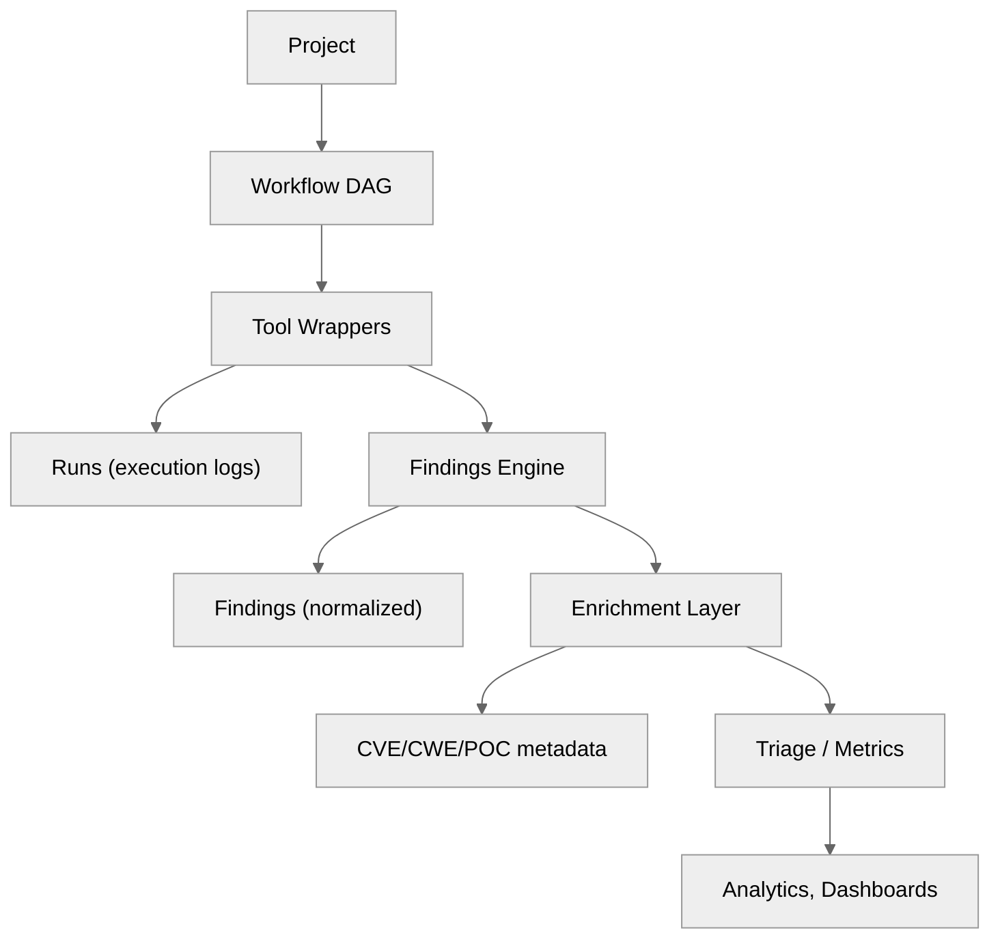

# 02 — Architecture Philosophy

## 🧭 Overview

SecFlow's architecture follows the **Hexagonal Architecture (Ports & Adapters)** paradigm, enforcing a *clear separation of concerns* between business logic, I/O mechanisms, and user interfaces.  
It is designed for **tool orchestration, data normalization, and future AI enrichment** — with extensibility, safety, and testability at its core.

---

## 🧱 Architectural Tenets

| Principle | Description |
|------------|-------------|
| **Hexagonal Isolation** | All business logic lives in core modules with no framework dependencies. I/O adapters (DB, CLI, API) communicate via interfaces (Ports). |
| **Event-Driven Orchestration** | Workflows operate as Directed Acyclic Graphs (DAGs) executed asynchronously, allowing parallel chaining of tools. |
| **Immutable Data Flow** | Each execution step produces structured, immutable output for auditing and replay. |
| **Composable Pipelines** | Discovery → Scanning → Enrichment workflows can be combined declaratively. |
| **Strong Typing** | All data contracts use Pydantic models for type safety and schema validation. |
| **Declarative Configuration** | YAML or JSON defines tools, wordlists, templates, and workflows. |
| **Safe Execution** | Every external tool runs within sandbox boundaries (filesystem + network isolation). |

---

## ⚙️ Core Architectural Layers

```
+---------------------------------------------------------------+
|                    Applications                               |
|                    Web-API                                   |
+---------------------------------------------------------------+
|                    Services Layer                             |
|                    Workflow Engine                            |
+---------------------------------------------------------------+
|                    Core-Lib                                  |
|                    DTOs                                      |
+---------------------------------------------------------------+
|                    Infrastructure                             |
|                    Database                                   |
+---------------------------------------------------------------+
|                    External                                  |
|                    Tools                                     |
+---------------------------------------------------------------+
```

Each layer exposes **well-defined boundaries**:
- *Applications* depend only on *Services* through **ports**.
- *Services* interact with *Core* logic through **domain interfaces**.
- *Core-Lib* defines **pure domain logic** with zero external imports.
- *Infrastructure* implements adapters to databases, cache, and external tools.

---

## 🧩 Design Goals

| Goal | Implementation Strategy |
|------|---------------------------|
| **Maintainability** | Modular mono-repo with strict import boundaries (`import-linter`). |
| **Scalability** | Async task execution (Celery/RQ) and worker-based orchestration. |
| **Observability** | Structured logs, Prometheus metrics, and OpenTelemetry tracing. |
| **Reproducibility** | Deterministic workflows with cached configuration + results. |
| **Security** | Sandboxed subprocesses, limited file system access, and tokenized configuration. |
| **Extensibility** | Plugin registry and manifest-based tool definitions. |

---

## 🧩 Why Hexagonal Architecture?

| Aspect | Traditional Architecture | SecFlow Approach |
|--------|--------------------------|------------------|
| **Dependencies** | Frameworks import core directly | Core is framework-agnostic |
| **Testing** | Hard to isolate logic | Core modules unit-tested independently |
| **Tool Integration** | Ad-hoc scripts | Formal wrappers with contracts |
| **Maintainability** | Spaghetti imports | Controlled boundaries with Import-Linter |
| **Extensibility** | Static toolset | Plugin & manifest system |

---

## 🧩 Component Responsibility Map

| Component | Responsibility |
|------------|----------------|
| **Core-Lib** | Defines domain models (`Finding`, `Project`, `Resource`) and interfaces (`ToolPort`, `StoragePort`). |
| **Findings-Engine** | Normalizes raw scan data into standardized Finding objects. |
| **Wrappers** | Execute external tools (Nuclei, Ferox, etc.) via manifest-driven configs. |
| **Worker** | Executes workflows, manages concurrency, caching, and cleanup. |
| **API** | Exposes endpoints for managing projects, workflows, and triage. |
| **Triage-UI** | Visual interface for findings review, filtering, and reporting. |
| **Plugins** | Optional modules extending detection or enrichment logic. |
| **Resource Registry** | Central management of wordlists, templates, and payloads. |

---

## 🧩 Data Flow Model



---

## 🧠 Architectural Patterns Used

| Pattern | Purpose |
|----------|----------|
| **Repository Pattern** | Abstract data access (DB, file, memory). |
| **DTO (Data Transfer Object)** | Enforce schema boundaries between layers. |
| **Command Pattern** | Workflow node execution commands. |
| **Strategy Pattern** | Dynamic selection of enrichment or parsing strategies. |
| **Observer Pattern** | Metrics and event hooks on scan completion. |
| **Decorator Pattern** | Reusable middleware for retries, timeouts, and auditing. |

---

## 🔐 Security-by-Design Integration

Every architectural decision includes a security review:
- Minimal privilege principle (scoped resource access).  
- Tokenized secrets (no plaintext credentials).  
- Environment isolation (Docker/Kubernetes runtime sandboxes).  
- Mandatory audit trail for findings modification.

---

## 🧠 Future-Proofing Considerations

- **AI Integrations:** Workflow outputs use JSON-LD style structures, allowing LLMs to reason over findings safely.  
- **Multi-Tenant Mode:** Namespaced projects ensure logical and data isolation.  
- **Plugin Safety:** Plugins are signed, versioned, and validated before loading.  
- **Extensible Schema:** Findings model allows additional enrichment fields via metadata dicts.

---

**Next:** [Repository Layout](03-repository-layout.md)
```
```