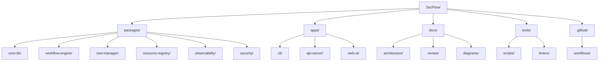

# 03 — Repository Layout

## 🧭 Overview

The **SecFlow** repository is structured as a **Python mono-repo workspace** housing multiple interdependent packages and apps.
This allows us to:
- Share interfaces and DTOs across services.
- Enforce architecture boundaries centrally.
- Run unified CI/CD pipelines and dependency resolution through **Poetry**.

---

## 🧱 Directory Structure



---

## ⚙️ Python Workspace Configuration

### **`pyproject.toml` Snippet**
```toml
[tool.poetry]
name = "SecFlow"
version = "1.0.0"
description = "Security Toolkit Orchestration Framework"
authors = ["Hernan Trajtemberg <hernan.trajtemberg@domain>"]

[tool.poetry.dependencies]
python = "^3.11"
fastapi = "^0.115"
sqlmodel = "^0.0.22"
celery = "^5.3"
redis = "^5.0"
pydantic = "^2.7"
import-linter = "^1.5"
ruff = "^0.7"
pytest = "^8.3"

[tool.poetry.group.dev.dependencies]
pyright = "*"
coverage = "*"

[build-system]
requires = ["poetry-core>=1.6"]
build-backend = "poetry.core.masonry.api"
```python

## 🧩 Application Layering

Each app in `/apps/` uses internal packages exclusively via ports, ensuring loose coupling.

| Layer | Directory | Import Rules |
|-------|-----------|--------------|
| **Core** | `packages/core-lib` | No external imports |
| **Findings Engine** | `packages/findings-engine` | May import core-lib |
| **Wrappers** | `packages/wrappers` | May import core-lib, utils |
| **API / Worker** | `apps/web-api`, `apps/worker` | May import via ports only |
| **Plugins** | `packages/plugins` | Dynamically loaded at runtime |

## 🧩 Import-Linter Configuration

`importlinter.ini` enforces import boundaries automatically:

```ini
[importlinter]
root_package = SecFlow

[contract: core-isolation]
name = Core-Lib Is Independent
type = forbidden
source_modules = SecFlow.packages.core_lib
forbidden_modules =
    SecFlow.apps
    SecFlow.packages.wrappers
    SecFlow.packages.findings_engine

[contract: adapters-only]
name = Adapters Only Depend On Ports
type = layers
layers =
    SecFlow.packages.core_lib
    SecFlow.packages.findings_engine
    SecFlow.packages.wrappers
    SecFlow.apps
```bash

If violated, the CI pipeline fails the build.

## 🧠 Developer Workflow

### Local Development
```bash
poetry install
poetry run pre-commit install
poetry run pytest
```yaml

### Run the Worker
```bash
poetry run celery -A SecFlow.apps.worker worker --loglevel=info
```bash

### Run the Web API
```bash
poetry run uvicorn SecFlow.apps.web_api.main:app --reload
```yaml

## 🧩 Continuous Integration Pipeline

GitHub Actions (`.github/workflows/ci.yml`):

```yaml
name: SecFlow CI
on: [push, pull_request]
jobs:
  build:
    runs-on: ubuntu-latest
    steps:
      - uses: actions/checkout@v4
      - uses: actions/setup-python@v5
        with:
          python-version: '3.11'
      - name: Install dependencies
        run: |
          pip install poetry
          poetry install
      - name: Lint & Type Check
        run: |
          poetry run ruff check .
          poetry run pyright
      - name: Run Tests
        run: poetry run pytest --maxfail=1 --disable-warnings -q
```yaml

## 🧰 Tooling & Developer Aids

| Tool | Purpose |
|------|---------|
| **Ruff** | Linting, formatting enforcement |
| **Pyright** | Static type checking |
| **Import-Linter** | Architecture enforcement |
| **Poetry** | Dependency & build management |
| **Tox** | Multi-environment testing |
| **MkDocs** | Documentation site generation |
| **Coverage.py** | Test coverage reports |

## 🧩 ASCII Diagram — High-Level View

```text
         +-----------------------------+
         |          SecFlow/           |
         +-------------+---------------+
                       |
          +------------v-------------+
          |        packages/         |
          | core-lib, findings, etc. |
          +------------+-------------+
                       |
          +------------v-------------+
          |          apps/           |
          | web-api, worker, cli, ui |
          +------------+-------------+
                       |
          +------------v-------------+
          |         tests/           |
          +--------------------------+
```

## 🧠 Future Enhancements

- **Monorepo Versioning:** Each package versioned via poetry-dynamic-versioning.
- **Documentation Pipeline:** Auto-regenerate schema docs (`mkdocs build`) on merge.
- **Pre-Commit Hooks:** Validate imports and enforce ruff formatting pre-push.
- **Code Owners:** Assign maintainers per package via `.github/CODEOWNERS`.

---

**Next:** [Core Packages & Responsibilities](04-core-packages-and-responsibilities.md)
```
```
```
```
```
```
```
```
```
```
```
```
