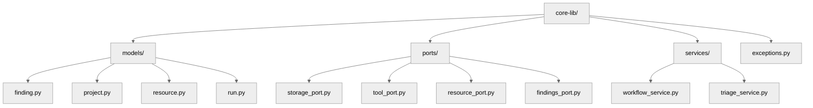
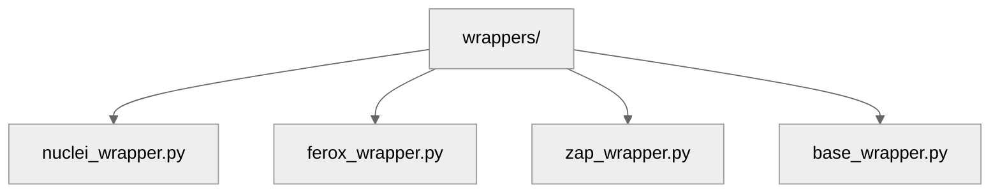

# 04 — Core Packages & Responsibilities

## 🧭 Overview

This document describes the **core packages** inside the `packages/` directory and explains the *roles, contracts, and relationships* that define the heart of SecFlow.

The architecture is intentionally **hexagonal**:
- `core-lib` defines *domain models* and *ports* (interfaces).  
- Other packages such as `findings-engine`, `wrappers`, and `storage` implement those ports.  
- Application layers (`web-api`, `worker`, `cli`) use the ports but never touch implementations directly.

---

## 🧩 Package Overview Table

| Package | Responsibility | Depends On |
|----------|----------------|-------------|
| **core-lib** | Domain models, DTOs, Ports, and Service Interfaces. | None |
| **findings-engine** | Normalization and enrichment of scan data. | `core-lib` |
| **wrappers** | Executes external tools and parses results. | `core-lib`, `utils` |
| **resources** | Manages reusable assets (wordlists, payloads, templates). | `core-lib` |
| **storage** | Implements persistence and caching (Postgres, SQLite, Redis). | `core-lib` |
| **plugins** | Houses extension modules (detectors, enrichers, analytics). | `core-lib` |
| **utils** | Generic utilities: logging, validation, subprocess helpers. | None |

---

## ⚙️ Core-Lib

### Purpose
`core-lib` is the **foundation** of SecFlow. It defines all domain entities, type contracts, and abstract interfaces (ports) used throughout the system.

### Structure


### Example Model
```
# core-lib/models/finding.py
from pydantic import BaseModel
from datetime import datetime
from typing import List, Optional, Dict

class Finding(BaseModel):
    id: str
    project_id: str
    detector_id: str
    title: str
    severity: str
    path: str
    evidence: Dict[str, str]
    created_at: datetime
    cwe: Optional[int]
    owasp: Optional[str]
    cve_ids: List[str] = []
    enrichment: Dict[str, any] = {}
```

### Example Port
```
# core-lib/ports/tool_port.py
from typing import Protocol, List
from core_lib.models.finding import Finding

class ToolPort(Protocol):
    def prepare(self, config: dict) -> None:
        """Prepare the tool with given configuration."""
        pass
    
    def execute(self) -> List[Finding]:
        """Execute the tool and return findings."""
        pass
    
    def validate_output(self, raw_output: str) -> bool:
        """Validate tool output format."""
        pass
```

This abstraction allows any external tool to be integrated simply by implementing `ToolPort`.

## 🧠 Findings-Engine

### Purpose
Responsible for normalizing, deduplicating, and enriching findings produced by wrappers.

### Example Normalization Flow
```
def normalize(raw_data: str, tool: str) -> Finding:
    if tool == "nuclei":
        return _normalize_nuclei_output(raw_data)
    elif tool == "ferox":
        return _normalize_ferox_output(raw_data)
```

### Capabilities
- Parse multiple output formats (JSON, XML, plain text).
- Deduplicate based on fingerprint (host + path + vuln_id).
- Attach CWE, CVSS, and severity from enrichment sources.
- Store normalized data through `StoragePort`.

## ⚙️ Wrappers

### Purpose
Wraps and executes third-party tools through a unified interface defined by `ToolPort`.

### Example Structure
```
wrappers/
```



### Example Base Class
```
# wrappers/base_wrapper.py
import subprocess
from core_lib.models.finding import Finding

class BaseWrapper:
    def __init__(self, manifest: dict):
        self.manifest = manifest

    def run(self, target: str) -> list[Finding]:
        cmd = [self.manifest["binary"], "-u", target]
        result = subprocess.run(cmd, capture_output=True, text=True)
        return self.parse_output(result.stdout)

    def parse_output(self, raw: str) -> list[Finding]:
        raise NotImplementedError
```

All wrappers inherit from `BaseWrapper` and override `parse_output`.

## 📦 Resources

### Purpose
`resources` manages global and scoped assets:
- Wordlists (directories, subdomains, parameters)
- Templates (Nuclei, ZAP)
- Payload sets
- Custom configurations

### Example Resource Model
```
# core-lib/models/resource.py
class Resource(BaseModel):
    id: str
    name: str
    type: Literal["wordlist", "template", "payload"]
    scope: Literal["global", "group", "project"]
    hash: str
    version: str
    metadata: dict
```

## 🗃️ Storage

### Purpose
Implements all persistence operations via the `StoragePort` interface.

### Example Interface
```
# core-lib/ports/storage_port.py
class StoragePort(Protocol):
    def save_finding(self, finding: Finding) -> None:
        """Save a finding to storage."""
        pass
    
    def list_findings(self, project_id: str) -> list[Finding]:
        """List all findings for a project."""
        pass
    
    def delete_project(self, project_id: str) -> None:
        """Delete a project and all its findings."""
        pass
```

### Implementation Examples
- `SQLiteStorageAdapter`
- `PostgresStorageAdapter`
- `RedisCacheAdapter`

All registered in the `storage.registry`.

## 🔌 Plugins

### Purpose
Extend SecFlow with additional detection or enrichment capabilities.

### Example Plugin Registration
```
# plugins/registry.py
from typing import Dict, Callable

PLUGIN_REGISTRY: Dict[str, Callable] = {}

def register_plugin(name: str):
    def decorator(func):
        PLUGIN_REGISTRY[name] = func
        return func
    return decorator
```

Plugins can dynamically hook into findings processing, orchestration, or resource management.

## 🧰 Utils

`utils` contains helper modules that are shared across packages but contain no business logic.

### Examples:
- `utils.subprocess_safe` – wrapper for secure process spawning.
- `utils.hashing` – generate resource hashes (SHA256).
- `utils.validation` – reusable Pydantic validators.
- `utils.config` – environment-aware configuration loader.

## 🔗 Cross-Package Interaction Diagram

```
+-------------+       +----------------+       +---------------+
|  Wrappers   | ----> | Findings-Engine| ----> |   Storage     |
+-------------+       +----------------+       +---------------+
       |                       ^                       |
       |                       |                       |
       v                       |                       v
   +-----------+        +----------------+        +----------------+
   | Resources |        |    Core-Lib    |        |    Plugins     |
   +-----------+        +----------------+        +----------------+
```

Arrows represent dependency flow, not import direction (imports always go downward).

## 🧠 Best Practices

- Every package must expose a `__all__` list for stable imports.
- Each module must define `__version__` for dependency tracking.
- No package may import directly from `/apps/`.
- Keep adapters stateless; use dependency injection for configuration.
- Always prefer Pydantic models over raw dictionaries.

## 🧩 Testing Guidelines

| Package | Test Type | Focus |
|----------|-----------|-------|
| core-lib | Unit | DTO validation and port contracts |
| findings-engine | Integration | Normalization and enrichment correctness |
| wrappers | System | Command execution, parsing accuracy |
| storage | Integration | CRUD consistency across backends |
| plugins | Unit | Hook execution and registry behavior |

## 🧠 Future Enhancements

- Introduce a service layer in `core-lib` to coordinate between repositories and orchestrators.
- Implement schema diffing for `findings-engine` to detect breaking changes.
- Add async wrappers for high-performance tools (e.g., Katana via aiohttp).
- Build auto-generated docs from port signatures (`mkdocs-gen-files`).

---

**Next:** [Orchestration & Workflow Engine](05-orchestration-and-workflow-engine.md)
```
```
```
```
```
```
```
```
```
```
```
```
```
```
```
```
```
```