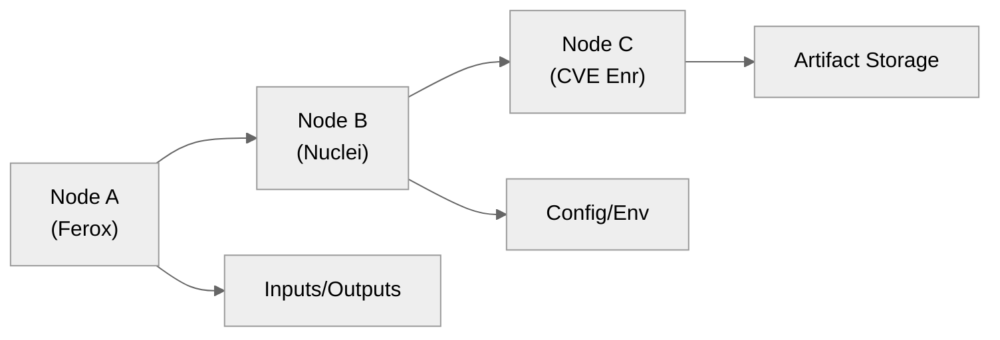
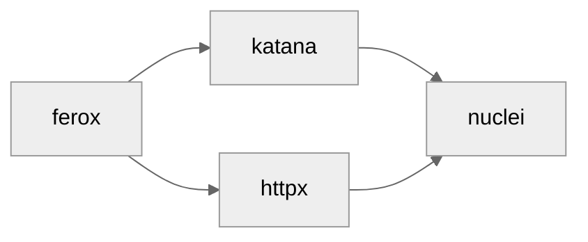

# 05 — Orchestration & Workflow Engine

## 🧭 Overview

The **Orchestration Engine** is the operational core of SecFlow.  
It executes *multi-tool workflows* composed of **discovery**, **scanning**, **filtering**, **enrichment**, and **analysis** stages.

Workflows are defined declaratively using **YAML recipes** and executed as **Directed Acyclic Graphs (DAGs)**.  
Each node represents a *tool invocation*, and edges define *data flow* between outputs and inputs.

---

## 🧱 Conceptual Model



Each node produces one or more datasets that can be consumed by downstream nodes.  
The workflow engine guarantees:
- Topological order of execution  
- Concurrent execution where possible  
- Automatic retries, timeouts, and logging per node  

---

## ⚙️ Workflow Specification Schema

```yaml
version: "1.0"
name: "OWASP Top 10 Scan"
description: "End-to-end test: discovery → scan → enrichment"

nodes:
  - id: "discovery"
    type: "discovery.ferox"
    config:
      wordlist: "res://wordlists/dirb:latest"
      threads: 50
    outputs: ["urls"]

  - id: "scan"
    type: "scan.nuclei"
    inputs: ["urls"]
    config:
      templates: "res://templates/owasp-top10:latest"
      rate_limit: 150
    outputs: ["findings"]

  - id: "enrich"
    type: "enrich.cve"
    inputs: ["findings"]
    config:
      sources: ["nvd", "osv", "exploitdb"]
    outputs: ["enriched_findings"]
```text

## 🧩 Workflow Engine Architecture

```text
+-------------------------------------------------------------+
|                         Worker Engine                       |
|-------------------------------------------------------------|
| - WorkflowScheduler                                          |
| - NodeExecutor                                               |
| - ResultCache                                                |
| - EventBus                                                   |
|-------------------------------------------------------------|
| Uses: Celery (Redis), asyncio, Pydantic validation           |
+-------------------------------------------------------------+
```text

### Key Components

| Component | Description |
|-----------|-------------|
| **WorkflowScheduler** | Parses YAML recipes, builds DAG, submits jobs to queue. |
| **NodeExecutor** | Executes nodes, manages subprocess wrappers. |
| **ResultCache** | Stores intermediate results between nodes. |
| **EventBus** | Publishes events (node_started, node_completed, workflow_failed). |
| **WorkflowStore** | Persists workflow metadata in DB. |

## ⚙️ Python Model — DAG Representation

```python
# findings-engine/workflow_dag.py
from typing import List, Dict, Any
from pydantic import BaseModel

class Node(BaseModel):
    id: str
    type: str
    config: Dict[str, Any] = {}
    inputs: List[str] = []
    outputs: List[str] = []

class Workflow(BaseModel):
    id: str
    name: str
    description: str
    nodes: List[Node]
```text

### DAG Validation Example
```python
def validate_dag(workflow: Workflow):
    ids = [n.id for n in workflow.nodes]
    for node in workflow.nodes:
        for inp in node.inputs:
            if inp not in [out for n in workflow.nodes for out in n.outputs]:
                raise ValueError(f"Unresolved input '{inp}' in node {node.id}")
```python

## 🧠 Execution Flow

1. Parse & Validate YAML workflow using Pydantic schema.
2. Register DAG in database (`WorkflowStore`).
3. Submit nodes to Celery/RQ queue respecting topological order.
4. Execute wrappers through `ToolPort` interface.
5. Normalize findings via `FindingsEngine`.
6. Publish events to `EventBus`.
7. Update metrics and trigger downstream listeners (e.g., triage UI).

## ⚙️ Node Executor (Simplified)

```python
# worker/executor.py
from core_lib.ports.tool_port import ToolPort

class NodeExecutor:
    def __init__(self, node, context):
        self.node = node
        self.context = context

    def run(self):
        tool: ToolPort = self.context.resolve_tool(self.node.type)
        tool.prepare(self.node.config)
        results = tool.execute()
        self.context.store_results(self.node.outputs, results)
        return results
```python

## 🔄 Concurrency Model

The orchestration engine is designed for asynchronous, multi-tool execution.

| Execution Mode | Description |
|----------------|-------------|
| **Sequential** | Enforced by DAG dependencies. |
| **Parallel** | Independent nodes run concurrently (async or Celery workers). |
| **Chained** | Output from one node auto-feeds into next via `ResultCache`. |

### Example


## 🧩 Error Handling

| Error Type | Handling Strategy |
|------------|-------------------|
| Tool crash / non-zero exit | Retry (max=3) then mark node failed. |
| Timeout | Kill process, log event, continue DAG. |
| Missing input dataset | Block downstream nodes, mark dependency unresolved. |
| Parser error | Log raw output, fallback to generic findings schema. |

Each failure is logged in the `workflow_runs` table and visible in the UI.

## 🧠 Event System

The orchestration layer publishes real-time events to facilitate reactive behavior.

### Example Event Contract
```json
{
  "event": "node_completed",
  "workflow_id": "abc123",
  "node_id": "scan",
  "duration": 12.3,
  "findings": 124
}
```python

Events can be consumed by:
- WebSocket clients in UI (live progress)
- Audit log processors
- Metrics collectors

## 🧩 Caching & Reuse

- **Intermediate Data:** Stored under `/cache/{workflow_id}/{node_id}.json`
- **ResultHashing:** SHA256 of config + inputs for cache hits
- **Warm Runs:** Workflows can resume from cached intermediate outputs

```python
cache_key = hashlib.sha256(json.dumps(node.config).encode()).hexdigest()
```text

## 🧱 Example DAG Execution Trace

```text
[2025-10-06 12:01:02] Workflow "OWASP Top 10 Scan" started
[2025-10-06 12:01:05] Node discovery.ferox completed (urls=356)
[2025-10-06 12:01:07] Node scan.nuclei completed (findings=112)
[2025-10-06 12:01:10] Node enrich.cve completed (enriched_findings=112)
[2025-10-06 12:01:10] Workflow completed successfully
```

## 🔌 Integration with Other Components

| Component | Interaction |
|-----------|-------------|
| **Findings Engine** | Receives raw output for normalization. |
| **Wrappers** | Execute the underlying binaries/tools. |
| **Storage** | Persists workflow runs, logs, results. |
| **Plugins** | Hooks into `on_node_complete` and `on_workflow_complete`. |
| **UI / API** | Subscribes to event bus for progress updates. |

## 🧩 Monitoring & Metrics

Every node execution reports:
- Duration (seconds)
- Findings count
- Exit status
- CPU/memory usage
- Cache hits

These metrics feed Prometheus exporters and the analytics dashboards.

## 🧠 Future Enhancements

- GraphQL-based workflow builder UI.
- Dynamic scheduling policies (priority, resource weighting).
- Conditional branching (if, switch nodes).
- AI-assisted workflow suggestions based on context and prior runs.
- Distributed orchestration using Celery groups/chords.

---

**Next:** [Plugin System](06-plugin-system.md)
```
```
```
```
```
```
```
```
```
```
```
```
```
```
```
```
```
```
