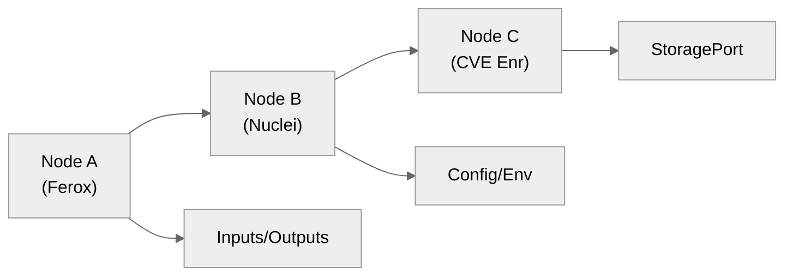
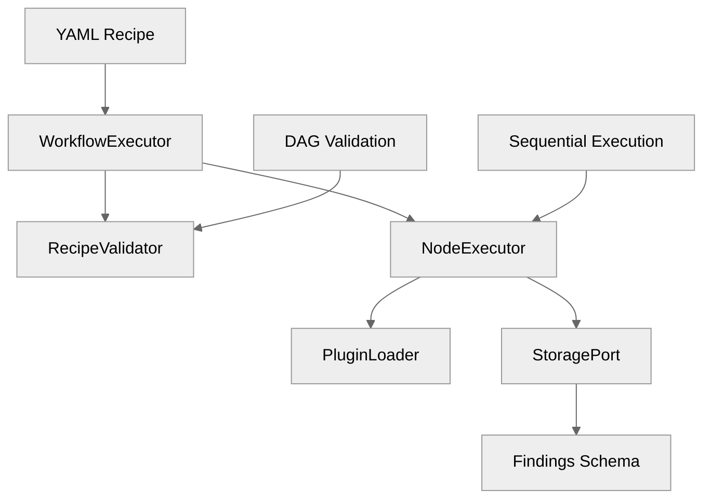
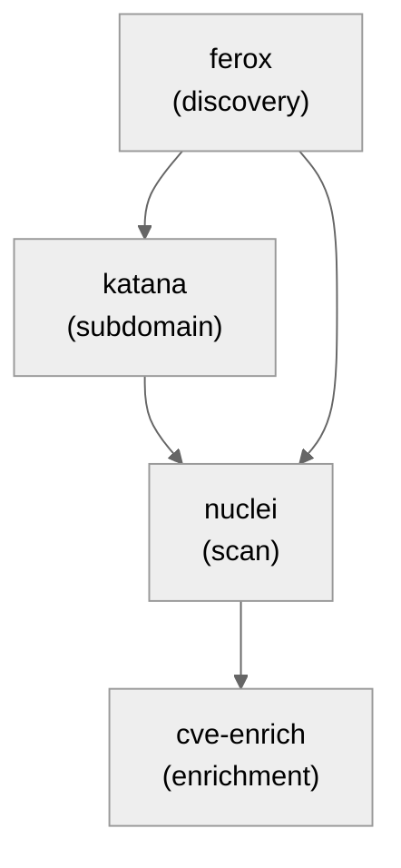

# 05 — Orchestration & Workflow Engine

## 🧭 Overview

The **Orchestration Engine** is the operational core of SecFlow.  
It executes *multi-tool workflows* composed of **discovery**, **scanning**, **filtering**, **enrichment**, and **analysis** stages.

Workflows are defined declaratively using **YAML recipes** and executed as **Directed Acyclic Graphs (DAGs)**.  
Each node represents a *tool invocation*, and edges define *data flow* between outputs and inputs.

**M1 Implementation Status**: ✅ **Complete** - Sequential execution, validation, retry logic, and plugin integration delivered.

**Note**: SecFlow executes workflow steps sequentially in M1 (parallel execution to be introduced in future versions).

---

## 🧱 Conceptual Model



Each node produces one or more datasets that can be consumed by downstream nodes.  
The workflow engine guarantees:
- Topological order of execution  
- Sequential execution (M1) with parallel execution planned for M3
- Automatic retries, timeouts, and logging per node  
- StoragePort integration for findings persistence

---

## ⚙️ Workflow Specification Schema (M1)

```yaml
version: "1.0"
name: "Linear Security Scan"
description: "Simple linear workflow: discovery → scan → enrichment"

nodes:
  - id: "discovery"
    type: "discovery.ferox"
    config:
      wordlist: "res://wordlists/dirb:latest"
      threads: 50
      timeout: 300
    outputs: ["urls"]

  - id: "scan"
    type: "scan.nuclei"
    inputs: ["urls"]
    config:
      templates: "res://templates/owasp-top10:latest"
      rate_limit: 150
      timeout: 600
    outputs: ["findings"]

  - id: "enrich"
    type: "enrich.cve"
    inputs: ["findings"]
    config:
      sources: ["nvd", "osv", "exploitdb"]
      timeout: 120
    outputs: ["enriched_findings"]

# Retry configuration
retry:
  max_attempts: 3
  backoff_factor: 2.0
  base_delay: 5.0

# State management
state:
  checkpoint_interval: 30
  resume_on_failure: true
  cache_intermediate: true
```

---

## 🧩 Workflow Engine Architecture (M1)



**M1 Components Delivered**:
- ✅ **WorkflowExecutor**: Parses YAML recipes, builds DAG, executes nodes sequentially
- ✅ **RecipeValidator**: Comprehensive validation with Pydantic schemas
- ✅ **NodeExecutor**: Executes individual nodes with retry logic and timeouts
- ✅ **PluginLoader**: Integrates with plugin system for tool execution
- ✅ **StoragePort Integration**: Uses StoragePort for findings persistence

---

## ⚙️ Python Model — DAG Representation (M1)

```python
# packages/workflow_engine/executor.py
from typing import Dict, List, Any, Optional
from pydantic import BaseModel
from dataclasses import dataclass, field

@dataclass
class NodeSpec:
    """Node specification for workflow execution."""
    id: str
    type: str
    params: Dict[str, Any] = field(default_factory=dict)
    requires: List[str] = field(default_factory=list)
    outputs: List[str] = field(default_factory=list)
    timeout_s: Optional[int] = None
    retries: int = 0
    retry_backoff_s: float = 0.5

@dataclass
class WorkflowSpec:
    """Workflow specification."""
    id: str
    name: str
    description: str
    nodes: List[NodeSpec]
    retry_config: Dict[str, Any] = field(default_factory=dict)
    state_config: Dict[str, Any] = field(default_factory=dict)

class WorkflowExecutor:
    """M1 Workflow Executor with sequential execution."""
    
    def __init__(self, storage: StoragePort = None):
        self.storage = storage or InMemoryStorageAdapter()
        self.plugin_loader = PluginLoader()
    
    def execute_workflow(self, workflow: WorkflowSpec) -> Dict[str, Any]:
        """Execute workflow with sequential node processing."""
        # M1: Sequential execution
        # M3: Parallel execution where dependencies allow
        pass
```

### DAG Validation Example (M1)
```python
def validate_dag(workflow: WorkflowSpec):
    """Validate workflow DAG structure."""
    ids = [n.id for n in workflow.nodes]
    
    # Check for cycles
    if has_cycles(workflow.nodes):
        raise ValueError("Workflow contains cycles")
    
    # Validate input/output references
    for node in workflow.nodes:
        for inp in node.requires:
            if inp not in [out for n in workflow.nodes for out in n.outputs]:
                raise ValueError(f"Unresolved input '{inp}' in node {node.id}")
    
    # Validate node types
    for node in workflow.nodes:
        if not is_valid_node_type(node.type):
            raise ValueError(f"Unknown node type: {node.type}")
```

---

## 🧠 Execution Flow (M1 Implementation)

1. **Parse & Validate** YAML workflow using Pydantic schema
2. **Build DAG** with topological ordering and dependency resolution
3. **Register Workflow** in execution context
4. **Execute Nodes Sequentially** respecting topological order
5. **Plugin Integration** via PluginLoader for tool execution
6. **Normalize Findings** via StoragePort with schema validation
7. **Update Metrics** and trigger downstream listeners

**M1 Execution Model**:
- **Sequential**: Nodes execute one after another in topological order
- **Retry Logic**: Configurable retry with exponential backoff
- **Timeout Handling**: Per-node timeout enforcement
- **Error Recovery**: Graceful failure handling with partial execution support

---

## ⚙️ Node Executor (M1 Implementation)

```python
# packages/workflow_engine/executor.py
class NodeExecutor:
    """M1 Node Executor with retry logic and timeout handling."""
    
    def __init__(self, node: NodeSpec, context: ExecutionContext):
        self.node = node
        self.context = context
        self.storage = context.storage
    
    def execute(self) -> Dict[str, Any]:
        """Execute node with retry logic and timeout handling."""
        for attempt in range(self.node.retries + 1):
            try:
                # Load plugin for node type
                plugin = self.context.plugin_loader.load(self.node.type)
                
                # Execute plugin with timeout
                result = self._execute_with_timeout(plugin)
                
                # Persist findings via StoragePort
                self._persist_findings(result)
                
                return result
                
            except TimeoutError:
                if attempt < self.node.retries:
                    delay = self.node.retry_backoff_s * (2 ** attempt)
                    time.sleep(delay)
                    continue
                raise
            except Exception as e:
                if attempt < self.node.retries:
                    delay = self.node.retry_backoff_s * (2 ** attempt)
                    time.sleep(delay)
                    continue
                raise
    
    def _execute_with_timeout(self, plugin: PluginInterface) -> Dict[str, Any]:
        """Execute plugin with timeout enforcement."""
        timeout = self.node.timeout_s or 300  # Default 5 minutes
        
        with timeout_context(timeout):
            return plugin.run(
                inputs=self.context.get_node_inputs(self.node),
                config=self.node.params,
                context=self.context
            )
    
    def _persist_findings(self, result: Dict[str, Any]) -> None:
        """Persist findings via StoragePort."""
        findings = result.get("findings", [])
        for finding in findings:
            # Ensure schema compliance
            finding["finding_schema_version"] = "1.0.0"
            self.storage.save_finding(finding)
```

---

## 🔄 Concurrency Model (M1 vs M3)

**M1 Implementation**: Sequential execution only
- Nodes execute one after another in topological order
- Dependencies are resolved before execution
- Simple error handling and retry logic
- Suitable for linear workflows and testing

**M3 Planned**: Parallel execution where dependencies allow
- Independent nodes run concurrently
- Dependency resolution with parallel execution
- Advanced error handling and recovery
- Event-driven architecture for real-time monitoring

### Example Sequential Execution (M1)


**Execution Order**: ferox → katana → nuclei → cve-enrich

---

## 🧩 Error Handling (M1)

| Error Type | Handling Strategy |
|------------|-------------------|
| Tool crash / non-zero exit | Retry (max=3) then mark node failed |
| Timeout | Kill process, log event, continue DAG |
| Missing input dataset | Block downstream nodes, mark dependency unresolved |
| Parser error | Log raw output, fallback to generic findings schema |
| Plugin load failure | Skip node, log warning, continue execution |

Each failure is logged with context and stored via StoragePort for analysis.

---

## 🧠 Event System (M1)

The orchestration layer publishes events for monitoring and debugging:

### Example Event Contract
```json
{
  "event": "node_completed",
  "workflow_id": "abc123",
  "node_id": "scan",
  "node_type": "scan.nuclei",
  "duration": 12.3,
  "findings_count": 124,
  "success": true,
  "timestamp": "2025-10-14T10:30:00Z"
}
```

Events can be consumed by:
- Logging systems for audit trails
- Metrics collectors for performance monitoring
- UI components for real-time progress (M3)

---

## 🧩 Caching & Reuse (M1)

- **Intermediate Data**: Stored via StoragePort with schema validation
- **Result Hashing**: SHA256 of config + inputs for cache hits
- **Warm Runs**: Workflows can resume from cached intermediate outputs

```python
def get_cache_key(node: NodeSpec, inputs: Dict[str, Any]) -> str:
    """Generate cache key for node execution."""
    config_hash = hashlib.sha256(json.dumps(node.params).encode()).hexdigest()
    input_hash = hashlib.sha256(json.dumps(inputs).encode()).hexdigest()
    return f"{node.id}:{config_hash}:{input_hash}"
```

---

## 🧱 Example DAG Execution Trace (M1)

```
[2025-10-14 12:01:02] Workflow "Linear Security Scan" started
[2025-10-14 12:01:05] Node discovery.ferox completed (urls=356)
[2025-10-14 12:01:07] Node scan.nuclei completed (findings=112)
[2025-10-14 12:01:10] Node enrich.cve completed (enriched_findings=112)
[2025-10-14 12:01:10] Workflow completed successfully
```

---

## 🔌 Integration with Other Components (M1)

| Component | Interaction |
|-----------|-------------|
| **Findings Engine** | Receives raw output for normalization via StoragePort |
| **Plugin System** | Executes plugins through PluginLoader interface |
| **Storage** | Persists workflow runs, logs, results via StoragePort |
| **Security** | Validates plugin signatures and enforces sandboxing |
| **Observability** | Publishes events and metrics for monitoring |

---

## 🧩 Monitoring & Metrics (M1)

Every node execution reports:
- Duration (seconds)
- Findings count
- Exit status
- Memory usage
- Cache hits
- Plugin execution details

These metrics are stored via StoragePort and available for analysis.

---

## 🧠 Future Enhancements (M3+)

- **Parallel Execution**: Concurrent node execution where dependencies allow
- **Event System**: Real-time event publishing and monitoring
- **Advanced Caching**: Intermediate result caching with persistence
- **GraphQL API**: Workflow builder UI integration
- **Dynamic Scheduling**: Priority and resource weighting
- **Conditional Branching**: if, switch nodes for complex workflows
- **AI-assisted Suggestions**: Workflow recommendations based on context

---

**Next:** [Plugin System](06-plugin-system.md)
```
```
```
```
```
```
```
```
```
```
```
```
```
```
```
```
```
```