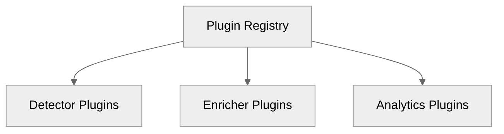
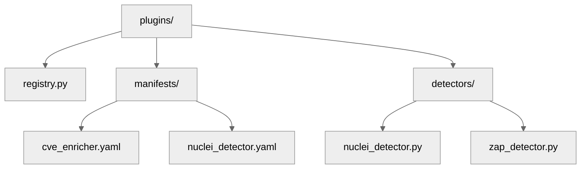

# 06 — Plugin System

## 🧭 Overview

The **Plugin System** in SecFlow provides an **extensible runtime** for integrating new detection, enrichment, or analytics capabilities without modifying core code.  
Plugins operate under a **controlled lifecycle** and interact through strictly defined **contracts (ports)**.

SecFlow supports three primary plugin categories:
1. **Detectors** — Introduce new scanning logic or post-processing steps.  
2. **Enrichers** — Add vulnerability metadata (CVE, CWE, CVSS, etc.).  
3. **Analytics** — Compute metrics, patterns, or visual insights over findings.

---

## 🧩 Design Principles

| Principle | Description |
|------------|-------------|
| **Isolation** | Each plugin runs in its own context (thread/process sandbox). |
| **Declarative Registration** | Plugins register via manifests or decorators. |
| **Contract Enforcement** | Plugins implement strict base interfaces (`PluginBase`, `DetectorPlugin`, etc.). |
| **Hot Reloading** | Plugin discovery occurs dynamically at startup. |
| **Safety** | Each plugin is validated, hashed, and versioned. |

---

## 🧱 Plugin Architecture Overview

```yaml
+-------------------------------------------------------------+
|                    Plugin Manager                           |
| - Registry                                                  |
| - Loader                                                    |
| - Validator                                                 |
| - Sandbox                                                   |
+-------------------------------------------------------------+


---

## ⚙️ Base Interfaces

```python
# core-lib/ports/plugin_port.py
from typing import Protocol, Any, Dict

class PluginPort(Protocol):
    name: str
    version: str
    category: str  # "detector" | "enricher" | "analytics"

    def initialize(self, context: Dict[str, Any]) -> None:
        """Initialize plugin with execution context."""
        pass
    
    def execute(self, data: Any) -> Any:
        """Execute plugin logic on input data."""
        pass
    
    def teardown(self) -> None:
        """Clean up plugin resources."""
        pass
```python

All plugins must subclass or conform to `PluginPort`.

## 🧩 Example Plugin Registry

```python
# plugins/registry.py
from typing import Dict, Type
from core_lib.ports.plugin_port import PluginPort

class PluginRegistry:
    _registry: Dict[str, Type[PluginPort]] = {}

    @classmethod
    def register(cls, name: str, plugin: Type[PluginPort]):
        cls._registry[name] = plugin
        print(f"[+] Registered plugin: {name}")

    @classmethod
    def get(cls, name: str) -> PluginPort:
        return cls._registry[name]

    @classmethod
    def list_plugins(cls):
        return list(cls._registry.keys())
```python

### Registration via Decorator
```python
def register_plugin(name: str):
    def decorator(cls):
        PluginRegistry.register(name, cls)
        return cls
    return decorator
```python

## 🧠 Plugin Lifecycle

1. **Registration:** Discovered from manifests or decorators.
2. **Validation:** Signature & schema verification.
3. **Initialization:** Context injected (paths, project ID, config).
4. **Execution:** Process data via `execute()`.
5. **Teardown:** Release resources, log metrics.

## 🧩 Plugin Manifest Specification

```yaml
name: nuclei-enricher
version: "1.0.0"
category: "enricher"
entrypoint: "plugins.nuclei_enricher:Enricher"
dependencies:
  - requests
  - cpe
config_schema: "schemas/nuclei_enricher.json"
sandbox: true
```python

Each manifest is stored under `/plugins/manifests/` and validated on startup.

## ⚙️ Example — CVE Enricher Plugin

```python
# plugins/nuclei_enricher.py
import requests
from core_lib.models.finding import Finding
from core_lib.ports.plugin_port import PluginPort

@register_plugin("cve_enricher")
class CVEEnricher(PluginPort):
    name = "cve_enricher"
    version = "1.0.0"
    category = "enricher"

    def initialize(self, context):
        self.sources = context.get("sources", ["nvd"])

    def execute(self, finding: Finding) -> Finding:
        for cve_id in finding.cve_ids:
            data = self._fetch_cve_data(cve_id)
            finding.enrichment["cve"][cve_id] = data
        return finding

    def _fetch_cve_data(self, cve_id):
        return requests.get(f"https://services.nvd.nist.gov/rest/json/cve/1.0/{cve_id}").json()

    def teardown(self):
        pass
```yaml

## 🔐 Sandbox Model

Each plugin executes inside a restricted environment:

| Control | Enforcement |
|---------|-------------|
| **Filesystem** | Read-only mount or temp directory |
| **Network** | Denied by default, opt-in per manifest |
| **Memory / CPU** | Controlled via subprocess resource limits |
| **Timeouts** | Enforced via execution wrapper |
| **Audit** | Every plugin invocation logged with context |

## 🧩 Plugin Discovery

### Directory Layout
```python
plugins/
```



### Discovery Algorithm
```python
def discover_plugins():
    for manifest in Path("plugins/manifests").glob("*.yaml"):
        data = yaml.safe_load(manifest.read_text())
        entrypoint = import_string(data["entrypoint"])
        PluginRegistry.register(data["name"], entrypoint)
```python

## 🧠 Plugin Telemetry

Each plugin emits lifecycle events:

```json
{
  "event": "plugin_executed",
  "plugin": "cve_enricher",
  "duration_ms": 342,
  "memory_mb": 42,
  "success": true
}
```json

Telemetry is captured by the Observability subsystem (see [Observability, Logging & Metrics](17-observability-logging-and-metrics.md)).

## 🧩 Error Handling

| Error | Strategy |
|-------|----------|
| Invalid Manifest | Skip plugin, log warning. |
| Dependency ImportError | Attempt isolated install if allowed. |
| Execution Timeout | Abort plugin, mark node partial-success. |
| Sandbox Violation | Terminate process, revoke plugin signature. |

## 🧠 Example End-to-End Plugin Flow

```text
[Plugin Manifest] → [Registry Register] → [Initialize] 
      ↓                       ↓                   ↓
 [Execute via Port] → [Telemetry + Logging] → [Teardown]
```

## 🔮 Future Enhancements

- Plugin signing (PGP signatures).
- Remote plugin repository (index + version resolution).
- In-UI plugin store with validation and ratings.
- Plugin telemetry aggregation dashboards.

---

**Next:** [Tools Integration Model](07-tools-integration-model.md)
```
```
```
```
```
```
```
```
```
```
```
```
```
```
```
```
```
```
