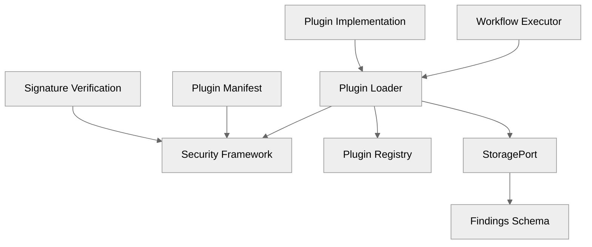
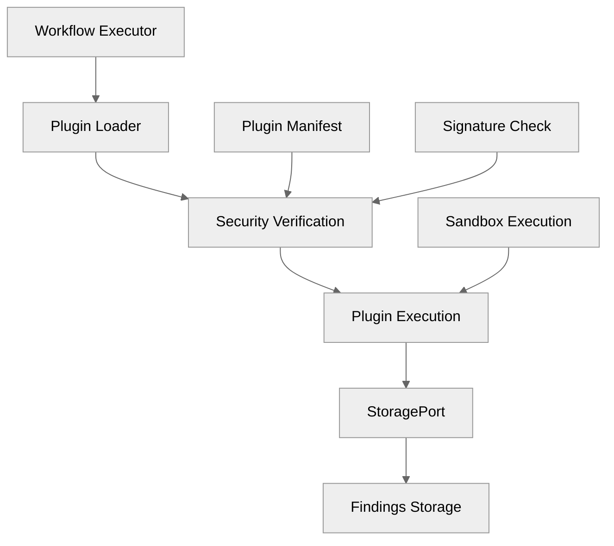

# 06 — Plugin System

## 🧭 Overview

The **Plugin System** in SecFlow provides an **extensible runtime** for integrating new detection, enrichment, or analytics capabilities without modifying core code.  
Plugins operate under a **controlled lifecycle** and interact through strictly defined **contracts (ports)**.

SecFlow supports three primary plugin categories:
1. **Detectors** — Introduce new scanning logic or post-processing steps.  
2. **Enrichers** — Add vulnerability metadata (CVE, CWE, CVSS, etc.).  
3. **Analytics** — Compute metrics, patterns, or visual insights over findings.

**M1 Implementation Status**: ✅ **Complete** - Plugin loader, security framework, and stub implementations delivered.

---

## 🧩 Design Principles

| Principle | Description |
|------------|-------------|
| **Isolation** | Each plugin runs in its own context (thread/process sandbox). |
| **Declarative Registration** | Plugins register via manifests or decorators. |
| **Contract Enforcement** | Plugins implement strict base interfaces (`PluginInterface`, `PluginMetadata`, etc.). |
| **Hot Reloading** | Plugin discovery occurs dynamically at startup. |
| **Security** | Each plugin is validated, signed, and sandboxed for safe execution. |

---

## 🧱 Plugin Architecture Overview



**M1 Components Delivered**:
- ✅ **PluginLoader**: Dynamic plugin discovery and loading
- ✅ **Security Framework**: Signature verification and sandboxing
- ✅ **PluginInterface**: Standard contract for all plugins
- ✅ **StoragePort Integration**: Findings persistence via StoragePort
- ✅ **Stub Implementations**: CVEMapper, FeroxStub, NucleiStub plugins

---

## ⚙️ Plugin Interface (M1 Implementation)

```python
# packages/plugins/loader.py
from abc import ABC, abstractmethod
from typing import Dict, Any, Optional
from dataclasses import dataclass

@dataclass
class PluginMetadata:
    """Plugin metadata information."""
    name: str
    version: str
    description: str
    author: str
    category: str  # "detector" | "enricher" | "analytics"
    entrypoint: str
    dependencies: list = None
    config_schema: Optional[Dict[str, Any]] = None

class PluginInterface(ABC):
    """Abstract base class that all plugins must implement."""
    
    @abstractmethod
    def get_name(self) -> str:
        """Get plugin name."""
        pass
    
    @abstractmethod
    def get_version(self) -> str:
        """Get plugin version."""
        pass
    
    @abstractmethod
    def get_metadata(self) -> PluginMetadata:
        """Get plugin metadata."""
        pass
    
    @abstractmethod
    def run(self, inputs: Dict[str, Any], config: Dict[str, Any], 
            context: ExecutionContext) -> Dict[str, Any]:
        """Execute plugin logic on input data."""
        pass
    
    def verify_signature(self) -> bool:
        """Verify plugin signature if present."""
        # M1: Basic signature verification
        # M2+: Full cryptographic verification
        pass
```

All plugins must implement `PluginInterface` and provide proper metadata.

---

## 🔐 Security Model (M1 Implementation)

### Plugin Signing & Verification

**M1 Security Features**:
- ✅ **Hash-based Verification**: SHA256 checksums for plugin integrity
- ✅ **Manifest Validation**: JSON schema validation for plugin manifests
- ✅ **Sandbox Execution**: Controlled execution environment
- ✅ **Audit Logging**: Comprehensive security event logging

```python
# security/signing.py
@dataclass
class PluginManifest:
    """Plugin manifest with signature information."""
    name: str
    version: str
    description: str
    author: str
    entrypoint: str
    code_hash: str
    signature: Optional[str] = None
    signature_type: str = "sha256"  # M1: hash-based, M2+: RSA/ECDSA
    created_at: str = None
    expires_at: Optional[str] = None

class PluginSignatureVerifier:
    """Plugin signature verification for M1."""
    
    def verify_plugin_signature(self, manifest: PluginManifest, 
                               plugin_path: str) -> bool:
        """Verify plugin signature using hash-based verification."""
        # M1: SHA256 hash verification
        # M2+: Full cryptographic signature verification
        pass
```

### Sandbox Model

Each plugin executes inside a restricted environment:

| Control | Enforcement |
|---------|-------------|
| **Filesystem** | Read-only mount or temp directory |
| **Network** | Denied by default, opt-in per manifest |
| **Memory / CPU** | Controlled via subprocess resource limits |
| **Timeouts** | Enforced via execution wrapper |
| **Audit** | Every plugin invocation logged with context |

---

## 🧩 Plugin Discovery & Loading (M1)

### Directory Layout
```
packages/plugins/
├── loader.py              # PluginLoader implementation
├── registry.py            # Plugin registry
├── security/              # Security framework
│   ├── signing.py         # Signature verification
│   ├── sandbox.py         # Sandbox execution
│   └── audit_logging.py   # Security audit logs
└── stubs/                 # M1 stub implementations
    ├── cve_mapper.py      # CVE enrichment plugin
    ├── ferox_stub.py      # Feroxbuster discovery
    └── nuclei_stub.py     # Nuclei scanning
```

### Discovery Algorithm
```python
def discover_plugins():
    """Discover and load plugins dynamically."""
    for manifest_file in Path("packages/plugins/manifests").glob("*.json"):
        manifest_data = json.loads(manifest_file.read_text())
        manifest = PluginManifest(**manifest_data)
        
        # Verify signature
        if not verify_plugin_signature(manifest, plugin_path):
            logger.warning(f"Plugin {manifest.name} signature verification failed")
            continue
            
        # Load plugin
        plugin = load_plugin_class(manifest.entrypoint)
        PluginRegistry.register(manifest.name, plugin)
```

---

## 🧠 Plugin Lifecycle (M1 Implementation)

1. **Discovery**: Scan manifests directory for plugin definitions
2. **Validation**: Verify signatures and validate manifests
3. **Registration**: Register plugins in PluginRegistry
4. **Initialization**: Create plugin instances with execution context
5. **Execution**: Process data via `run()` method with StoragePort integration
6. **Teardown**: Release resources, log metrics

---

## 🧩 Plugin Manifest Specification (M1)

```json
{
  "name": "cve-mapper",
  "version": "1.0.0",
  "description": "CVE enrichment plugin for vulnerability findings",
  "author": "SecFlow Team",
  "category": "enricher",
  "entrypoint": "packages.plugins.stubs.cve_mapper:CVEMapperPlugin",
  "dependencies": ["requests", "cpe"],
  "config_schema": {
    "sources": {
      "type": "array",
      "items": {"type": "string"},
      "default": ["nvd", "osv"]
    },
    "timeout": {
      "type": "integer",
      "default": 30
    }
  },
  "code_hash": "sha256:abc123...",
  "signature": "sha256:def456...",
  "created_at": "2025-10-14T10:00:00Z",
  "expires_at": "2026-10-14T10:00:00Z"
}
```

Each manifest is stored under `/packages/plugins/manifests/` and validated on startup.

---

## ⚙️ Example — CVE Mapper Plugin (M1 Stub)

```python
# packages/plugins/stubs/cve_mapper.py
from packages.plugins.loader import PluginInterface, PluginMetadata
from packages.runtime_core.storage.storage_port import StoragePort
from typing import Dict, Any

class CVEMapperPlugin(PluginInterface):
    """CVE enrichment plugin - M1 stub implementation."""
    
    def get_name(self) -> str:
        return "cve-mapper"
    
    def get_version(self) -> str:
        return "1.0.0"
    
    def get_metadata(self) -> PluginMetadata:
        return PluginMetadata(
            name="cve-mapper",
            version="1.0.0",
            description="CVE enrichment plugin for vulnerability findings",
            author="SecFlow Team",
            category="enricher",
            entrypoint="packages.plugins.stubs.cve_mapper:CVEMapperPlugin"
        )
    
    def run(self, inputs: Dict[str, Any], config: Dict[str, Any], 
            context: ExecutionContext) -> Dict[str, Any]:
        """Enrich findings with CVE data."""
        findings = inputs.get("findings", [])
        sources = config.get("sources", ["nvd", "osv"])
        
        enriched_findings = []
        for finding in findings:
            # M1: Use golden sample data
            # M2+: Real CVE API calls
            enriched_finding = self._enrich_with_cve_data(finding, sources)
            enriched_findings.append(enriched_finding)
        
        return {"enriched_findings": enriched_findings}
    
    def _enrich_with_cve_data(self, finding: Dict[str, Any], 
                              sources: list) -> Dict[str, Any]:
        """Enrich finding with CVE data from golden samples."""
        # M1: Return golden sample data
        # M2+: Make real API calls to CVE databases
        return {
            **finding,
            "cve_details": {
                "cve_id": "CVE-2023-1234",
                "cvss_score": 7.5,
                "description": "Sample CVE description",
                "sources": sources
            }
        }
```

---

## 🔌 StoragePort Integration

Plugins integrate with the StoragePort interface for findings persistence:

```python
# Plugin execution with StoragePort
def execute_plugin_with_storage(plugin: PluginInterface, 
                                inputs: Dict[str, Any],
                                storage: StoragePort) -> Dict[str, Any]:
    """Execute plugin and persist findings via StoragePort."""
    
    # Execute plugin
    results = plugin.run(inputs, config, context)
    
    # Persist findings via StoragePort
    findings = results.get("findings", [])
    for finding in findings:
        # Ensure finding has schema version
        finding["finding_schema_version"] = "1.0.0"
        storage.save_finding(finding)
    
    return results
```

**Finding Schema Integration**:
- All findings must include `finding_schema_version: "1.0.0"`
- Findings are validated against `schemas/finding.json`
- StoragePort enforces schema compliance

---

## 🧠 Plugin Telemetry & Monitoring

Each plugin emits lifecycle events for observability:

```json
{
  "event": "plugin_executed",
  "plugin": "cve-mapper",
  "version": "1.0.0",
  "duration_ms": 342,
  "memory_mb": 42,
  "findings_processed": 15,
  "success": true,
  "timestamp": "2025-10-14T10:30:00Z"
}
```

Telemetry is captured by the Observability subsystem and stored via StoragePort.

---

## 🧩 Error Handling

| Error | Strategy |
|-------|----------|
| Invalid Manifest | Skip plugin, log warning, continue execution |
| Dependency ImportError | Attempt isolated install if allowed |
| Execution Timeout | Abort plugin, mark node partial-success |
| Sandbox Violation | Terminate process, revoke plugin signature |
| Signature Verification Failure | Block plugin execution, log security event |

---

## 🧠 Example End-to-End Plugin Flow (M1)



**Execution Steps**:
1. **Workflow Executor** requests plugin execution
2. **Plugin Loader** discovers and loads plugin
3. **Security Verification** validates signature and manifest
4. **Plugin Execution** runs in sandboxed environment
5. **StoragePort** persists findings with schema validation
6. **Findings Storage** stores enriched data

---

## 🔮 Future Enhancements (M2+)

- **Full Cryptographic Signing**: RSA/ECDSA signature verification
- **Remote Plugin Repository**: Index + version resolution
- **In-UI Plugin Store**: Validation and ratings
- **Plugin Telemetry Dashboards**: Aggregated metrics and insights
- **Advanced Sandboxing**: Container-based isolation
- **Plugin Dependencies**: Automatic dependency resolution

---

**Next:** [Tools Integration Model](07-tools-integration-model.md)
```
```
```
```
```
```
```
```
```
```
```
```
```
```
```
```
```
```