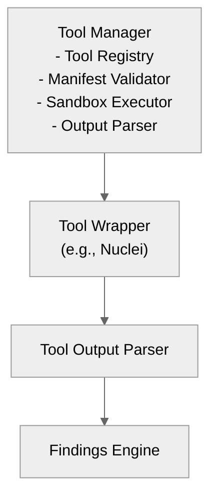

# 07 — Tools Integration Model

## 🧭 Overview

The **Tools Integration Model** defines how external security tools (Nuclei, Feroxbuster, Katana, ZAP, Caido, etc.) are integrated and orchestrated inside **SecFlow**.

The system is **manifest-driven**, allowing tools to be defined declaratively, executed in isolation, and chained dynamically via the Workflow Engine.

Each integrated tool is represented as:
- A **manifest** (describes binary, configuration, security policies, I/O schema)
- A **wrapper** (implements the standardized execution interface)
- An optional **adapter plugin** (translates output to normalized Findings)

---

## 🧱 Architectural Overview



---

## ⚙️ Tool Manifest Structure

Every tool integrated into SecFlow must define a **manifest** under `/wrappers/manifests/<tool>.json`.

### Example: `nuclei.json`
```json
{
  "name": "nuclei",
  "version": "3.2.1",
  "binary": "nuclei",
  "capabilities": ["scan"],
  "outputs": {"dataset": "findings"},
  "defaults": {
    "threads": 25,
    "rate_limit": 150,
    "templates": "res://templates/nuclei:latest"
  },
  "configSchema": "schemas/nuclei-config.json",
  "resource_requirements": {
    "cpu_cores": 2,
    "memory_mb": 512,
    "timeout_seconds": 300
  },
  "security": {
    "sandbox": true,
    "network_access": true,
    "file_system_access": "read_only"
  },
  "selftest": {
    "args": ["-version"],
    "expect": "Nuclei"
  }
}
```python

## 🧩 Wrapper Interface

All tool wrappers implement the same contract to ensure consistent orchestration.

```python
# core-lib/ports/tool_port.py
from typing import Any, Dict, Protocol, List
from core_lib.models.finding import Finding

class ToolPort(Protocol):
    def prepare(self, config: Dict[str, Any]) -> None:
        """Prepare tool with configuration."""
        pass
    
    def run(self) -> str:
        """Execute tool and return raw output."""
        pass
    
    def parse_output(self, raw_output: str) -> List[Finding]:
        """Parse raw output into structured findings."""
        pass
```python

## 🧠 Example Implementation: Nuclei Wrapper

```python
# wrappers/nuclei_wrapper.py
import subprocess, json
from core_lib.models.finding import Finding
from core_lib.ports.tool_port import ToolPort

class NucleiWrapper(ToolPort):
    def __init__(self, config):
        self.config = config

    def prepare(self, config):
        self.args = [
            "nuclei", "-json",
            "-t", config.get("templates", "res://templates/nuclei:latest"),
            "-rl", str(config.get("rate_limit", 150)),
            "-c", str(config.get("threads", 25))
        ]

    def run(self):
        result = subprocess.run(self.args, capture_output=True, text=True, timeout=300)
        return result.stdout

    def parse_output(self, raw_output):
        findings = []
        for line in raw_output.splitlines():
            try:
                data = json.loads(line)
                findings.append(
                    Finding(
                        title=data["info"]["name"],
                        severity=data["info"]["severity"],
                        path=data["matched-at"],
                        detector_id="nuclei",
                        evidence=data
                    )
                )
            except Exception:
                continue
        return findings
```python

## 🔐 Sandbox Execution

Tools run through a Sandbox Executor, enforcing CPU, memory, and network constraints.

```python
# wrappers/executor.py
import resource, subprocess, signal

class SandboxExecutor:
    def __init__(self, cpu_limit=2, mem_limit_mb=512):
        self.cpu_limit = cpu_limit
        self.mem_limit_mb = mem_limit_mb

    def execute(self, args):
        def set_limits():
            resource.setrlimit(resource.RLIMIT_CPU, (self.cpu_limit, self.cpu_limit))
            resource.setrlimit(resource.RLIMIT_AS, (self.mem_limit_mb * 1024**2,) * 2)

        proc = subprocess.Popen(args, preexec_fn=set_limits, stdout=subprocess.PIPE, stderr=subprocess.PIPE)
        stdout, stderr = proc.communicate(timeout=300)
        return stdout.decode(), stderr.decode(), proc.returncode
```python

## 🧩 Tool Registry

```python
# wrappers/registry.py
from typing import Dict, Type
from core_lib.ports.tool_port import ToolPort

class ToolRegistry:
    _registry: Dict[str, Type[ToolPort]] = {}

    @classmethod
    def register(cls, name: str, impl: Type[ToolPort]):
        cls._registry[name] = impl
        print(f"[+] Registered tool: {name}")

    @classmethod
    def get(cls, name: str) -> ToolPort:
        return cls._registry[name]
```python

Tools register via decorators or discovery:

```python
from wrappers.registry import ToolRegistry

@ToolRegistry.register("feroxbuster")
class FeroxWrapper(ToolPort):
    def prepare(self, config: Dict[str, Any]) -> None:
        self.wordlist = config.get("wordlist", "res://wordlists/dirb:latest")
        self.threads = config.get("threads", 50)
    
    def run(self) -> str:
        cmd = ["feroxbuster", "-u", self.target, "-w", self.wordlist, "-t", str(self.threads)]
        result = subprocess.run(cmd, capture_output=True, text=True)
        return result.stdout
    
    def parse_output(self, raw_output: str) -> List[Finding]:
        findings = []
        for line in raw_output.split('\n'):
            if line.strip() and not line.startswith('#'):
                findings.append(Finding(
                    id=f"ferox_{hash(line)}",
                    url=line.strip(),
                    tool="feroxbuster",
                    severity="info"
                ))
        return findings
```python

## 🧠 Example Integration — Feroxbuster

```python
# wrappers/ferox_wrapper.py
import subprocess
from core_lib.models.finding import Finding

class FeroxWrapper(ToolPort):
    def prepare(self, config):
        self.target = config["target"]
        self.wordlist = config.get("wordlist", "/usr/share/wordlists/dirb/common.txt")
        self.args = ["feroxbuster", "-u", self.target, "-w", self.wordlist, "-o", "-"]

    def run(self):
        result = subprocess.run(self.args, capture_output=True, text=True)
        return result.stdout

    def parse_output(self, raw):
        findings = []
        for line in raw.splitlines():
            if "200" in line or "301" in line:
                findings.append(
                    Finding(
                        title="Discovered Path",
                        severity="info",
                        path=line.split()[0],
                        detector_id="feroxbuster"
                    )
                )
        return findings
```text

## 🧩 Tool Orchestration

The Workflow Engine dynamically chains tool executions:
- Each node defines a tool (by name), configuration, and expected outputs.
- Outputs become inputs for subsequent nodes.

### Example:
```yaml
nodes:
  - id: discovery
    type: discovery.ferox
    config:
      wordlist: res://wordlists/dirb:latest
    outputs: ["urls"]

  - id: scan
    type: scan.nuclei
    inputs: ["urls"]
    outputs: ["findings"]
```

## 🧠 Tool Output Normalization

All tool outputs are normalized into the Finding schema before storage.

| Field | Description |
|-------|-------------|
| detector_id | Tool name (e.g., nuclei, zap) |
| title | Human-readable description |
| path | Target or endpoint |
| severity | Normalized (critical/high/medium/low/info) |
| evidence | Raw tool output |
| created_at | UTC timestamp |
| provenance | Manifest + execution context |

## 🧩 Error Handling

| Condition | Behavior |
|-----------|----------|
| Tool binary missing | Raise `ToolNotFoundError` |
| Sandbox violation | Terminate subprocess |
| Timeout | Abort execution, mark partial-success |
| Parse failure | Skip line, log warning |
| Non-zero exit code | Log and attach stderr to run context |

## 🔮 Future Extensions

- Interactive tool chaining (UI-based pipeline builder)
- Tool profiles for project-specific setups
- Remote execution agents (distributed scanning)
- Version-aware compatibility checks
- Auto-updating manifests (self-test validation)

---

**Next:** [Tool Manager & User Experience Design](08-tool-manager-and-ux-design.md)
```
```
```
```
```
```
```
```
```
```
```
```
```
```
```
```
