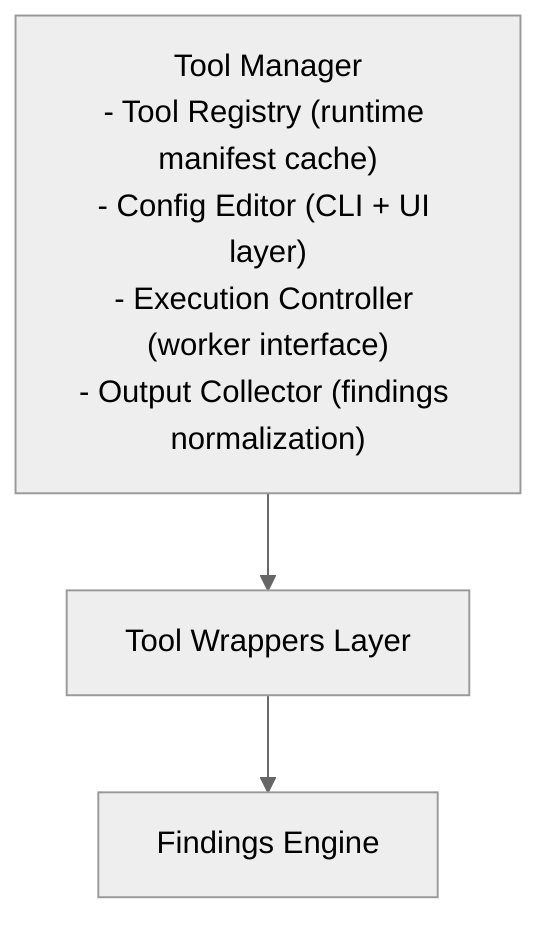
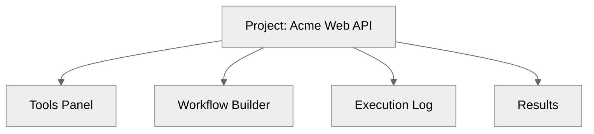
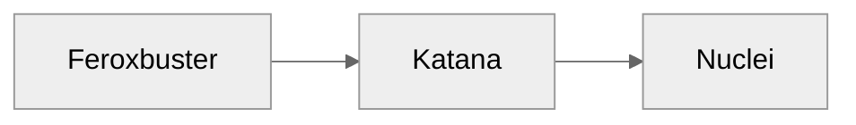

# 08 — Tool Manager & User Experience Design

## 🧭 Overview

The **Tool Manager** serves as the central orchestration and configuration interface for all integrated tools (Nuclei, Feroxbuster, Katana, ZAP, Caido, etc.).  
It acts as the *human-facing control plane* that bridges declarative configuration, project-level defaults, and the automated orchestration engine.

The **UX design** ensures that both CLI users and UI users can:
- Install or enable tools dynamically.  
- Configure tool parameters or use defaults.  
- Chain tools together (e.g., *Ferox → Katana → Nuclei*).  
- Reuse shared wordlists, payloads, and templates.  
- View and modify execution pipelines visually or textually.

---

## 🧩 Architecture Overview



---

## ⚙️ Tool Manager Responsibilities

| Subsystem | Responsibility |
|------------|----------------|
| **Registry** | Keeps in-memory registry of available tools with metadata. |
| **Configurator** | Provides unified interface for tool configuration & validation. |
| **Executor** | Handles actual subprocess calls via `SandboxExecutor`. |
| **Cache Layer** | Stores tool state, results, and logs for replay. |
| **Renderer** | Generates UI/CLI views for configuration and results. |

---

## 🧱 UX Goals

| Goal | Description |
|------|-------------|
| **Low Friction** | User can run default scans without prior configuration. |
| **Transparency** | Full visibility into command-line arguments, logs, and results. |
| **Reusability** | Configurations and results can be reused across projects. |
| **Isolation** | Each project may have independent or shared tool setups. |
| **Extensibility** | Easy to add new tools through manifests. |

---

## 🧠 CLI Experience

### Example Commands
```
# List available tools
SecFlow tools list

# Enable Feroxbuster & Nuclei
SecFlow tools enable feroxbuster nuclei

# Configure a tool
SecFlow tools config nuclei --threads 50 --templates owasp-top10

# Run workflow interactively
SecFlow run workflow.yaml

# Chain tools manually
SecFlow run feroxbuster --target https://example.com | SecFlow run nuclei
```

### CLI UX Principles
- YAML/JSON inputs mirror internal manifests.
- All commands are idempotent — re-runs use cached configurations.
- CLI supports both single-tool and multi-node workflow modes.

## 🧠 Web UI Experience

### Visual Overview
```
Project: Acme Web API
```



### Key Panels

| Panel | Description |
|-------|-------------|
| **Tools Panel** | Shows installed tools, version, manifest, health check. |
| **Workflow Builder** | Drag-and-drop DAG composer (Ferox → Katana → Nuclei). |
| **Execution Log** | Real-time stdout/stderr stream with structured logging. |
| **Results Viewer** | Interactive findings dashboard, linked to triage view. |

### Example Workflow Builder Nodes
```
  (Discovery)          (Crawler)            (Scanner)
```



Users can:
- Configure node properties via sidebar.
- Save and export workflows as YAML (`workflow-recipe.yaml`).
- Re-run saved workflows directly or modify them visually.

## 🧩 Configuration Persistence

Each tool has a persistent JSON/YAML config stored under:

```
~/.SecFlow/config/tools/<tool>.yaml
```

### Example
```
version: "1.0"
defaults:
  threads: 25
  rate_limit: 150
  templates: res://templates/nuclei:latest
profiles:
  aggressive:
    rate_limit: 300
  safe:
    rate_limit: 50
    sandbox: true
```

Profiles allow contextual configurations (e.g., "aggressive", "safe").

## 🔗 Tool Chaining (Runtime)

Tool chaining uses the Workflow Engine, but users can also trigger ad-hoc sequences.
Each output dataset is normalized as JSON Lines, allowing flexible piping.

```
SecFlow run feroxbuster --target https://app.local \
| SecFlow run katana --stdin \
| SecFlow run nuclei --stdin
```

### Data interoperability:
Each tool must produce output in a structured JSON format with required fields:

```
{
  "url": "https://example.com/login",
  "status": 200,
  "source": "feroxbuster"
}
```

## 🧩 Default Configurations & Templates

When the user installs SecFlow:
- Default manifests are loaded from `/resources/defaults/`
- All core tools (Nuclei, Ferox, Katana) have pre-configured templates.
- The user can immediately run scans without extra setup.

### Example command:
```
SecFlow quickscan https://example.com
```

Equivalent to:
- **Workflow:** Ferox → Nuclei (OWASP templates)

## 🧠 Advanced Features

| Feature | Description |
|---------|-------------|
| **Auto-Discovery** | Detects installed binaries and populates manifest registry automatically. |
| **Tool Self-Test** | Validates binary presence and functionality via manifest-defined tests. |
| **Runtime Profiles** | Switch between safe/aggressive scanning modes. |
| **Execution History** | Stores past runs and parameters for reproducibility. |

## 🔐 User Permissions

Tool Manager respects project and role isolation:

| Role | Capabilities |
|------|-------------|
| **Admin** | Install, configure, delete tools. |
| **Analyst** | Execute workflows, view logs, triage findings. |
| **Viewer** | Read-only access to results. |

All actions are logged to the Audit Log.

## 🧱 Integration with Resource Registry

The Tool Manager automatically pulls shared wordlists, templates, or payloads from the Resource Registry (see [09-resource-registry.md](09-resource-registry.md)).

### Example:
```
wordlist: res://wordlists/dirb:latest
templates: res://templates/nuclei:latest
```

## 🧩 Error Recovery UX

If a tool fails:
- The UI highlights failed nodes in red.
- Logs show stderr output inline.
- Users can retry individual nodes.
- Failures generate a triage entry (finding type = "tool error").

## 🧠 Example CLI Session

```
# Add Ferox with a project-local override wordlist
secflow tools add ferox \
  --version 2.10.0 \
  --scope project \
  --config '{ "wordlist": "res://wordlists/raft-medium-directories.txt", "threads": 64 }'

# Run a two-node workflow directly from CLI (discovery → nuclei)
secflow run \
  --project acme-web \
  --recipe workflows/discovery-to-nuclei.yaml \
  --var target=https://app.acme.com
```

### API Response Example

```
{
  "tool": "feroxbuster",
  "version": "2.10.0",
  "scope": "project",
  "effective_config": {
    "wordlist": "res://wordlists/raft-medium-directories.txt",
    "threads": 64,
    "rate_limit": 0
  },
  "status": "installed",
  "selftest": { "ok": true, "elapsed_ms": 143 }
}
```

## 🔮 Future Enhancements

- UI-based "Workflow Marketplace" for community templates.
- AI-assisted tool parameter tuning based on context.
- Live terminal dashboard with interactive progress visualization.
- Integration with Burp/OWASP ZAP APIs for direct import.

---

**Next:** [Resource Registry](09-resource-registry.md)
```
```
```
```
```
```
```
```
```
```
```
```
```
```
```
```
```
```
```
```
```
```
```
```