# 10 — Wordlist & Output Sharing Rules

## 🧭 Overview

One of SecFlow's key strengths is **inter-tool resource sharing** —  
allowing different scanners and discovery tools to reuse **wordlists**, **templates**, and **output datasets** through a unified and versioned Resource Registry.

This enables workflows like:


Each step consumes outputs and produces standardized findings that can be reused in subsequent stages — without manual conversions or reconfiguration.

---

## 🧱 Design Objectives

| Objective | Description |
|------------|-------------|
| **Shared Wordlists** | All tools can reference the same library of wordlists. |
| **Isolated Overrides** | Each tool may override global wordlists with project-specific ones. |
| **Consistent Output Contracts** | Every wrapper emits normalized JSON output. |
| **Dataset Interoperability** | Discovery results from one tool can feed another automatically. |
| **Performance Efficiency** | Cached resources and deduplication prevent redundant I/O. |

---

## ⚙️ Wordlist Management Flow


Each execution context resolves wordlists from the **Resource Registry**, fetching them locally if needed.

---

## 🧩 Shared Wordlist Schema

```yaml
id: res://wordlists/dirb:1.2.0
type: wordlist
scope: global
metadata:
  description: "Common web directory wordlist"
  format: "text"
  size: 24312
```yaml

### Usage Example
```yaml
tools:
  feroxbuster:
    wordlist: res://wordlists/dirb:latest
  nuclei:
    templates: res://templates/owasp-top10:latest
```yaml

At runtime, SecFlow resolves these resources to absolute paths and injects them into each wrapper.

## 🧠 Multi-Scope Selection Logic

### 1. Run-Level Override
Supplied directly in the workflow recipe or CLI argument.

**Example:**
```bash
SecFlow run feroxbuster --wordlist ./private.txt
```bash

### 2. Node-Level Configuration
Declared inside workflow YAML.

**Example:**
```yaml
nodes:
  - id: ferox
    type: discovery.ferox
    config:
      wordlist: res://wordlists/dirb:1.0
```yaml

### 3. Project Default
Stored under `~/.SecFlow/projects/<id>/config.yaml`.

### 4. Group Default
Shared among organizational units or red-team groups.

### 5. Global Default
Fallback resource available for all users.

## 🧠 Tool-Specific Overrides

Each wrapper can define preferred wordlists and formats in its manifest.

### Example (feroxbuster.json):
```json
{
  "defaults": {
    "wordlist": "res://wordlists/dirb:latest"
  },
  "accepted_formats": ["txt", "lst"]
}
```json

### Nuclei Example:
```json
{
  "defaults": {
    "templates": "res://templates/nuclei:latest"
  },
  "accepted_formats": ["yaml"]
}
```json

The Tool Manager dynamically validates that the provided wordlist matches the expected format before execution.

## 🧩 Output Standardization

All tools output to a shared JSON Lines dataset (`.jsonl`).

### Example — Ferox Output
```json
{"url": "https://target.com/login", "status": 200, "source": "feroxbuster"}
```json

### Example — Nuclei Output
```json
{"id": "CVE-2024-12345", "template": "sql-injection", "severity": "high", "matched-at": "https://target.com/login"}
```json

These outputs are normalized into the Finding schema by the Findings Engine.

## 🧠 Chained Data Exchange


Each wrapper declares output channels (urls, parameters, endpoints, etc.).

The Workflow Engine automatically maps compatible output types to input fields of the next node.

### Example Workflow Excerpt
```yaml
nodes:
  - id: ferox
    type: discovery.ferox
    outputs: ["urls"]

  - id: katana
    type: crawler.katana
    inputs: ["urls"]
    outputs: ["urls", "params"]

  - id: nuclei
    type: scanner.nuclei
    inputs: ["urls", "params"]
    outputs: ["findings"]
```yaml

## 🧩 Cross-Tool Resource Sharing Rules

| Rule | Description |
|------|-------------|
| **Wordlists** | All tools can access any registered wordlist; wrappers define which formats they accept. |
| **Templates** | Shared globally between Nuclei, ZAP, or other scanners. |
| **Headers** | Reusable header sets (e.g., API tokens) can be applied per project. |
| **Payloads** | Payload libraries are versioned and accessible to all fuzzers. |
| **Findings Outputs** | Findings may be exported or reused as seed data for enrichment tools. |

## 🧠 Example — Shared Output Dataset

### Scenario:
A user runs Ferox → Nuclei chain.
Nuclei reuses the output from Ferox as its input dataset.

```bash
SecFlow run feroxbuster --target https://api.company.com \
| SecFlow run nuclei --stdin
```bash

### Result:
1. Ferox writes discovered URLs to `/runs/<uuid>/ferox/urls.jsonl`
2. The Workflow Engine pipes this dataset to the Nuclei node.
3. Nuclei scans each URL using selected templates.
4. Normalized findings are saved under `/runs/<uuid>/nuclei/findings.jsonl`

## 🧩 Shared Dataset Metadata

```yaml
dataset:
  id: "runs/2025-10-06T12:31Z-ferox-urls"
  type: "urls"
  source: "feroxbuster"
  size: 243
  created_at: "2025-10-06T12:31Z"
```yaml

This metadata is referenced by downstream nodes to ensure deterministic workflows.

## 🔐 Data Isolation & Sharing Between Projects

SecFlow supports granular sharing control for multi-project setups:

| Mode | Description |
|------|-------------|
| **Isolated** | Each project keeps separate resources and findings. |
| **Shared Group** | Projects under the same group share wordlists and results. |
| **Selective** | User manually links resources or outputs between projects. |

### Example:
```yaml
project:
  name: acme-api
  sharing:
    with: ["internal-api", "dev-api"]
    resources: ["wordlists", "templates"]
    outputs: ["urls", "parameters"]
```yaml

## 🧩 Cache & Deduplication

Wordlists and tool outputs are hash-indexed and cached for reuse.

### Cache Key Formula
```python
cache_key = sha256(resource_id + version + scope)
```python

This guarantees consistent retrieval and avoids redundant downloads.

## 🧠 Example End-to-End Flow

```text
Project: acme-api
```



```mermaid
%%{init: {"theme":"neutral"}}%%
flowchart TD
    A["Shared wordlists (global)"]
    B["Custom payloads (project)"]
    C["Workflow: Ferox → Katana → Nuclei"]
    D["URLs discovered → shared dataset"]
    E["Parameters extracted → temp dataset"]
    F["Findings enriched → persisted"]
    G["Cached resources → reused in next run"]
    
    A --> C
    B --> C
    C --> D
    C --> E
    C --> F
    C --> G
```

## 🧩 Validation & Conflict Resolution

| Conflict | Resolution |
|----------|------------|
| Same resource name, different scope | Higher precedence scope wins (project > group > global). |
| Resource deleted mid-run | Cached version remains until TTL expires. |
| Output schema mismatch | Adapter plugin transforms data. |
| Duplicate URLs or findings | De-duplication engine merges entries by hash. |

## 🔮 Future Enhancements

- Distributed cache synchronization (Redis or MinIO).
- Tag-based linking of related outputs (e.g., same target domain).
- Automatic scope inference based on project classification.
- Resource "diff" view between runs.
- AI suggestion for optimal wordlists or template selection.

---

**Next:** [Project Isolation & Data Sharing Controls](11-project-isolation-and-data-sharing.md)
```
```
```
```
```
```
```
```
```
```
```
```
```
```
```
```
```
```
```
```
```
```
```
```
```
```
```
```
```
```
```
```
