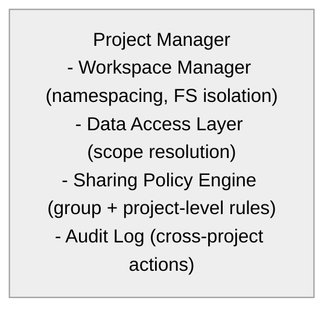
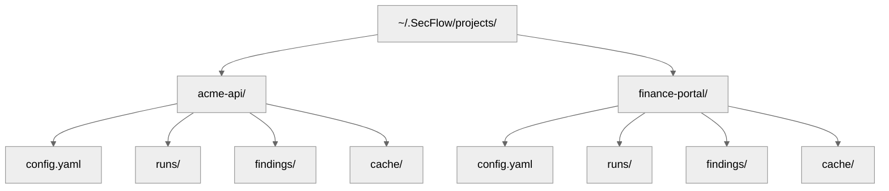

# 11 — Project Isolation & Data Sharing Controls

## 🧭 Overview

The **Project Isolation & Sharing** subsystem defines how multiple SecFlow projects coexist securely within the same environment.  
Each project has its **own namespace**, **storage domain**, and **execution context**, but can optionally **share data or resources** under controlled policies.

SecFlow's isolation model is designed to:
- Protect sensitive customer or target data.  
- Enable reuse of discovery outputs between related engagements.  
- Support team-based collaboration while maintaining auditability.

---

## 🧱 Design Principles

| Principle | Description |
|------------|-------------|
| **Default Isolation** | Every project operates in its own workspace and database namespace. |
| **Explicit Sharing** | No cross-project access occurs unless explicitly declared. |
| **Scoped Resources** | Shared assets must be tagged and versioned. |
| **Least Privilege Access** | Users only see or manage projects they are assigned to. |
| **Full Traceability** | Every cross-project data access is logged and auditable. |

---

## ⚙️ Architectural Overview



---

## 🧩 Project Data Model

```
# core-lib/models/project.py
from typing import List, Optional
from datetime import datetime
from pydantic import BaseModel

class Project(BaseModel):
    id: str
    name: str
    owner: str
    group: Optional[str]
    description: Optional[str]
    created_at: datetime
    updated_at: datetime
    sharing: Optional[dict] = {
        "enabled": False,
        "with": [],
        "resources": [],
        "outputs": []
    }
```

## 🧩 Workspace Isolation

Each project is backed by its own filesystem and database schema.

### Example Directory Layout


### Database Schema Isolation

Each project gets a dedicated schema:

```
public.findings_acme_api
public.findings_finance_portal
```

This allows multiple concurrent engagements with strict data boundaries.

## 🧠 Data Sharing Configuration

### Example: Controlled Cross-Project Sharing
```
project:
  name: "acme-api"
  sharing:
    enabled: true
    with:
      - "internal-api"
      - "qa-staging"
    resources:
      - "wordlists"
      - "templates"
    outputs:
      - "urls"
      - "parameters"
```

In this configuration:
- The `acme-api` project shares wordlists and templates with two sibling projects.
- The outputs (e.g., discovered URLs) are made available for enrichment or scanning reuse.

## 🧩 Sharing Policy Engine

### Logic Flow
```
User Request
   ↓
Policy Check (Project A → Project B)
   ↓
Scope Validation
   ↓
Access Decision (allow | deny)
```

### Policy Structure

| Field | Description |
|-------|-------------|
| **resource_type** | What type of data is being shared (wordlist, output, finding). |
| **scope** | Allowed scope (project, group, global). |
| **mode** | Access type (read-only, read-write, clone). |
| **ttl** | Time-to-live for shared access. |

### Example Policy Definition
```
policies:
  - resource_type: "outputs"
    scope: "group"
    mode: "read-only"
    ttl: 30d
```

## 🧩 Isolation Enforcement Mechanisms

| Layer | Enforcement |
|-------|-------------|
| **Filesystem** | Each project path is sandboxed under `~/.SecFlow/projects/<id>`. |
| **Database** | Separate schema per project (namespaced tables). |
| **Cache** | Project-specific cache directories. |
| **Runtime Context** | Workers run with `PROJECT_ID` environment variable. |
| **Authorization** | API tokens include `project_id` scope claim. |

## 🧠 Access Token Scoping

API tokens encode the project scope:

```
{
  "sub": "hernan.trajtemberg",
  "project_id": "acme-api",
  "roles": ["analyst"],
  "exp": 1759870400
}
```

Tokens can be project-scoped or group-scoped.
The access control middleware rejects out-of-scope operations.

## 🧩 Resource Linking Between Projects

Projects can import shared assets from another project's registry.

### Example Command
```
SecFlow projects link internal-api --resources wordlists templates
```

### Example Output
```
Linked resources:
✔ wordlists (3)
✔ templates (5)
```

Linked resources are marked in metadata:

```
linked_from: "project:internal-api"
mode: "read-only"
```

## 🧱 Output Sharing

Outputs (datasets or findings) can also be shared for cross-project correlation or enrichment.

### Example Workflow:
```
Project A → Discovery + Scan
        ↓
Shared Outputs (URLs, endpoints)
        ↓
Project B → Enrichment / Retesting
```

### Sharing Command
```
SecFlow share outputs acme-api --with finance-portal --types urls parameters
```

The receiving project's engine imports the shared dataset as a read-only reference.

## 🧩 Audit Logging

Every cross-project access event is logged.

### Example Log Entry
```
{
  "event": "resource_access",
  "actor": "hernan.trajtemberg",
  "source_project": "acme-api",
  "target_project": "internal-api",
  "resource": "wordlists",
  "timestamp": "2025-10-06T11:42:21Z",
  "action": "read"
}
```

## 🧠 Isolation Example Scenarios

### 1. Strict Isolation (Default)
Each project operates completely independently.
Useful for sensitive pentests or regulated environments.

### 2. Group-Level Sharing
Multiple analysts share discovery data across projects within the same team.

### 3. Selective Sharing
A red-team lead selectively shares Nuclei findings between "internal-api" and "staging-api".

## 🔐 Security Considerations

| Risk | Mitigation |
|------|------------|
| Unauthorized access to shared data | Token-scoped enforcement and audit logging |
| Resource version drift | Immutable hashes + version pinning |
| Data leakage across clients | No implicit sharing; explicit only |
| Lateral movement between project schemas | Database role isolation |
| Policy misconfiguration | Policy validation + test harness |

## 🧩 Example Policy Validation Script

```
def validate_policy(policy):
    assert policy["mode"] in ("read-only", "read-write", "clone")
    assert policy["scope"] in ("project", "group", "global")
    if policy["ttl"]:
        assert re.match(r"^\d+[dh]$", policy["ttl"])
```

## 🔮 Future Enhancements

- Group-level "Shared Intelligence Pool" for recurring findings.
- Automatic synchronization of enrichment data across related projects.
- AI-based data deduplication and anomaly detection.
- Visual dependency graph of shared resources in UI.
- Temporal sharing policies ("auto-expire after 30 days").

---

**Next:** [Findings Model & Schema Normalization](12-findings-model-and-schema.md)
```
```
```
```
```
```
```
```
```
```
```
```
```
```
```
```
```
```
```
```
```
```
```
```
```
```
```
```