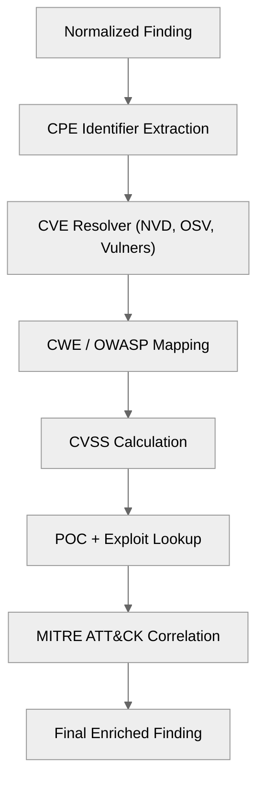

# 13 — CVE/CWE/POC Enrichment Layer

## 🧭 Overview

The **Enrichment Layer** bridges the gap between raw scanner results and full vulnerability intelligence.  
It performs automated correlation between findings and vulnerability databases such as:

- **CVE/NVD** — canonical vulnerability records  
- **CWE** — weakness categorization  
- **CVSS** — scoring and severity models  
- **Exploit-DB**, **Vulners**, **Metasploit**, **OSV** — PoC and exploit references  
- **MITRE ATT&CK** — behavioral mapping  

SecFlow treats enrichment as a **pluggable knowledge graph** layer that can be extended via simple JSON/YAML definitions or API connectors.

---

## ⚙️ Enrichment Pipeline



---

## 🧩 CPE & Component Extraction

The enrichment process begins by fingerprinting software components.

```
def extract_cpe(finding: Finding) -> Optional[str]:
    headers = finding.evidence.get("response", {}).get("headers", {})
    banner = headers.get("Server") or headers.get("X-Powered-By")
    return cpe_guess(banner) if banner else None
```

### Example results:
- `Server: Apache/2.4.54` → `cpe:/a:apache:http_server:2.4.54`
- `X-Powered-By: Express` → `cpe:/a:npmjs:express:4.18.2`

## 🧩 CVE Resolution Engine

The CVE Resolver queries multiple backends in a failover chain:

| Source | Endpoint | Rate Limit | Cache TTL |
|--------|----------|------------|-----------|
| **NVD** | `https://services.nvd.nist.gov/rest/json/cves/2.0` | 1000/day | 24h |
| **OSV.dev** | `https://api.osv.dev/v1/query` | Unlimited | 12h |
| **Vulners API** | `https://vulners.com/api/v3/search/lucene/` | 2000/day | 24h |

```
class CVEResolver:
    def resolve(self, cpe: str) -> List[dict]:
        cached = self.cache.get(cpe)
        if cached: return cached

        results = []
        for backend in self.backends:
            try:
                results.extend(backend.query(cpe))
            except Exception:
                continue
        self.cache.set(cpe, results)
        return results
```

Results are merged and normalized into a unified CVE format.

## 🧠 CVE Normalized Model

```
class CVEEntry(BaseModel):
    cve_id: str
    description: str
    published: datetime
    cvss_score: float
    cvss_vector: str
    cwe_ids: List[int]
    references: List[str]
    exploit_refs: List[str]
    source: str
```

Each finding may be associated with multiple CVE entries.

## 🧩 CWE / OWASP / MITRE Mapping

Once CVEs are linked, weaknesses and behavioral context are resolved.

| Source | Purpose | Mapping Strategy |
|--------|---------|------------------|
| **CWE** | Weakness classification | CVE → CWE via NVD JSON |
| **OWASP** | Application risk class | CWE → OWASP Top 10 map |
| **MITRE ATT&CK** | Adversary tactics/techniques | CWE → ATT&CK TID correlation |

```
def map_cwe_to_owasp(cwe_id: int) -> str:
    mapping = {
        79: "A03: Injection",
        89: "A03: Injection",
        787: "A05: Buffer Overflow",
        601: "A10: SSRF"
    }
    return mapping.get(cwe_id, "N/A")
```

### MITRE correlation example:
```
mitre_map = {
    "CWE-79": "T1059.007 (Cross-Site Scripting)",
    "CWE-89": "T1505.003 (SQL Injection)"
}
```

## 🧩 CVSS Calculation

If a finding lacks explicit CVSS scoring, SecFlow derives one via heuristics:

```
def derive_cvss(cwe_id: int, context: dict) -> float:
    # basic fallback estimation
    if cwe_id in (79, 89):
        return 9.0
    elif cwe_id in (200, 201):
        return 7.5
    return 5.0
```

### Final score combines:
```
base = CVSS
temporal = exploit_availability * 0.2
environmental = exposure_factor * 0.3
final = (base + temporal + environmental) / 1.5
```

## 🧠 PoC & Exploit Correlation

### Data Sources
| Source | Access | Notes |
|--------|--------|-------|
| **Exploit-DB** | Public dump | Weekly sync |
| **Vulners** | API | Indexed by CVE |
| **Metasploit** | Local metadata | Optional |
| **GitHub PoC** | OSV + GitHub GraphQL | Filter by repo tags |
| **SecurityFocus (legacy)** | Offline mirror | Static references |

### Example Resolver
```
def resolve_poc(cve_id: str) -> list:
    sources = [exploitdb, vulners, githubpoc]
    results = []
    for s in sources:
        results.extend(s.search(cve_id))
    return list(set(results))
```

## 🧩 PoC Safety Governance

Because PoCs can contain malicious payloads, SecFlow enforces strict isolation.

| Policy | Enforcement |
|--------|-------------|
| **Read-only storage** | PoCs stored as text blobs, no exec permission |
| **Sandbox validation** | Hash-check before use |
| **Legal disclaimer** | Must be accepted before PoC download |
| **Runtime restriction** | Execution allowed only in `--sandbox` mode |

### Example governance guard:
```
def safe_open_poc(poc_path: Path):
    if not user.accepted_disclaimer:
        raise PermissionError("PoC execution disabled until disclaimer accepted.")
    subprocess.run(["sandbox", "python3", poc_path])
```

## 🧩 Caching & Synchronization

Each enrichment source maintains a versioned local cache:

| Component | Backend | Format | TTL |
|-----------|---------|--------|-----|
| **CVE** | NVD JSON | SQLite | 24h |
| **CWE** | MITRE XML | JSON | 7d |
| **PoC** | Exploit-DB | FS/JSON | 14d |

### Example cache adapter:
```
class LocalCache:
    def get(self, key: str) -> Optional[Any]:
        """Get value from cache by key."""
        pass
    
    def set(self, key: str, value: Any, ttl: int) -> None:
        """Set value in cache with TTL."""
        pass
    
    def purge_expired(self) -> None:
        """Remove expired entries from cache."""
        pass
```

## 🧩 API Exposure

The enrichment system provides a unified query interface:

| Endpoint | Method | Description |
|----------|--------|-------------|
| `/api/v1/enrich/cve` | POST | Enrich a finding by CPE/CVE |
| `/api/v1/enrich/cwe` | POST | Map CWE to OWASP |
| `/api/v1/enrich/poc` | GET | Retrieve PoC links |
| `/api/v1/enrich/status` | GET | Show cache health |

### Example response:
```
{
  "finding_id": "1234",
  "cve": ["CVE-2024-12345"],
  "CVSS": 9.8,
  "cwe": 89,
  "owasp": "A03: Injection",
  "poc_links": ["https://exploit-db.com/exploits/52341"]
}
```

## 🧩 Enrichment Rules & Priority

1. Local cache first
2. API sources (NVD/OSV) second
3. Third-party mirrors (Vulners, Exploit-DB) last

Each backend includes retry and circuit-breaker logic via Tenacity.

## 🧩 Parallel Enrichment

The enrichment worker uses async pipelines for batch enrichment:

```
async def enrich_findings_batch(findings: list):
    async with aiohttp.ClientSession() as session:
        tasks = [enrich_one(f, session) for f in findings]
        return await asyncio.gather(*tasks)
```

Each finding may take 0.1–1.5 seconds depending on CVE count; concurrency keeps throughput high.

## 🧠 Example Enrichment Output

```
{
  "finding_id": "abcd-1234",
  "cpe": "cpe:/a:apache:http_server:2.4.54",
  "cve_ids": ["CVE-2023-25690"],
  "cwe": 89,
  "owasp": "A03: Injection",
  "cvss_score": 9.8,
  "poc_links": ["https://exploit-db.com/exploits/52341"],
  "mitre_tid": "T1505.003",
  "last_enriched": "2025-10-06T09:43:00Z"
}
```

## 🔒 Security & Compliance

- All enrichment data is public-source only.
- No proprietary or restricted databases.
- Caching system automatically purges expired CVE entries.
- Full audit trail for every enrichment event.

## 🔮 Future Enhancements

- Integrate VulnCheck, CISA KEV, and EPSS for exploit prediction.
- Introduce AI-based CVE clustering for semantic matching.
- Enrichment correlation graph for cross-project analysis.
- Automated risk re-scoring based on KEV updates.

---

**Next:** [POC Sources, Safety & Legal Guidelines](14-poc-sources-and-legal-guidelines.md)
```
```
```
```
```
```
```
```
```
```
```
```
```
```
```
```
```
```
```
```
```
```
```
```
```
```