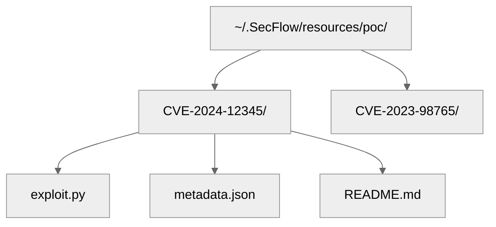
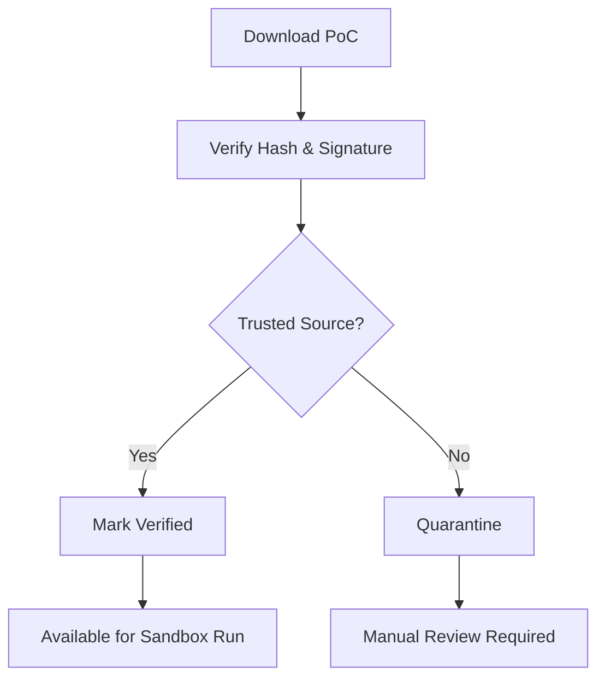

# 14 — PoC Governance, Safety, and Legal Framework

## 🧭 Overview

Proof-of-Concept (PoC) execution is the most sensitive aspect of the SecFlow platform.  
While enrichment and discovery involve data collection, PoC modules may **trigger actual exploits** — often on controlled test targets or lab environments.

This section defines:
- The **security model** for PoC management and execution.
- **Legal and ethical boundaries** for researchers.
- **Technical enforcement** of sandbox isolation.
- **Policy hierarchy** for PoC lifecycle, provenance, and deletion.

---

## ⚖️ Legal & Ethical Framework

### 1. Authorized Testing Only
PoC execution is **strictly limited** to:
- Assets owned or explicitly authorized by the user.
- Lab or offline sandbox targets.
- Non-production systems unless a signed authorization exists.

### 2. Compliance with International Norms
SecFlow aligns with:
- **ISO/IEC 29147** — Vulnerability Disclosure.
- **ISO/IEC 30111** — Vulnerability Handling.
- **NIST SP 800-115** — Technical Guide to Information Security Testing.
- **CISA KEV** and **CVE® Program** standards.

### 3. Researcher Agreement
Before using any exploit-related features:
- Users must accept the **Responsible Use Agreement (RUA)**.
- Every PoC download or execution is logged.
- No redistribution of PoC code outside permitted licensing (e.g., GPL, BSD).

---

## 🧱 PoC Lifecycle Management

| Stage | Description |
|--------|-------------|
| **Acquisition** | PoC fetched from trusted sources (Exploit-DB, Vulners, GitHub PoC, OSV). |
| **Verification** | Signature/hash validated; metadata normalized. |
| **Classification** | Marked as local, remote, DoS, or privilege escalation. |
| **Sandbox Execution** | Run only in isolated containers or VMs. |
| **Audit Logging** | Execution parameters, user, and timestamp recorded. |
| **Retention & Purge** | Expired PoCs automatically archived or deleted. |

---

## 🧩 Storage & Metadata

PoCs are stored as **immutable artifacts** under the internal resource store:



### Example `metadata.json`
```
{
  "cve": "CVE-2024-12345",
  "source": "exploit-db",
  "url": "https://www.exploit-db.com/exploits/52341",
  "verified": true,
  "language": "python",
  "type": "rce",
  "hash": "b3f9f74e89e2a1b4c5d6e7f8a9b0c1d2e3f4a5b6c7d8e9f0a1b2c3d4e5f6a7b8c9d0",
  "sandbox_only": true,
  "license": "GPLv2",
  "date_fetched": "2025-10-06T10:20:00Z"
}
```

## 🔒 Sandbox Execution Architecture

### 1. Isolation Model

All PoC executions occur within the SecFlow Sandbox Runtime, implemented as:

- Docker container with restricted capabilities (`--cap-drop=ALL`).
- Read-only mount of PoC files.
- No network egress unless explicitly allowed.
- Time & memory quotas enforced by cgroups.

### 2. Runtime Diagram
```
+-------------------------------------------------------+
|                SecFlow Sandbox Runtime                |
|-------------------------------------------------------|
|  - Namespace Isolation (PID, NET, MNT)                |
|  - Read-only FS for /poc                              |
|  - IPC + SYS_ADMIN disabled                           |
|  - AppArmor / SELinux profiles                        |
|  - Seccomp filters (deny dangerous syscalls)          |
+-------------------------------------------------------+
         ↑
         | PoC artifact + parameters
         |
[SecFlow Worker] → [Sandbox Orchestrator] → [Container Runtime]
```

### 3. Sample Sandbox Invocation
```
SecFlow sandbox run poc CVE-2024-12345 --target https://staging.example.com
```

Under the hood:
```
subprocess.run([
  "docker", "run", "--rm", "--network", "none",
  "--memory", "512m", "--cpus", "1",
  "-v", "/pocstore/CVE-2024-12345:/poc:ro",
  "SecFlow-sandbox:latest",
  "python3", "/poc/exploit.py", "--target", "https://staging.example.com"
])
```

## ⚙️ PoC Execution Policy

| Policy | Enforcement |
|--------|-------------|
| **Sandbox Only** | No PoC runs on host system. |
| **Read-only Filesystem** | Prevents code modification or persistence. |
| **No Network by Default** | All outbound connections blocked. |
| **User Authorization** | Each run signed with user identity & timestamp. |
| **Logging & Replay** | Stdout/stderr captured in audit logs. |
| **Time-Bound Execution** | Hard kill if runtime exceeds `timeout_seconds`. |

## 🧠 Policy Configuration Example

```
# ~/.SecFlow/policies/poc.yaml
sandbox:
  image: SecFlow-sandbox:latest
  max_cpu: 1
  max_memory_mb: 512
  timeout_seconds: 300
  allow_network: false
  allow_filesystem_write: false

compliance:
  require_disclaimer: true
  require_project_authorization: true
  auto_verify_hashes: true
```

## 🧩 Governance Logging

Every PoC-related event is appended to a tamper-resistant audit log:

| Field | Description |
|-------|-------------|
| event_id | UUID of the audit entry |
| user_id | Executing user |
| timestamp | UTC ISO-8601 time |
| action | e.g., "sandbox_run", "download", "verify" |
| cve_id | Related CVE |
| tool | Source or wrapper (e.g., "exploitdb") |
| sandbox_id | Container identifier |
| hash | SHA256 of PoC code |

### Example Log Entry
```
{
  "event_id": "a1f3b7c2-9f11-45d0-bc97-6c9472cbdcb2",
  "user_id": "hernan",
  "action": "sandbox_run",
  "cve_id": "CVE-2024-12345",
  "timestamp": "2025-10-06T10:43:00Z",
  "sandbox_id": "sandbox-83214",
  "hash": "b3f9f74e89e2a1b4c5d6e7f8a9b0c1d2e3f4a5b6c7d8e9f0a1b2c3d4e5f6a7b8c9d0",
  "tool": "exploitdb"
}
```

## 🧠 Legal Notice Enforcement

Before any PoC interaction, users must sign a legal disclaimer:

```
Responsible Use Notice:
You acknowledge that PoC exploitation is to be performed exclusively on systems you own or are explicitly authorized to test. SecFlow is not liable for any misuse or damages resulting from unauthorized use.
```

The system stores an acceptance hash:
```
~/.SecFlow/.disclaimer_accepted
```

## 🧩 Cross-Project PoC Access

To prevent accidental disclosure:
- PoC artifacts are scoped per project by default.
- Shared PoCs require explicit admin approval.
- Access controlled via role-based permissions (RBAC).

| Role | Access |
|------|--------|
| **Admin** | Global & project PoCs |
| **Analyst** | Project PoCs only |
| **Viewer** | Read-only (metadata only) |

## 🧱 PoC Verification Workflow



## 🔒 Quarantine Mechanism

Unknown or tampered PoCs are moved to:
```
~/.SecFlow/resources/poc/quarantine/
```

Each is tagged with a quarantine reason.
Admins can review and promote back to verified status.

```
def quarantine_poc(poc_id: str, reason: str):
    shutil.move(f"/pocstore/{poc_id}", "/pocstore/quarantine/")
    write_log(f"PoC {poc_id} quarantined: {reason}")
```

## 🧠 Example Execution Trace

```
[PoC: CVE-2024-12345] Verified source: ExploitDB
[Sandbox] Starting container SecFlow-sandbox:latest
[Sandbox] CPU quota: 1 core, Memory: 512MB
[Sandbox] Network: disabled
[Output]
    [+] Exploit successful: remote command executed
[Cleanup]
    PoC container destroyed after 120s
```

## 🔮 Future Enhancements

- AppArmor enforcement policies with dynamic runtime profiling.
- PoC provenance blockchain for cryptographic integrity.
- AI-assisted PoC safety classification (RCE, DoS, PrivEsc).
- Multi-tenant isolation for collaborative workspaces.
- Live replay of PoC runs for training and documentation.

---

**Next:** [Garbage Collection & Data Retention Policy](15-garbage-collection-and-retention.md)
```
```
```
```
```
```
```
```
```
```
```
```
```
```
```
```
```
```
```
```
```
```
```
```