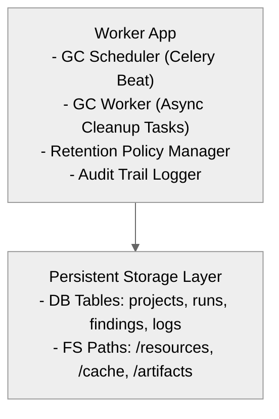
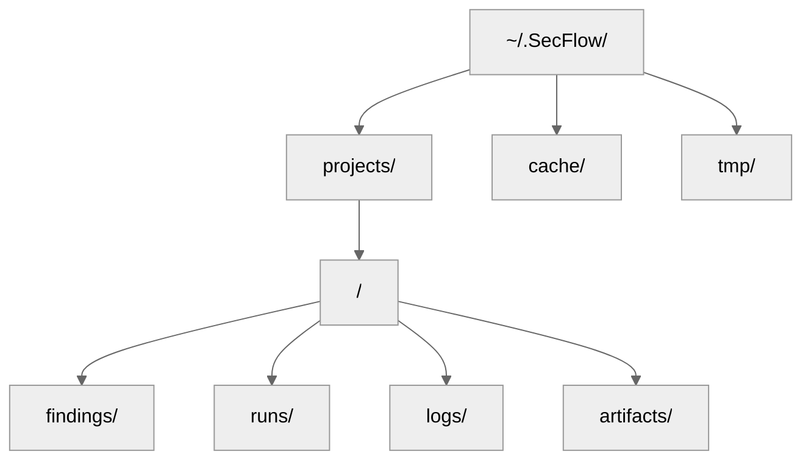

# 15 — Garbage Collection & Data Retention Policy

## 🧭 Overview

The **Garbage Collection (GC)** subsystem ensures long-term maintainability and performance of the SecFlow platform.  
It automates the cleanup of:
- Expired runs and temporary results  
- Deleted project data (findings, resources, logs)  
- Old cache entries and transient files  
- Obsolete resources (e.g., old templates or wordlists)  

GC operates as an **asynchronous background service** within the `worker` app and supports both *soft-delete* and *hard-delete* modes.

---

## ⚙️ Core Objectives

| Objective | Description |
|------------|-------------|
| **Consistency** | Prevent orphaned or dangling records (runs, findings). |
| **Recoverability** | Allow temporary undo (via soft delete + TTL). |
| **Auditability** | Maintain logs of every GC event for compliance. |
| **Efficiency** | Keep database and disk footprint minimal. |
| **Isolation** | Per-project retention scopes (independent cleanup). |

---

## 🧩 Architecture Diagram



---

## 🧩 Retention Model

Each project defines its **retention profile** in `~/.SecFlow/projects/<id>/config.yaml`:

```yaml
retention:
  findings_ttl_days: 180
  runs_ttl_days: 90
  cache_ttl_days: 30
  artifacts_ttl_days: 180
  soft_delete_ttl_days: 14
  auto_cleanup: true
```yaml

## 🧱 Data Lifecycle

| Stage | Description |
|-------|-------------|
| **Active** | Data used by ongoing projects or workflows. |
| **Soft Deleted** | Marked for deletion but restorable (`flag: deleted=true`). |
| **Expired** | TTL exceeded; scheduled for cleanup. |
| **Hard Deleted** | Permanently removed after grace period. |

## 🧠 Database-Level Soft Delete

```python
class BaseModel(SQLModel):
    id: UUID
    created_at: datetime
    updated_at: datetime
    deleted: bool = False
    deleted_at: Optional[datetime] = None
```python

When a record is soft-deleted:

```python
def soft_delete(obj):
    obj.deleted = True
    obj.deleted_at = datetime.utcnow()
    session.add(obj)
    session.commit()
```python

Recovery:

```python
def restore(obj):
    obj.deleted = False
    obj.deleted_at = None
    session.commit()
```text

## 🧩 File System Garbage Collector

### Directory Structure
```text
/data/
```



The GC worker traverses these trees periodically:

```python
def sweep_directory(base_path: Path, older_than: timedelta):
    now = datetime.utcnow()
    for p in base_path.rglob("*"):
        if p.is_file() and (now - datetime.fromtimestamp(p.stat().st_mtime)) > older_than:
            p.unlink()
```python

## 🧠 GC Task Scheduling

### Celery Task Definition
```python
@app.task(name="gc.cleanup_expired")
def cleanup_expired():
    sweep_projects()
    sweep_cache()
    sweep_artifacts()
```text

### Scheduler Configuration
```python
CELERY_BEAT_SCHEDULE = {
    "cleanup-every-6h": {
        "task": "gc.cleanup_expired",
        "schedule": crontab(hour="*/6"),
    },
}
```text

GC tasks can be triggered manually:
```bash
SecFlow gc run --project acme-api
```python

## 🧩 Retention Policy Evaluation

### Example Policy Rules
| Rule | Condition | Action |
|------|-----------|--------|
| Inactive Runs | Run ended > 90 days ago | Delete run logs |
| Soft-Deleted Findings | Deleted > 14 days ago | Purge permanently |
| Cache Expired | Cache entry older than 30 days | Remove |
| Unused Artifacts | Artifact not accessed for 180 days | Archive or delete |

### Policy Engine Snippet
```python
def evaluate_retention(entity, policy):
    if entity.deleted and expired(entity.deleted_at, policy.soft_delete_ttl_days):
        hard_delete(entity)
    elif expired(entity.updated_at, policy.findings_ttl_days):
        soft_delete(entity)
```text

## 🧩 Audit Logging for GC

Each GC operation generates an audit record:

```json
{
  "event": "gc_delete",
  "type": "finding",
  "target_id": "f123-45ac",
  "project_id": "p001",
  "timestamp": "2025-10-06T09:30:00Z",
  "user": "system",
  "ttl_rule": "soft_delete_ttl_days=14"
}
```text

Stored in:
```text
~/.SecFlow/audit/gc.log
```python

## 🧱 Orphan Detection

### SQL Example
```sql
SELECT f.id
FROM findings f
LEFT JOIN runs r ON f.run_id = r.id
WHERE r.id IS NULL;
```python

Any orphaned findings or artifacts (without associated runs/projects) are purged automatically.

## 🧩 Cache Lifecycle

Caches (e.g., CVE data, scan results, tool logs) use a standardized interface:

```python
class CacheEntry(BaseModel):
    key: str
    value: bytes
    expires_at: datetime

def purge_expired():
    session.query(CacheEntry).filter(CacheEntry.expires_at < datetime.utcnow()).delete()
```text

## 🧠 Manual Cleanup Command

Users can trigger GC manually via CLI:

```bash
# Run full cleanup (all projects)
SecFlow gc run

# Run cleanup for one project
SecFlow gc run --project acme-api

# Preview what will be deleted
SecFlow gc dry-run
```text

### Example output:
```text
[GC] Found 12 expired runs, 4 orphaned findings, 6 stale cache entries
[GC] Total reclaimed: 1.2 GB
```text

## 🔐 Security Considerations

- All deletions (soft or hard) are logged.
- Data is never removed without audit trace.
- System prevents GC while a project is locked or running.
- Manual GC requires Admin role.

## 🔄 GC Metrics & Observability

| Metric | Description |
|--------|-------------|
| gc_runs_total | Number of GC cycles executed |
| gc_files_removed_total | Number of files deleted |
| gc_bytes_reclaimed_total | Storage reclaimed in bytes |
| gc_duration_seconds | Time per GC cycle |
| gc_errors_total | Failed cleanup operations |

Exposed via Prometheus at `/metrics`.

## 🧠 Example GC Cycle Log

```text
[GC] Cycle started at 2025-10-06T09:00:00Z
[GC] Processed 3 projects
[GC] Deleted 15 findings (soft)
[GC] Purged 10 runs (hard)
[GC] Reclaimed 1.8GB disk space
[GC] Cycle completed in 42.3s
```

## 🔮 Future Enhancements

- Incremental snapshot pruning — keep only latest versions of runs.
- Policy-as-Code — customizable YAML rulesets.
- AI-based cleanup predictions — identify stale datasets dynamically.
- Storage quota enforcement per user/project.
- UI dashboard for retention and GC insights.

---

**Next:** [Security Model (RBAC, Authentication, Sandboxing)](16-security-model.md)
```
```
```
```
```
```
```
```
```
```
```
```
```
```
```
```
```
```
```
```
```
```
```
```
```
```
```
```
```
```
```
```
```
```
