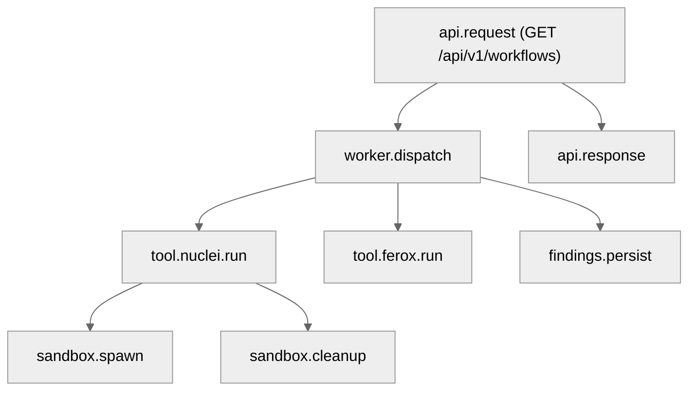
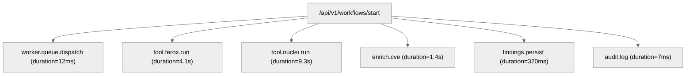

# 17 — Observability, Logging, Metrics & Tracing

## 🧭 Overview

The **Observability Layer** provides full transparency into the runtime behavior of SecFlow.  
It enables developers, analysts, and operators to:
- Track system health and performance metrics.  
- Trace workflow execution across tools and workers.  
- Monitor logs and alerts from all layers (API, Worker, Sandbox).  
- Correlate findings, runs, and audit trails with unique identifiers.

The observability system is **standards-based**, built upon:
- **OpenTelemetry (OTel)** for tracing and context propagation.  
- **Prometheus** for metrics export.  
- **JSON structured logging** for event correlation.  
- **Grafana dashboards** for visualization.

---

## 🧱 Observability Architecture Overview

```
+--------------------------------------------------------------+
|                    SecFlow Stack                             |
| API Layer → Structured Logging, Metrics, Tracing            |
| Worker → Task Metrics, Workflow Spans, Sandbox Logs         |
| Sandbox → Runtime Metrics, Security Telemetry                |
| Database → Query Timing, Connection Pool Stats              |
--------------------------------------------------------------
| Exporters → Prometheus (Metrics), OTLP (Traces), Loki (Logs)|
+--------------------------------------------------------------+
```

---

## 🧩 Logging Subsystem

### Logging Design Goals
| Goal | Implementation |
|-------|----------------|
| **Machine-readable** | JSON structured format with standard fields |
| **Correlated across systems** | `trace_id` and `span_id` included |
| **Context-aware** | User, project, workflow metadata embedded |
| **Immutable** | Append-only, timestamped, HMAC-signed if required |

### Log Record Example

```
{
  "timestamp": "2025-10-06T09:45:32Z",
  "level": "INFO",
  "service": "worker",
  "trace_id": "cbd82b67-4a2b-4db6-9a90-1c3ed1b7e203",
  "span_id": "4f7c2b91",
  "project": "acme-api",
  "workflow_id": "wf-abc123",
  "message": "Nuclei scan completed successfully",
  "duration_ms": 34215
}
```

### Logging Stack
- **Python Logging + Structlog** — base structured logs.
- **OpenTelemetry LoggingHandler** — trace context propagation.
- **Loki Exporter** — for central log aggregation (optional).

### Configuration snippet:
```
LOGGING = {
  "version": 1,
  "formatters": {"json": {"()": "pythonjsonlogger.jsonlogger.JsonFormatter"}},
  "handlers": {
    "console": {"class": "logging.StreamHandler", "formatter": "json"},
  },
  "root": {"level": "INFO", "handlers": ["console"]},
}
```

## ⚙️ Log Levels & Policies

| Level | Description |
|-------|-------------|
| **DEBUG** | Developer-only context, disabled by default in production. |
| **INFO** | System lifecycle and status messages. |
| **WARNING** | Recoverable issues, retryable errors. |
| **ERROR** | Failures in user-triggered operations. |
| **CRITICAL** | Irrecoverable errors (sandbox isolation breach, DB corruption). |

Retention policy for logs follows the GC subsystem (see [15-garbage-collection-and-retention.md](15-garbage-collection-and-retention.md)).

## 🧠 Trace Propagation & Distributed Context

SecFlow uses OpenTelemetry (OTel) for distributed tracing.
Every API request, task dispatch, and plugin call generates spans linked under one root trace.

### Example Trace Structure
```
TraceID: 5b2e4f21c9a344f9
```



### Code Example
```
from opentelemetry import trace

tracer = trace.get_tracer("SecFlow.worker")

with tracer.start_as_current_span("workflow.execute") as span:
    span.set_attribute("workflow.id", workflow.id)
    run_workflow(workflow)
```

All traces are exported through OTLP gRPC to the observability backend (e.g., Tempo, Jaeger).

## 📊 Metrics System

SecFlow exposes runtime metrics through Prometheus-compatible endpoints.

### Default Endpoint
```
/metrics
```

### Example Metrics
| Metric | Type | Description |
|--------|------|-------------|
| secflow_requests_total | Counter | Total API requests handled |
| secflow_active_workflows | Gauge | Currently running workflows |
| secflow_findings_generated_total | Counter | Findings created |
| secflow_task_duration_seconds | Histogram | Time taken by async tasks |
| secflow_gc_bytes_reclaimed_total | Counter | GC reclaimed bytes |
| secflow_sandbox_executions_total | Counter | Number of sandbox runs |
| secflow_tool_failures_total | Counter | Failed tool executions |
| secflow_worker_queue_depth | Gauge | Pending Celery tasks |
| secflow_cve_enrichment_latency_seconds | Histogram | Time per CVE query |

### Prometheus Export Example
```
from prometheus_client import Counter, Gauge

findings_total = Counter("secflow_findings_generated_total", "Number of findings created")
active_workflows = Gauge("secflow_active_workflows", "Currently running workflows")
```

## 🔍 Example Grafana Dashboard Panels

| Panel | Visualization | Query |
|-------|---------------|-------|
| Workflow Throughput | Time series | `rate(secflow_requests_total[5m])` |
| Average Scan Duration | Histogram | `histogram_quantile(0.9, rate(secflow_task_duration_seconds_bucket[5m]))` |
| Findings per Project | Bar chart | `sum by (project)(secflow_findings_generated_total)` |
| GC Efficiency | SingleStat | `rate(secflow_gc_bytes_reclaimed_total[1h])` |
| Sandbox Failures | Table | `secflow_tool_failures_total` |

## 🧩 Error Correlation & Incident Debugging

Every finding, workflow, and audit entry includes a trace ID.
Errors can be traced back to exact processes and spans.

### Example correlation:
```
Finding → Workflow ID: wf-abc123 → Trace ID: cbd82b67a1e4f9d2c8b5e6f7a3d4c9e2b1f8a5c6d7e9f2a3b4c5d6e7f8a9b2c3d4e5f6
→ Logs: worker.log
→ Span: tool.nuclei.run
```

This guarantees reproducibility and fast RCA (root cause analysis).

## 🧠 Alerting & Health Checks

### Health Endpoints
| Endpoint | Description |
|----------|-------------|
| `/healthz` | Liveness probe (basic app status) |
| `/readyz` | Readiness probe (DB + cache + queue connectivity) |

### Example Output
```
{
  "status": "ok",
  "services": {
    "database": "up",
    "cache": "up",
    "worker": "idle"
  }
}
```

### Alerts (Prometheus Rules)
```
groups:
  - name: secflow_alerts
    rules:
      - alert: HighErrorRate
        expr: rate(secflow_tool_failures_total[5m]) > 5
        for: 10m
        labels: { severity: warning }
        annotations:
          summary: "Tool failure rate too high"
```

## 🔒 Security of Observability Data

| Concern | Mitigation |
|---------|------------|
| Sensitive logs | Field redaction (password, token, secret) |
| Trace integrity | HMAC signing of exported spans |
| Log tampering | Append-only JSONL + rotation |
| Metrics abuse | Authenticated `/metrics` endpoint (basic token or mutual TLS) |

### Example redaction middleware:
```
def sanitize(data: dict) -> dict:
    for key in data.keys():
        if "token" in key.lower() or "password" in key.lower():
            data[key] = "[REDACTED]"
    return data
```

## 🧱 Correlation Example: End-to-End Trace

```
[TRACE 5b2e4f21c9a344f9]
```



## 🧩 Integration with CI/CD and Testing

During CI runs:
- Unit and integration tests export OTel traces for regression analysis.
- Performance tests measure task durations and error rates.

### Example CI configuration:
```
env:
  OTEL_EXPORTER_OTLP_ENDPOINT: "http://otel-collector:4317"
  PROMETHEUS_MULTIPROC_DIR: "/tmp/metrics"
```

## 🔮 Future Enhancements

- Distributed tracing for multi-cluster deployments.
- Real-time log streaming to the web UI.
- AI-assisted anomaly detection for workflow performance.
- Adaptive sampling for trace volume reduction.
- On-demand debug mode via CLI flag (`--trace verbose`).

---

**Next:** [Error Handling & Recovery](18-error-handling-and-recovery.md)
```
```
```
```
```
```
```
```
```
```
```
```
```
```
```
```
```
```
```
```
```
```
```
```