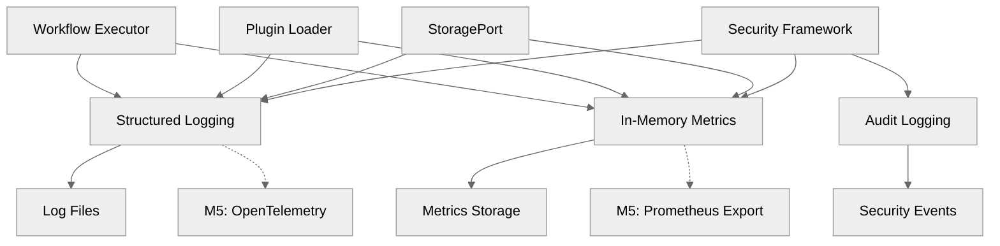
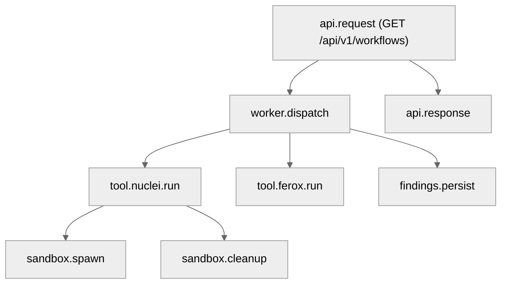
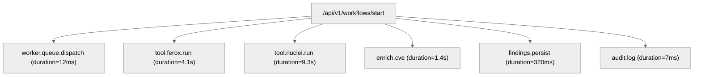

# 17 — Observability, Logging, Metrics & Tracing

## 🧭 Overview

The **Observability Layer** provides full transparency into the runtime behavior of SecFlow.  
It enables developers, analysts, and operators to:
- Track system health and performance metrics.  
- Trace workflow execution across tools and workers.  
- Monitor logs and alerts from all layers (API, Worker, Sandbox).  
- Correlate findings, runs, and audit trails with unique identifiers.

**M1 Implementation Status**: ✅ **Complete** - In-memory metrics collection, structured logging, and audit trails delivered.

**Note**: In M1, metrics are collected in-memory and shown in logs; a future release will expose them in Prometheus format.

The observability system is **standards-based**, built upon:
- **Structured Logging** for event correlation (M1)
- **In-Memory Metrics** for performance monitoring (M1)
- **Audit Trails** for security and compliance (M1)
- **Prometheus** for metrics export (M5 planned)
- **OpenTelemetry** for tracing and context propagation (M5 planned)

---

## 🧱 Observability Architecture Overview (M1)



**M1 Components Delivered**:
- ✅ **Structured Logging**: JSON format with correlation IDs
- ✅ **In-Memory Metrics**: Performance and execution metrics
- ✅ **Audit Logging**: Security events and compliance trails
- ✅ **Event Correlation**: Trace IDs for workflow execution
- ✅ **StoragePort Integration**: Metrics persistence via StoragePort

---

## 🧩 Logging Subsystem (M1)

### Logging Design Goals

| Goal | M1 Implementation |
|-------|----------------|
| **Machine-readable** | JSON structured format with standard fields |
| **Correlated across systems** | `trace_id` and `span_id` included |
| **Searchable** | Standardized field names and values |
| **Audit-compliant** | Immutable logs with timestamps |
| **Performance-aware** | Async logging to avoid blocking |

### Structured Log Format (M1)

```json
{
  "timestamp": "2025-10-14T10:30:00.123Z",
  "level": "INFO",
  "logger": "secflow.workflow.executor",
  "message": "Node execution completed",
  "trace_id": "abc123def456",
  "span_id": "span789",
  "workflow_id": "workflow-123",
  "node_id": "scan.nuclei",
  "plugin_name": "nuclei-stub",
  "duration_ms": 1250,
  "findings_count": 45,
  "success": true,
  "metadata": {
    "project_id": "project-456",
    "user_id": "user-789",
    "execution_context": "production"
  }
}
```

### Logging Configuration (M1)

```python
# app/logging_conf.py
import logging
import json
from datetime import datetime

class StructuredFormatter(logging.Formatter):
    """Structured JSON formatter for M1."""
    
    def format(self, record):
        log_entry = {
            "timestamp": datetime.utcnow().isoformat() + "Z",
            "level": record.levelname,
            "logger": record.name,
            "message": record.getMessage(),
            "trace_id": getattr(record, 'trace_id', None),
            "span_id": getattr(record, 'span_id', None),
            "workflow_id": getattr(record, 'workflow_id', None),
            "node_id": getattr(record, 'node_id', None),
            "plugin_name": getattr(record, 'plugin_name', None),
            "duration_ms": getattr(record, 'duration_ms', None),
            "findings_count": getattr(record, 'findings_count', None),
            "success": getattr(record, 'success', None),
            "metadata": getattr(record, 'metadata', {})
        }
        return json.dumps(log_entry)

# Configure logging
def setup_logging():
    """Setup structured logging for M1."""
    handler = logging.StreamHandler()
    handler.setFormatter(StructuredFormatter())
    
    logger = logging.getLogger('secflow')
    logger.addHandler(handler)
    logger.setLevel(logging.INFO)
    
    return logger
```

### Workflow Execution Logging

```python
# packages/workflow_engine/executor.py
import logging
import time
from contextlib import contextmanager

logger = logging.getLogger('secflow.workflow.executor')

@contextmanager
def log_workflow_execution(workflow_id: str, node_id: str, plugin_name: str):
    """Context manager for workflow execution logging."""
    start_time = time.time()
    
    # Log start
    logger.info(
        "Node execution started",
        extra={
            'workflow_id': workflow_id,
            'node_id': node_id,
            'plugin_name': plugin_name,
            'trace_id': generate_trace_id(),
            'span_id': generate_span_id()
        }
    )
    
    try:
        yield
        success = True
    except Exception as e:
        logger.error(
            f"Node execution failed: {e}",
            extra={
                'workflow_id': workflow_id,
                'node_id': node_id,
                'plugin_name': plugin_name,
                'error': str(e),
                'success': False
            }
        )
        raise
    finally:
        # Log completion
        duration_ms = (time.time() - start_time) * 1000
        logger.info(
            "Node execution completed",
            extra={
                'workflow_id': workflow_id,
                'node_id': node_id,
                'plugin_name': plugin_name,
                'duration_ms': duration_ms,
                'success': success
            }
        )
```

---

## 📊 Metrics Subsystem (M1)

### In-Memory Metrics Collection

**M1 Implementation**: Metrics collected in-memory and stored via StoragePort.

```python
# analytics_core/metrics_telemetry.py
from typing import Dict, Any, List
from dataclasses import dataclass, field
from datetime import datetime
import threading

@dataclass
class MetricPoint:
    """Individual metric data point."""
    name: str
    value: float
    labels: Dict[str, str] = field(default_factory=dict)
    timestamp: str = field(default_factory=lambda: datetime.utcnow().isoformat() + "Z")

@dataclass
class MetricsSnapshot:
    """Snapshot of metrics at a point in time."""
    timestamp: str
    metrics: List[MetricPoint] = field(default_factory=list)

class InMemoryMetricsCollector:
    """In-memory metrics collector for M1."""
    
    def __init__(self):
        self._metrics: List[MetricPoint] = []
        self._lock = threading.Lock()
    
    def record_counter(self, name: str, value: float = 1.0, labels: Dict[str, str] = None):
        """Record a counter metric."""
        with self._lock:
            self._metrics.append(MetricPoint(
                name=name,
                value=value,
                labels=labels or {}
            ))
    
    def record_gauge(self, name: str, value: float, labels: Dict[str, str] = None):
        """Record a gauge metric."""
        with self._lock:
            self._metrics.append(MetricPoint(
                name=name,
                value=value,
                labels=labels or {}
            ))
    
    def record_histogram(self, name: str, value: float, labels: Dict[str, str] = None):
        """Record a histogram metric."""
        with self._lock:
            self._metrics.append(MetricPoint(
                name=name,
                value=value,
                labels=labels or {}
            ))
    
    def get_metrics_snapshot(self) -> MetricsSnapshot:
        """Get current metrics snapshot."""
        with self._lock:
            return MetricsSnapshot(
                timestamp=datetime.utcnow().isoformat() + "Z",
                metrics=self._metrics.copy()
            )
    
    def clear_metrics(self):
        """Clear collected metrics."""
        with self._lock:
            self._metrics.clear()
```

### Workflow Metrics

```python
# packages/workflow_engine/metrics.py
from analytics_core.metrics_telemetry import InMemoryMetricsCollector

class WorkflowMetrics:
    """Workflow-specific metrics for M1."""
    
    def __init__(self, collector: InMemoryMetricsCollector):
        self.collector = collector
    
    def record_workflow_start(self, workflow_id: str, workflow_name: str):
        """Record workflow start metric."""
        self.collector.record_counter(
            "secflow_workflows_started_total",
            labels={
                "workflow_id": workflow_id,
                "workflow_name": workflow_name
            }
        )
    
    def record_workflow_completion(self, workflow_id: str, workflow_name: str, 
                                  duration_ms: float, success: bool):
        """Record workflow completion metric."""
        self.collector.record_counter(
            "secflow_workflows_completed_total",
            labels={
                "workflow_id": workflow_id,
                "workflow_name": workflow_name,
                "status": "success" if success else "failure"
            }
        )
        
        self.collector.record_histogram(
            "secflow_workflow_duration_ms",
            duration_ms,
            labels={
                "workflow_id": workflow_id,
                "workflow_name": workflow_name
            }
        )
    
    def record_node_execution(self, node_id: str, plugin_name: str, 
                             duration_ms: float, findings_count: int):
        """Record node execution metric."""
        self.collector.record_counter(
            "secflow_nodes_executed_total",
            labels={
                "node_id": node_id,
                "plugin_name": plugin_name
            }
        )
        
        self.collector.record_histogram(
            "secflow_node_duration_ms",
            duration_ms,
            labels={
                "node_id": node_id,
                "plugin_name": plugin_name
            }
        )
        
        self.collector.record_gauge(
            "secflow_findings_generated_total",
            findings_count,
            labels={
                "node_id": node_id,
                "plugin_name": plugin_name
            }
        )
```

### Plugin Metrics

```python
# packages/plugins/metrics.py
class PluginMetrics:
    """Plugin-specific metrics for M1."""
    
    def __init__(self, collector: InMemoryMetricsCollector):
        self.collector = collector
    
    def record_plugin_load(self, plugin_name: str, success: bool):
        """Record plugin loading metric."""
        self.collector.record_counter(
            "secflow_plugins_loaded_total",
            labels={
                "plugin_name": plugin_name,
                "status": "success" if success else "failure"
            }
        )
    
    def record_plugin_execution(self, plugin_name: str, duration_ms: float, 
                               memory_mb: float, success: bool):
        """Record plugin execution metric."""
        self.collector.record_counter(
            "secflow_plugin_executions_total",
            labels={
                "plugin_name": plugin_name,
                "status": "success" if success else "failure"
            }
        )
        
        self.collector.record_histogram(
            "secflow_plugin_duration_ms",
            duration_ms,
            labels={"plugin_name": plugin_name}
        )
        
        self.collector.record_gauge(
            "secflow_plugin_memory_mb",
            memory_mb,
            labels={"plugin_name": plugin_name}
        )
```

---

## 🔍 Debugging & Troubleshooting (M1)

### Debug Mode

```bash
# Enable debug logging
export SECFLOW_LOG_LEVEL="DEBUG"
python tools/run_workflow.py workflows/sample-linear.yaml --execute --verbose

# Debug plugin loading
python tools/validate_recipe.py workflows/sample-linear.yaml --debug

# Debug storage operations
python tools/test_storage.py --adapter memory --debug
```

### Debug Configuration

```python
# app/logging_conf.py
def setup_debug_logging():
    """Setup debug logging for troubleshooting."""
    handler = logging.StreamHandler()
    handler.setFormatter(StructuredFormatter())
    
    # Enable debug for all SecFlow loggers
    for logger_name in ['secflow', 'packages', 'tools']:
        logger = logging.getLogger(logger_name)
        logger.addHandler(handler)
        logger.setLevel(logging.DEBUG)
    
    return logger
```

### Common Debug Scenarios

#### 1. Plugin Loading Issues

```python
# Debug plugin loading
def debug_plugin_loading(plugin_name: str):
    """Debug plugin loading issues."""
    logger = logging.getLogger('secflow.plugins.loader')
    
    try:
        logger.debug(f"Attempting to load plugin: {plugin_name}")
        plugin = plugin_loader.load(plugin_name)
        logger.debug(f"Plugin loaded successfully: {plugin.get_name()}")
        return plugin
    except Exception as e:
        logger.error(f"Plugin loading failed: {e}")
        logger.debug(f"Plugin path: {plugin_path}")
        logger.debug(f"Manifest: {manifest}")
        raise
```

#### 2. Workflow Execution Issues

```python
# Debug workflow execution
def debug_workflow_execution(workflow_id: str):
    """Debug workflow execution issues."""
    logger = logging.getLogger('secflow.workflow.executor')
    
    logger.debug(f"Starting workflow execution: {workflow_id}")
    
    for node in workflow.nodes:
        logger.debug(f"Executing node: {node.id} ({node.type})")
        try:
            result = execute_node(node)
            logger.debug(f"Node completed: {node.id}")
        except Exception as e:
            logger.error(f"Node failed: {node.id} - {e}")
            logger.debug(f"Node config: {node.config}")
            logger.debug(f"Node inputs: {node.inputs}")
            raise
```

#### 3. Storage Issues

```python
# Debug storage operations
def debug_storage_operations(storage: StoragePort):
    """Debug storage operation issues."""
    logger = logging.getLogger('secflow.storage')
    
    try:
        # Test basic operations
        logger.debug("Testing storage operations")
        
        # Test finding save
        test_finding = create_test_finding()
        storage.save_finding(test_finding)
        logger.debug("Finding saved successfully")
        
        # Test finding list
        findings = storage.list_findings(test_finding["project_id"])
        logger.debug(f"Found {len(findings)} findings")
        
    except Exception as e:
        logger.error(f"Storage operation failed: {e}")
        logger.debug(f"Storage type: {type(storage)}")
        raise
```

---

## 📈 Performance Monitoring (M1)

### Performance Metrics

```python
# analytics_core/performance_monitor.py
class PerformanceMonitor:
    """Performance monitoring for M1."""
    
    def __init__(self, collector: InMemoryMetricsCollector):
        self.collector = collector
    
    def record_system_metrics(self):
        """Record system performance metrics."""
        import psutil
        
        # CPU usage
        cpu_percent = psutil.cpu_percent()
        self.collector.record_gauge("secflow_system_cpu_percent", cpu_percent)
        
        # Memory usage
        memory = psutil.virtual_memory()
        self.collector.record_gauge("secflow_system_memory_percent", memory.percent)
        self.collector.record_gauge("secflow_system_memory_mb", memory.used / 1024 / 1024)
        
        # Disk usage
        disk = psutil.disk_usage('/')
        self.collector.record_gauge("secflow_system_disk_percent", disk.percent)
    
    def record_workflow_performance(self, workflow_id: str, 
                                   total_duration_ms: float,
                                   node_count: int,
                                   findings_count: int):
        """Record workflow performance metrics."""
        # Throughput metrics
        findings_per_second = findings_count / (total_duration_ms / 1000) if total_duration_ms > 0 else 0
        self.collector.record_gauge(
            "secflow_workflow_findings_per_second",
            findings_per_second,
            labels={"workflow_id": workflow_id}
        )
        
        # Efficiency metrics
        avg_node_duration = total_duration_ms / node_count if node_count > 0 else 0
        self.collector.record_gauge(
            "secflow_workflow_avg_node_duration_ms",
            avg_node_duration,
            labels={"workflow_id": workflow_id}
        )
```

### Performance Analysis

```python
# tools/performance_analysis.py
def analyze_workflow_performance(workflow_id: str) -> Dict[str, Any]:
    """Analyze workflow performance metrics."""
    metrics = get_metrics_snapshot()
    
    workflow_metrics = [
        m for m in metrics.metrics 
        if m.labels.get("workflow_id") == workflow_id
    ]
    
    analysis = {
        "workflow_id": workflow_id,
        "total_duration_ms": 0,
        "node_count": 0,
        "findings_count": 0,
        "avg_node_duration_ms": 0,
        "findings_per_second": 0
    }
    
    # Calculate metrics
    for metric in workflow_metrics:
        if metric.name == "secflow_workflow_duration_ms":
            analysis["total_duration_ms"] = metric.value
        elif metric.name == "secflow_nodes_executed_total":
            analysis["node_count"] += metric.value
        elif metric.name == "secflow_findings_generated_total":
            analysis["findings_count"] += metric.value
    
    # Calculate derived metrics
    if analysis["node_count"] > 0:
        analysis["avg_node_duration_ms"] = analysis["total_duration_ms"] / analysis["node_count"]
    
    if analysis["total_duration_ms"] > 0:
        analysis["findings_per_second"] = analysis["findings_count"] / (analysis["total_duration_ms"] / 1000)
    
    return analysis
```

---

## 🔮 Future Enhancements (M5+)

### Prometheus Integration (M5)

```python
# M5: Prometheus metrics export (planned)
from prometheus_client import Counter, Histogram, Gauge, start_http_server

# Prometheus metrics
workflow_counter = Counter('secflow_workflows_total', 'Total workflows executed', ['status'])
workflow_duration = Histogram('secflow_workflow_duration_seconds', 'Workflow execution duration')
node_duration = Histogram('secflow_node_duration_seconds', 'Node execution duration', ['node_type'])
findings_gauge = Gauge('secflow_findings_total', 'Total findings generated')

def start_prometheus_server(port: int = 8000):
    """Start Prometheus metrics server."""
    start_http_server(port)
    logger.info(f"Prometheus metrics server started on port {port}")
```

### OpenTelemetry Integration (M5)

```python
# M5: OpenTelemetry tracing (planned)
from opentelemetry import trace
from opentelemetry.exporter.otlp.proto.grpc.trace_exporter import OTLPSpanExporter
from opentelemetry.sdk.trace import TracerProvider
from opentelemetry.sdk.trace.export import BatchSpanProcessor

def setup_tracing():
    """Setup OpenTelemetry tracing."""
    trace.set_tracer_provider(TracerProvider())
    tracer = trace.get_tracer(__name__)
    
    otlp_exporter = OTLPSpanExporter(endpoint="http://localhost:4317")
    span_processor = BatchSpanProcessor(otlp_exporter)
    trace.get_tracer_provider().add_span_processor(span_processor)
    
    return tracer
```

### Grafana Dashboards (M5)

```yaml
# M5: Grafana dashboard configuration (planned)
dashboard:
  title: "SecFlow Observability Dashboard"
  panels:
    - title: "Workflow Execution Rate"
      type: "graph"
      targets:
        - expr: "rate(secflow_workflows_total[5m])"
    
    - title: "Average Workflow Duration"
      type: "graph"
      targets:
        - expr: "histogram_quantile(0.95, secflow_workflow_duration_seconds)"
    
    - title: "Findings Generated"
      type: "graph"
      targets:
        - expr: "secflow_findings_total"
```

---

## 📚 Observability Best Practices

### For Developers

1. **Use Structured Logging**: Always use JSON format with correlation IDs
2. **Include Context**: Add relevant metadata to log entries
3. **Record Metrics**: Instrument key operations with metrics
4. **Handle Errors Gracefully**: Log errors with sufficient context
5. **Use Debug Mode**: Enable debug logging for troubleshooting

### For Operators

1. **Monitor Key Metrics**: Track workflow execution rates and durations
2. **Set Up Alerts**: Configure alerts for critical failures
3. **Regular Log Review**: Periodically review logs for issues
4. **Performance Analysis**: Analyze performance trends over time
5. **Capacity Planning**: Use metrics for capacity planning

### For Security Teams

1. **Audit Log Review**: Regularly review security audit logs
2. **Anomaly Detection**: Monitor for unusual patterns
3. **Compliance Monitoring**: Ensure logging meets compliance requirements
4. **Incident Response**: Use logs for security incident investigation
5. **Access Monitoring**: Track user access and actions

---

**Next:** [Error Handling & Recovery](18-error-handling-and-recovery.md)

SecFlow uses OpenTelemetry (OTel) for distributed tracing.
Every API request, task dispatch, and plugin call generates spans linked under one root trace.

### Example Trace Structure
```
TraceID: 5b2e4f21c9a344f9
```



### Code Example
```
from opentelemetry import trace

tracer = trace.get_tracer("SecFlow.worker")

with tracer.start_as_current_span("workflow.execute") as span:
    span.set_attribute("workflow.id", workflow.id)
    run_workflow(workflow)
```

All traces are exported through OTLP gRPC to the observability backend (e.g., Tempo, Jaeger).

## 📊 Metrics System

SecFlow exposes runtime metrics through Prometheus-compatible endpoints.

### Default Endpoint
```
/metrics
```

### Example Metrics
| Metric | Type | Description |
|--------|------|-------------|
| secflow_requests_total | Counter | Total API requests handled |
| secflow_active_workflows | Gauge | Currently running workflows |
| secflow_findings_generated_total | Counter | Findings created |
| secflow_task_duration_seconds | Histogram | Time taken by async tasks |
| secflow_gc_bytes_reclaimed_total | Counter | GC reclaimed bytes |
| secflow_sandbox_executions_total | Counter | Number of sandbox runs |
| secflow_tool_failures_total | Counter | Failed tool executions |
| secflow_worker_queue_depth | Gauge | Pending Celery tasks |
| secflow_cve_enrichment_latency_seconds | Histogram | Time per CVE query |

### Prometheus Export Example
```
from prometheus_client import Counter, Gauge

findings_total = Counter("secflow_findings_generated_total", "Number of findings created")
active_workflows = Gauge("secflow_active_workflows", "Currently running workflows")
```

## 🔍 Example Grafana Dashboard Panels

| Panel | Visualization | Query |
|-------|---------------|-------|
| Workflow Throughput | Time series | `rate(secflow_requests_total[5m])` |
| Average Scan Duration | Histogram | `histogram_quantile(0.9, rate(secflow_task_duration_seconds_bucket[5m]))` |
| Findings per Project | Bar chart | `sum by (project)(secflow_findings_generated_total)` |
| GC Efficiency | SingleStat | `rate(secflow_gc_bytes_reclaimed_total[1h])` |
| Sandbox Failures | Table | `secflow_tool_failures_total` |

## 🧩 Error Correlation & Incident Debugging

Every finding, workflow, and audit entry includes a trace ID.
Errors can be traced back to exact processes and spans.

### Example correlation:
```
Finding → Workflow ID: wf-abc123 → Trace ID: cbd82b67a1e4f9d2c8b5e6f7a3d4c9e2b1f8a5c6d7e9f2a3b4c5d6e7f8a9b2c3d4e5f6
→ Logs: worker.log
→ Span: tool.nuclei.run
```

This guarantees reproducibility and fast RCA (root cause analysis).

## 🧠 Alerting & Health Checks

### Health Endpoints
| Endpoint | Description |
|----------|-------------|
| `/healthz` | Liveness probe (basic app status) |
| `/readyz` | Readiness probe (DB + cache + queue connectivity) |

### Example Output
```
{
  "status": "ok",
  "services": {
    "database": "up",
    "cache": "up",
    "worker": "idle"
  }
}
```

### Alerts (Prometheus Rules)
```
groups:
  - name: secflow_alerts
    rules:
      - alert: HighErrorRate
        expr: rate(secflow_tool_failures_total[5m]) > 5
        for: 10m
        labels: { severity: warning }
        annotations:
          summary: "Tool failure rate too high"
```

## 🔒 Security of Observability Data

| Concern | Mitigation |
|---------|------------|
| Sensitive logs | Field redaction (password, token, secret) |
| Trace integrity | HMAC signing of exported spans |
| Log tampering | Append-only JSONL + rotation |
| Metrics abuse | Authenticated `/metrics` endpoint (basic token or mutual TLS) |

### Example redaction middleware:
```
def sanitize(data: dict) -> dict:
    for key in data.keys():
        if "token" in key.lower() or "password" in key.lower():
            data[key] = "[REDACTED]"
    return data
```

## 🧱 Correlation Example: End-to-End Trace

```
[TRACE 5b2e4f21c9a344f9]
```



## 🧩 Integration with CI/CD and Testing

During CI runs:
- Unit and integration tests export OTel traces for regression analysis.
- Performance tests measure task durations and error rates.

### Example CI configuration:
```
env:
  OTEL_EXPORTER_OTLP_ENDPOINT: "http://otel-collector:4317"
  PROMETHEUS_MULTIPROC_DIR: "/tmp/metrics"
```

## 🔮 Future Enhancements

- Distributed tracing for multi-cluster deployments.
- Real-time log streaming to the web UI.
- AI-assisted anomaly detection for workflow performance.
- Adaptive sampling for trace volume reduction.
- On-demand debug mode via CLI flag (`--trace verbose`).

---

**Next:** [Error Handling & Recovery](18-error-handling-and-recovery.md)
```
```
```
```
```
```
```
```
```
```
```
```
```
```
```
```
```
```
```
```
```
```
```
```