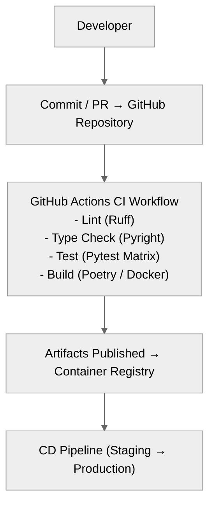
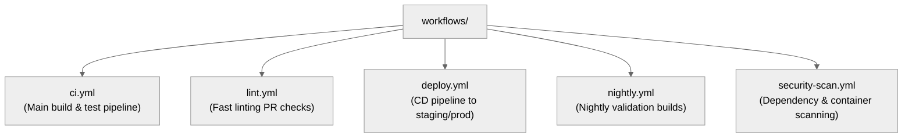
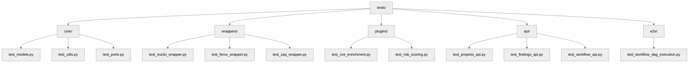

# 21 — CI/CD and Testing Strategy

## 🧭 Overview

The CI/CD and testing strategy ensures SecFlow maintains high reliability, reproducibility, and security compliance across all modules.  
It defines automated pipelines for build validation, testing, linting, packaging, and deployment to staging and production.

SecFlow's architecture enables modular CI pipelines for **packages** (core-lib, storage, wrappers, plugins) and **apps** (web-api, worker, triage-ui).

---

## ⚙️ CI/CD Architecture Diagram



---

## 🧱 CI Pipeline Structure

### Files
```
.github/
```



### Environments
- **dev** → local or containerized build  
- **staging** → auto-deployed for QA validation  
- **production** → manual approval required  

---

## 🧪 Test Taxonomy

| Level | Scope | Example |
|--------|--------|---------|
| **Unit Tests** | Function-level logic validation | Testing CVSS normalization, config parsing |
| **Integration Tests** | Module interoperability | NucleiWrapper + FindingsEngine |
| **Functional Tests** | End-to-end system behavior | Workflow execution pipeline |
| **Regression Tests** | Legacy feature coverage | Old project import/export |
| **Performance Tests** | Latency and scalability | Parallel scan runs |
| **Security Tests** | Dependency & vulnerability checks | Pip-audit, Trivy |

---

## 🧩 Test Framework Stack

| Tool | Purpose |
|------|----------|
| **pytest** | Primary test runner |
| **pytest-asyncio** | Async tests for API and worker |
| **pytest-cov** | Coverage reports |
| **tox** | Matrix execution (Python 3.10–3.12) |
| **httpx** | HTTP API test client |
| **sqlite-memory** | Fast ephemeral DB backend for testing |
| **faker** | Generate synthetic test data |
| **pytest-docker** | Integration tests for containerized tools |

---

## 🧱 Test Folder Structure

```
tests/
```



---

## 🧮 CI Matrix Configuration Example

```
# .github/workflows/ci.yml
name: CI
on:
  push:
    branches: [ main ]
  pull_request:
    branches: [ main ]

jobs:
  build-test:
    runs-on: ubuntu-latest
    strategy:
      matrix:
        python-version: [ "3.10", "3.11", "3.12" ]
        database: [ "sqlite", "postgres" ]
    steps:
      - uses: actions/checkout@v4
      - uses: actions/setup-python@v5
        with:
          python-version: ${{ matrix.python-version }}
      - run: pip install poetry
      - run: poetry install
      - run: make lint
      - run: make test DB=${{ matrix.database }}
      - run: pytest --cov=src --cov-report=xml
```

## 🧠 Deployment Pipeline

### Staging Pipeline (Continuous Deployment)
- Triggered on merge to main
- Deploys to staging environment automatically
- Runs post-deploy smoke tests:
  - `/healthz` endpoint
  - Workflow execution sanity test

### Production Pipeline
- Requires manual approval (`workflow_dispatch`)
- Signs Docker images before publishing
- Deploys to Kubernetes or Docker Swarm cluster
- Monitors deployment via Prometheus metrics

### Example job snippet:
```
- name: Deploy to Staging
  run: |
    docker-compose -f docker-compose.staging.yml up -d
    pytest tests/e2e/ --maxfail=1
```

## 🧰 Build Artifacts & Packages

| Type | Output | Destination |
|------|--------|-------------|
| Python Wheels | `dist/*.whl` | PyPI private index |
| Docker Images | `SecFlow-api`, `SecFlow-worker` | Container registry |
| Reports | `coverage.xml`, `lint.txt`, `typecheck.json` | GitHub artifacts |
| Documentation | mkdocs `site/` | GitHub Pages |

## 🧠 Quality Gates

| Check | Tool | Threshold |
|-------|------|-----------|
| Linting | Ruff | No errors |
| Type Checking | Pyright | 100% coverage |
| Test Coverage | Pytest + Coverage | > 90% |
| Dependency Scan | Pip-audit / Trivy | 0 Critical |
| Build Size | Docker | < 400 MB per image |

Failed gates block merges automatically.

## 🧪 Continuous Security Testing

- **Dependency Auditing:** via pip-audit and Safety
- **Container Scanning:** via Trivy in CI
- **Secrets Detection:** via gitleaks pre-commit hook
- **Infrastructure Scan:** via tfsec (for IaC configs)

```
pip install pip-audit safety gitleaks trivy
make security-scan
```

## 🔄 Regression & Replay Testing

Each workflow run can be recorded and replayed for regression tests.
This ensures stability across version upgrades.

### Example:
```
pytest tests/e2e/test_workflow_dag_execution.py --record
pytest --replay last-run
```

Replay data is stored under `/tests/artifacts/replays/`.

## 🧰 Local Developer Testing

Developers can run lightweight tests locally:

```
make test
pytest -k "not e2e"
```

With Docker-enabled integration tests:
```
make test-docker
```

## 📊 Metrics & Reporting

After each CI build:
- Coverage report published to Codecov
- Lint/type results annotated in GitHub PR
- Performance metrics logged to Prometheus

### Example coverage badge:
```
[](https://codecov.io/gh/SecFlow)
```

## 🧱 Disaster Recovery & Rollback

Every deployment is versioned:
- Docker image tags = `vX.Y.Z-buildhash`

### Rollback command:
```
docker pull SecFlow-api:v1.3.2
docker compose up -d --no-build
```

- Database snapshots every 6h during staging deployment

## 🔮 Future Enhancements

- Integration with GitHub Advanced Security (code scanning)
- Dynamic Test Selection (test impacted code only)
- Chaos Testing on worker queue reliability
- Parallelized build matrix using GitHub Actions caching

---

**Next:** [Developer Experience & Documentation Plan](22-developer-experience-and-docs.md)
```
```
```
```
```
```
```
```
```
```
```
```
```
```
```
```
```
```
```
```