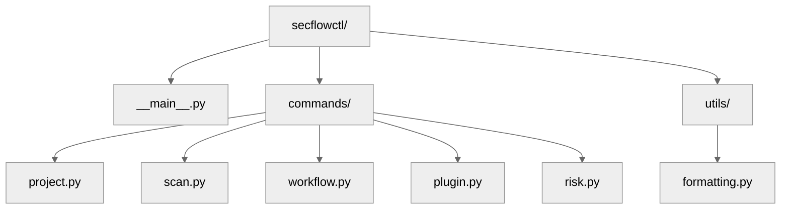
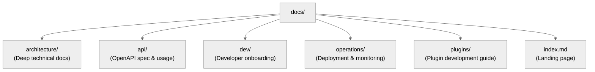

# 22 — Developer Experience & Documentation Plan

## 🧭 Overview

SecFlow prioritizes an efficient, reliable, and enjoyable **developer experience (DX)** that promotes rapid iteration without compromising architectural integrity.  
This section outlines the local environment setup, development workflow, CLI tools, documentation strategy, and contribution guidelines.

---

## 🧩 Core DX Principles

| Principle | Description |
|------------|-------------|
| **Fast Feedback** | Every command (`make test`, `make dev`) provides results in < 5s. |
| **Safe by Default** | Guardrails enforce architectural discipline (ruff, pyright, import-linter). |
| **Visible Architecture** | Auto-generated MkDocs diagrams and interlinked specs. |
| **One-Command Onboarding** | New developers can start coding in minutes. |
| **DevOps Parity** | Local, CI, and production environments behave identically. |

---

## ⚙️ Local Environment Setup

### Prerequisites
- Python ≥3.11  
- Poetry  
- Docker + Docker Compose  
- Node.js ≥18 (for triage-ui builds)

### Setup Commands
```
git clone https://github.com/SecFlow/security-toolkit.git
cd security-toolkit
make init
make up
```

`make init` performs:
- Poetry virtualenv setup
- Dependency installation
- Database migration (SQLite dev DB)
- Git pre-commit hooks (ruff, pyright, pytest)
- Environment validation (`make check`)

## 🧱 Developer Makefile Commands

| Command | Description |
|---------|-------------|
| `make up` | Start local stack (API, worker, UI) |
| `make down` | Stop containers and cleanup |
| `make dev` | Launch dev server with autoreload |
| `make test` | Run all tests |
| `make lint` | Run lint + type check |
| `make docs` | Build MkDocs documentation |
| `make check` | Validate dependencies and environment |
| `make clean` | Remove caches and build artifacts |

### Example:
```
make dev
# http://localhost:8080
```

## 🧰 Developer CLI — secflowctl

SecFlow provides an integrated command-line interface for developers and operators.

### Example Commands
```
secflowctl project list
secflowctl scan start nuclei --project mytest
secflowctl workflow run owasp-top10.yaml
secflowctl plugin list
secflowctl risk report --format table
```

### CLI Structure


### CLI Design Features
- Rich TUI (Textual) output for interactive sessions
- Tab autocompletion
- JSON/YAML output modes
- Direct API calls or local orchestration

## 🧭 Development Workflow

### Branching Model
```
main        → stable production branch
develop     → integration branch
feature/*   → new features or refactors
fix/*       → bug fixes
release/*   → versioned release candidates
```

### Pull Request Requirements
- 1 approving review
- All CI checks passed (lint, test, type, security scan)
- Linked issue ID
- Updated changelog entry

### Commit Style (Conventional Commits)
```
feat(workflow): add nuclei plugin support
fix(storage): handle null resource hash
docs(readme): update setup instructions
```

## 📘 Documentation System (MkDocs)

### MkDocs Project Layout
```
docs/
```



### Build Command
```
make docs
# Builds into site/
```

### Features
- Material for MkDocs theme
- Auto-generated architecture diagrams via Mermaid
- Built-in search and code highlighting
- Versioned docs (via mike) for each release
- Plugin-based navigation for "core", "apps", "plugins", "API"

### Example mkdocs.yml:
```
site_name: "SecFlow Developer Docs"
theme:
  name: material
  features:
    - navigation.sections
    - navigation.instant
markdown_extensions:
  - toc:
      permalink: true
  - admonition
  - pymdownx.superfences
plugins:
  - search
  - mermaid2
  - awesome-pages
```

## 🧠 Architecture Visualization

Architecture diagrams are auto-generated from the codebase using diagrams + pydeps.

### Example script:
```
make diagram
```

Output: `/docs/architecture/assets/architecture.svg`

### Example generated image (ASCII simplified):
```
        +-------------+
        |  web-api    |
        +------+------+----+
               |           |
       +-------v--+   +----v--------+
       | worker   |   | triage-ui   |
       +----------+   +-------------+
               |         |
          +----v---------v----+
          |  core-lib / engine |
          +--------------------+
```

## 🧩 Developer Onboarding Flow

| Step | Description |
|------|-------------|
| 1. Clone Repository | `git clone` and `make init` |
| 2. Run Local Stack | `make up` → visit localhost:8080 |
| 3. Explore CLI | `secflowctl help` |
| 4. Read Docs | `make docs` → open site/index.html |
| 5. Add Feature | Create `feature/my-feature` branch |
| 6. Submit PR | Push to GitHub, run CI, get review |
| 7. Merge & Deploy | Auto-deployed to staging |

## 🧰 Tooling Summary

| Category | Tool | Purpose |
|----------|------|---------|
| Package Management | Poetry | Dependency control |
| Linting | Ruff | Code style & hygiene |
| Typing | Pyright | Static type enforcement |
| Testing | Pytest | Unit & integration tests |
| Docs | MkDocs | Documentation |
| Visualization | Diagrams | Auto-generate architecture maps |
| Security | Gitleaks, Safety | Prevent secrets & vulns |
| Formatting | Black | Consistent code format |

## 🧩 Developer Guidelines

### Code Style
- Follow PEP8 + Ruff config
- Enforce docstrings for public classes/functions
- Avoid circular imports (use ports)
- Use dependency injection where possible

### Commit Rules
- Keep commits atomic (1 logical change)
- Use descriptive messages
- Reference related issue (#123)

### Code Review Expectations
- Small PRs (<500 LOC preferred)
- Include before/after screenshots for UI changes
- Add unit tests for every new feature

## 🧠 Local Testing Shortcuts

| Scenario | Command |
|----------|---------|
| Run single test | `pytest tests/core/test_models.py::test_project_model` |
| Run tests with coverage | `pytest --cov=src --cov-report=html` |
| Run async API tests | `pytest tests/api -k "async"` |
| Skip slow tests | `pytest -m "not slow"` |
| Lint before commit | `pre-commit run --all-files` |

## 📘 Developer Documentation Contributions

Docs are written in Markdown under `docs/`

### Always include:
- Code examples
- Usage samples
- Config references

### Build locally via:
```
mkdocs serve
```

### For architecture updates:
```
make diagram && make docs
```

## 🔮 Future DX Enhancements

- VS Code Dev Containers for instant onboarding
- CLI Autoupdate System for secflowctl
- MkDocs AI Search Plugin (semantic search)
- Interactive Architecture Map (Mermaid + Live API)
- Unified Dev Dashboard combining logs, metrics, and CI build state

---

**Next:** [Future Roadmap](23-future-roadmap.md)
```
```
```
```
```
```
```
```
```
```
```
```
```
```
```
```
```
```
```
```
```
```
```
```