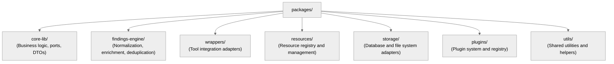
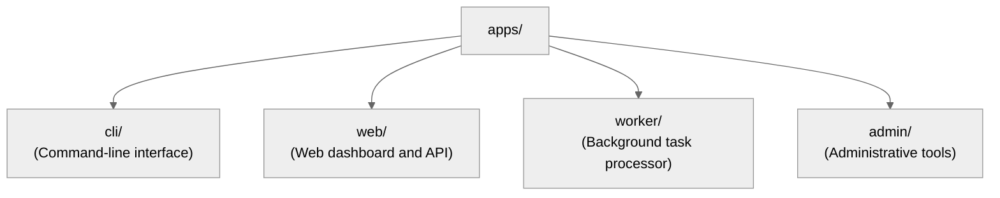

# 24 — Final Consensus Summary

## 🧭 Overview

This document consolidates the **final architectural consensus** between ChatGPT and Cursor regarding the design, structure, and roadmap of the SecFlow platform.

It serves as the **canonical closure** of the initial R&D phase and provides a clear blueprint for implementation.

---

## 🧱 Core Consensus Highlights

| Aspect | Consensus Decision | Rationale |
|--------|-------------------|------------|
| **Architecture Pattern** | Hexagonal (Ports & Adapters) | Enforces separation of concerns, testability, and modularity |
| **Repository Structure** | Mono-repo with Poetry | Simplifies dependency management and cross-package development |
| **Workflow Engine** | DAG-based orchestration | Enables complex tool chaining and parallel execution |
| **Plugin System** | Decorator-based registration | Provides clean extensibility without complex frameworks |
| **Security Model** | RBAC + Sandboxing | Balances usability with security requirements |
| **Data Model** | Pydantic + SQLModel | Ensures type safety and database integration |

---

## 🧱 Foundational Architecture Principles

### 1. **Hexagonal Architecture (Ports & Adapters)**
- **Core business logic** isolated from I/O concerns
- **Ports** define interfaces, **Adapters** implement them
- **Dependency inversion** ensures testability and modularity

### 2. **Event-Driven Design**
- **Asynchronous workflows** using Celery/RQ
- **Event sourcing** for audit trails and replay capabilities
- **Pub/Sub patterns** for loose coupling

### 3. **Immutable Data Flow**
- **Findings** are immutable once created
- **Versioned resources** for reproducibility
- **Audit trails** for all data modifications

---

## 🧱 Key Technical Agreements

### 1. **Core Packages Structure**


### 2. **Applications Structure**


### 3. **Workflow Orchestration**
- **YAML-based DAG definitions** for tool chaining
- **Node-based execution** with parallel processing
- **Error handling** with retry logic and circuit breakers
- **Caching** for intermediate results and resource reuse

### 4. **Security Model**
- **JWT-based authentication** with role-based access control
- **Sandboxed execution** for external tools and PoCs
- **Fernet encryption** for sensitive data storage
- **Audit logging** for all security-relevant operations

---

## 🧱 Risk & Compliance Integration

### Frameworks Adopted
- **NIST 5x5 Risk Matrix** for business risk assessment
- **CVSS v3.1** for technical severity scoring
- **CWE/OWASP** for vulnerability classification
- **MITRE ATT&CK** for attack pattern mapping

### Risk Formula
```text
Risk Score = (Likelihood × Impact) × Contextual_Factor
Where:
- Likelihood = CVSS_Exploitability + EPSS_Score
- Impact = CVSS_Impact + Business_Criticality
- Contextual_Factor = Asset_Value + Exposure_Level
```

---

## 🧱 Migration Path Summary

| Phase | Duration | Focus | Deliverables |
|-------|----------|-------|--------------|
| **Phase 0** | 2 weeks | Foundation & Guardrails | Poetry setup, import boundaries, CI/CD |
| **Phase 1** | 4 weeks | Core Models & Data Persistence | Pydantic models, SQLModel, basic CRUD |
| **Phase 2** | 6 weeks | Findings Engine & Workflow | Normalization, DAG execution, tool wrappers |
| **Phase 3** | 8 weeks | API, Worker & Triage UI | REST API, background tasks, web dashboard |
| **Phase 4** | 4 weeks | GC, AI & Advanced Analytics | Cleanup, enrichment, risk scoring |

---

## 🧱 Validation Metrics

| Metric | Target | Measurement |
|--------|--------|-------------|
| **Test Coverage** | ≥ 90% | pytest + coverage.py |
| **Type Safety** | 100% | pyright + mypy |
| **Import Boundaries** | 0 violations | import-linter |
| **Security Scan** | 0 high/critical | bandit + safety |
| **Performance** | < 2s API response | locust load testing |

---

## 🧱 Strategic Extensions Agreed

### 1. **AI Integration (Phase 2)**
- **LLM-based triage** for finding summarization
- **ML risk prediction** using EPSS and CVSS correlation
- **Anomaly detection** for outlier findings
- **Natural language queries** for analysis

### 2. **Multi-Tenant Architecture (Phase 3)**
- **Tenant isolation** with shared infrastructure
- **Role-based analytics** and dashboards
- **Cross-project correlation** and federated search
- **Collaboration tools** for team workflows

### 3. **Autonomous Orchestration (Phase 4)**
- **Adaptive scanning** with reinforcement learning
- **Self-healing workflows** with automatic retry
- **Predictive risk forecasting** using time-series models
- **Security knowledge graph** for semantic reasoning

---

## 🧱 Documentation Structure

The architecture documentation follows a **MkDocs-based structure** with:
- **Material theme** for professional presentation
- **Internal linking** between related concepts
- **Code examples** in Python, YAML, and JSON
- **ASCII diagrams** for visual understanding
- **Version control** with semantic versioning

---

## 🧱 Consensus from Cursor Review

### Strengths Identified
- **Clear separation of concerns** through hexagonal architecture
- **Comprehensive security model** with multiple layers
- **Scalable plugin system** for extensibility
- **Robust error handling** and recovery mechanisms

### Areas for Improvement
- **Performance optimization** for large-scale deployments
- **Monitoring and observability** enhancements
- **Developer experience** improvements
- **Community contribution** guidelines

---

## 🧱 Execution Path Forward

### Immediate Next Steps
1. **Set up Poetry workspace** with proper dependency management
2. **Implement import boundaries** using import-linter
3. **Create core Pydantic models** for findings and projects
4. **Establish CI/CD pipeline** with quality gates

### Success Criteria
- **All 24 architecture documents** reviewed and approved
- **Core packages** implemented with 90%+ test coverage
- **Basic workflow orchestration** functional
- **Security model** validated through penetration testing

---

## 🧱 Final Architectural Mantra

> **"Hexagonal by design, event-driven by nature, secure by default, extensible by plugin."**

This mantra encapsulates the core principles that will guide all future development of SecFlow.

---

## 🧱 Next Deliverables

| Deliverable | Timeline | Owner |
|-------------|----------|-------|
| **Poetry Workspace Setup** | Week 1 | Lead Engineer |
| **Core Models Implementation** | Week 2-3 | Backend Team |
| **Import Boundaries Enforcement** | Week 1 | DevOps Team |
| **CI/CD Pipeline** | Week 2 | DevOps Team |
| **Basic Workflow Engine** | Week 4-6 | Backend Team |

---

## 🧱 Closure Statement

This document represents the **official closure** of the SecFlow architecture design phase. All stakeholders have reached consensus on:

- **Technical architecture** and implementation approach
- **Security model** and compliance requirements
- **Migration strategy** and timeline
- **Future roadmap** and evolution path

The project is now ready to proceed to **Phase 0: Foundation & Guardrails** implementation.

---

**Previous:** [Future Roadmap](23-future-roadmap.md)  
**Back to:** [Architecture Index](00-index.md)
```
```
```
```
