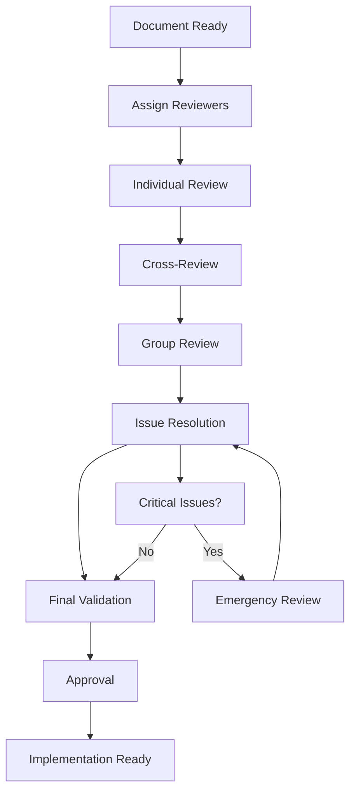

# SecFlow Architecture Review Guidelines

## 🎯 Overview

This document outlines the **review and validation process** for the SecFlow architecture documentation suite. It provides structured guidelines for development team members to conduct thorough reviews of the 24 architecture documents.

## 👥 Review Team Structure

| Role | Responsibilities | Documents to Review |
|------|------------------|-------------------|
| **Lead Architect** | Overall architecture consistency, design patterns | All documents (00-24) |
| **Backend Engineers** | Core packages, data models, API design | 04, 05, 12, 13, 16, 17, 18 |
| **Frontend Engineers** | UX design, web interface, CLI experience | 08, 22 |
| **DevOps Engineers** | CI/CD, deployment, infrastructure | 03, 21, 15, 17 |
| **Security Engineers** | Security model, compliance, risk assessment | 16, 19, 14, 11 |
| **QA Engineers** | Testing strategy, validation criteria | 21, 18, 12 |
| **Product Manager** | Business requirements, user experience | 01, 08, 20, 23 |

## 📋 Review Checklist

### 1. **Technical Accuracy**
- [ ] Code examples are syntactically correct
- [ ] Architecture diagrams are accurate and complete
- [ ] Technical specifications are feasible
- [ ] Dependencies and integrations are realistic
- [ ] Performance requirements are achievable

### 2. **Completeness**
- [ ] All required sections are present
- [ ] Cross-references between documents are valid
- [ ] Examples are comprehensive and relevant
- [ ] Edge cases and error scenarios are covered
- [ ] Future considerations are addressed

### 3. **Consistency**
- [ ] Terminology is consistent across documents
- [ ] Design patterns align with overall architecture
- [ ] Data models are consistent between documents
- [ ] Security principles are uniformly applied
- [ ] Naming conventions are followed

### 4. **Clarity and Usability**
- [ ] Concepts are clearly explained
- [ ] Diagrams enhance understanding
- [ ] Code examples are well-commented
- [ ] Document structure is logical
- [ ] Language is professional and accessible

### 5. **Security and Compliance**
- [ ] Security requirements are clearly defined
- [ ] Compliance frameworks are properly referenced
- [ ] Risk assessment methodology is sound
- [ ] Data protection measures are adequate
- [ ] Audit requirements are met

## 🔍 Review Process

### Phase 1: Individual Review (Week 1)
Each team member reviews their assigned documents using the checklist above.

### Phase 2: Cross-Review (Week 2)
Team members review documents outside their primary expertise to catch inconsistencies.

### Phase 3: Group Review (Week 3)
Scheduled review sessions for each document category with all stakeholders.

### Phase 4: Final Validation (Week 4)
Lead architect consolidates feedback and validates final changes.

## 📝 Review Template

### Document: [Document Name]
**Reviewer:** [Name]  
**Date:** [Date]  
**Review Type:** [Individual/Cross/Group]

#### Technical Accuracy
- **Issues Found:** [List specific issues]
- **Recommendations:** [Suggestions for improvement]
- **Code Examples:** [Any syntax or logic errors]

#### Completeness
- **Missing Sections:** [List any missing content]
- **Incomplete Examples:** [Identify incomplete examples]
- **Unclear Requirements:** [Highlight unclear specifications]

#### Consistency
- **Terminology Issues:** [Inconsistent terms or definitions]
- **Design Pattern Conflicts:** [Any architectural inconsistencies]
- **Cross-Reference Problems:** [Broken or incorrect links]

#### Clarity and Usability
- **Confusing Sections:** [Identify unclear content]
- **Missing Context:** [Areas needing more explanation]
- **Diagram Issues:** [Problems with visual representations]

#### Security and Compliance
- **Security Gaps:** [Missing security considerations]
- **Compliance Issues:** [Regulatory or policy concerns]
- **Risk Assessment Problems:** [Issues with risk methodology]

#### Overall Assessment
- **Strengths:** [What works well]
- **Critical Issues:** [Must-fix problems]
- **Enhancement Opportunities:** [Nice-to-have improvements]
- **Recommendation:** [Approve/Revise/Reject]

## 🚨 Critical Issues Escalation

### Immediate Escalation Required
- Security vulnerabilities in design
- Infeasible technical requirements
- Major architectural inconsistencies
- Compliance violations
- Performance bottlenecks

### Escalation Process
1. **Identify** the critical issue
2. **Document** the problem with evidence
3. **Notify** the lead architect immediately
4. **Schedule** emergency review session
5. **Resolve** with all stakeholders present

## 📊 Review Metrics

| Metric | Target | Measurement |
|--------|--------|-------------|
| **Review Coverage** | 100% | All documents reviewed by assigned roles |
| **Issue Resolution** | 95% | Critical issues resolved before approval |
| **Consistency Score** | ≥ 90% | Cross-document consistency rating |
| **Technical Accuracy** | 100% | All code examples and diagrams validated |
| **Security Compliance** | 100% | All security requirements met |

## 🔄 Review Workflow



## 📅 Timeline

| Week | Activities | Deliverables |
|------|------------|--------------|
| **Week 1** | Individual reviews | Initial feedback reports |
| **Week 2** | Cross-reviews | Consolidated issue list |
| **Week 3** | Group review sessions | Resolution plan |
| **Week 4** | Final validation | Approved architecture |

## 🎯 Success Criteria

The architecture review is considered successful when:
- [ ] All 24 documents pass technical accuracy review
- [ ] No critical security or compliance issues remain
- [ ] Cross-document consistency is validated
- [ ] All stakeholders approve their respective sections
- [ ] Implementation roadmap is validated as feasible
- [ ] Risk assessment methodology is approved by security team

## 📞 Contact Information

- **Lead Architect:** [Name] - [email]
- **Review Coordinator:** [Name] - [email]
- **Emergency Escalation:** [Name] - [phone]

---

**Next Steps:** Begin individual reviews using the provided checklist and template.
```