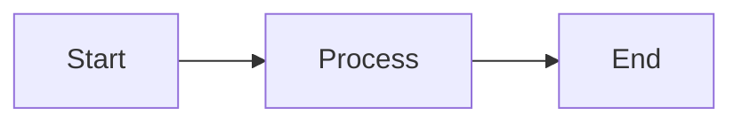
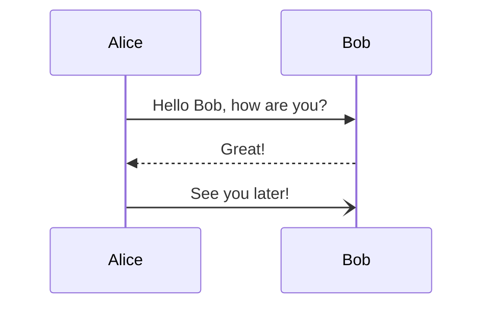
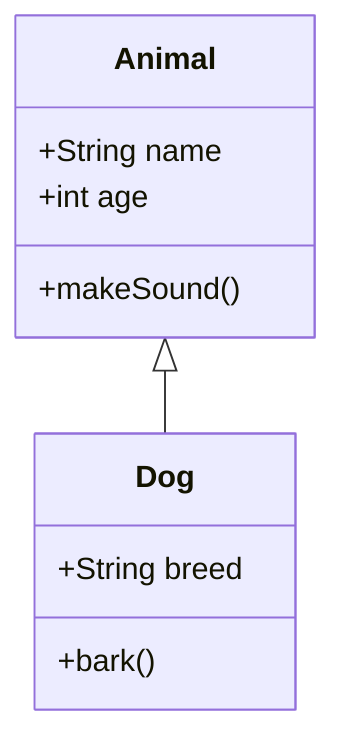
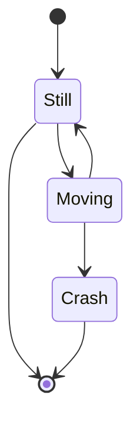

# Mermaid Smoketest

This page tests that Mermaid diagrams are rendering correctly using the superfences + local Mermaid approach.

## 🧪 Test Diagram



## ✅ Expected Result

You should see a flowchart diagram above with three boxes connected by arrows.

## 🔄 Sequence Diagram Test



## 📊 Class Diagram Test



## 🎯 State Diagram Test



## 📈 Expected Results

All four diagrams above should render as interactive Mermaid diagrams, not as code blocks.
```