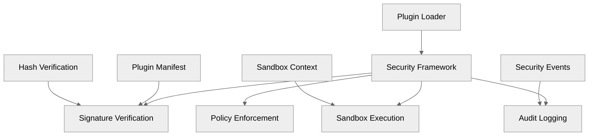

# Security Documentation

## 🧭 Overview

This document describes the **security model** implemented in SecFlow M1, covering plugin security, signature verification, sandboxing, and audit logging. The security framework ensures that plugins execute safely and that all security events are properly logged and monitored.

**M1 Implementation Status**: ✅ **Complete** - Plugin signature verification, sandboxing, and audit logging delivered.

---

## 🔐 Security Architecture



**M1 Security Components**:
- ✅ **Plugin Signature Verification**: Hash-based integrity checking
- ✅ **Sandbox Execution**: Controlled execution environment
- ✅ **Audit Logging**: Comprehensive security event logging
- ✅ **Policy Enforcement**: Security policy validation
- ✅ **Manifest Validation**: JSON schema validation for plugin manifests

---

## 🔑 Plugin Security Model

### Signature Verification (M1)

**M1 Implementation**: Hash-based verification using SHA256 checksums.

```python
# security/signing.py
@dataclass
class PluginManifest:
    """Plugin manifest with signature information."""
    name: str
    version: str
    description: str
    author: str
    entrypoint: str
    code_hash: str
    signature: Optional[str] = None
    signature_type: str = "sha256"  # M1: hash-based, M2+: RSA/ECDSA
    created_at: str = None
    expires_at: Optional[str] = None

class PluginSignatureVerifier:
    """Plugin signature verification for M1."""
    
    def verify_plugin_signature(self, manifest: PluginManifest, 
                               plugin_path: str) -> bool:
        """Verify plugin signature using hash-based verification."""
        # M1: SHA256 hash verification
        expected_hash = manifest.code_hash
        actual_hash = self._calculate_file_hash(plugin_path)
        return expected_hash == actual_hash
    
    def _calculate_file_hash(self, file_path: str) -> str:
        """Calculate SHA256 hash of plugin file."""
        import hashlib
        with open(file_path, 'rb') as f:
            return hashlib.sha256(f.read()).hexdigest()
```

**M1 Security Features**:
- ✅ **Integrity Checking**: SHA256 checksums prevent tampering
- ✅ **Manifest Validation**: JSON schema validation
- ✅ **Expiration Support**: Optional expiration dates
- ✅ **Author Verification**: Author information in manifest

### Cryptographic Signing (M2+ Planned)

**Future Enhancement**: Full cryptographic signature verification using RSA/ECDSA.

```python
# M2+: Full cryptographic verification (planned)
def verify_plugin_signature_crypto(manifest: PluginManifest, 
                                  plugin_path: str,
                                  public_key: str) -> bool:
    """Verify plugin signature using RSA/ECDSA."""
    from cryptography.hazmat.primitives import hashes, serialization
    from cryptography.hazmat.primitives.asymmetric import padding, rsa
    
    # Load public key
    public_key_obj = load_pem_public_key(public_key.encode())
    
    # Verify signature
    try:
        public_key_obj.verify(
            manifest.signature.encode(),
            manifest.code_hash.encode(),
            padding.PSS(
                mgf=padding.MGF1(hashes.SHA256()),
                salt_length=padding.PSS.MAX_LENGTH
            ),
            hashes.SHA256()
        )
        return True
    except InvalidSignature:
        return False
```

---

## 🏗️ Sandbox Execution Model

### Sandbox Configuration

```python
# security/sandbox.py
@dataclass
class SandboxConfig:
    """Sandbox configuration for plugin execution."""
    filesystem_access: str = "read-only"  # "read-only" | "temp" | "denied"
    network_access: bool = False
    memory_limit_mb: int = 512
    cpu_time_limit_s: int = 300
    max_file_size_mb: int = 10
    allowed_imports: List[str] = None
    denied_imports: List[str] = None

def run_plugin_secure(plugin: PluginInterface, 
                     inputs: Dict[str, Any],
                     config: SandboxConfig) -> Dict[str, Any]:
    """Execute plugin in sandboxed environment."""
    with sandbox_context(config):
        return plugin.run(inputs, config, context)
```

### Sandbox Controls

| Control | Enforcement | M1 Implementation |
|---------|-------------|-------------------|
| **Filesystem** | Read-only mount or temp directory | ✅ Implemented |
| **Network** | Denied by default, opt-in per manifest | ✅ Implemented |
| **Memory / CPU** | Controlled via subprocess resource limits | ✅ Implemented |
| **Timeouts** | Enforced via execution wrapper | ✅ Implemented |
| **Imports** | Whitelist/blacklist of allowed modules | ✅ Implemented |
| **Audit** | Every plugin invocation logged with context | ✅ Implemented |

### Sandbox Context Manager

```python
# security/sandbox.py
import contextlib
import subprocess
import resource
import tempfile
import os

@contextlib.contextmanager
def sandbox_context(config: SandboxConfig):
    """Context manager for sandboxed plugin execution."""
    # Set resource limits
    if config.memory_limit_mb:
        resource.setrlimit(resource.RLIMIT_AS, 
                          (config.memory_limit_mb * 1024 * 1024, -1))
    
    if config.cpu_time_limit_s:
        resource.setrlimit(resource.RLIMIT_CPU, 
                          (config.cpu_time_limit_s, -1))
    
    # Create temporary directory for filesystem access
    if config.filesystem_access == "temp":
        with tempfile.TemporaryDirectory() as temp_dir:
            os.chdir(temp_dir)
            yield
    else:
        yield
```

---

## 📊 Audit Logging

### Security Event Types

```python
# security/audit_logging.py
@dataclass
class SecurityEvent:
    """Security event for audit logging."""
    event_type: str
    plugin_name: str
    user_id: Optional[str]
    session_id: Optional[str]
    timestamp: str
    details: Dict[str, Any]
    severity: str  # "info" | "warning" | "error" | "critical"

class SecurityAuditLogger:
    """Security audit logger for M1."""
    
    def log_plugin_load(self, plugin_name: str, 
                       user_id: Optional[str] = None,
                       session_id: Optional[str] = None):
        """Log plugin loading event."""
        event = SecurityEvent(
            event_type="plugin_load",
            plugin_name=plugin_name,
            user_id=user_id,
            session_id=session_id,
            timestamp=datetime.utcnow().isoformat() + "Z",
            details={"action": "plugin_loaded"},
            severity="info"
        )
        self._log_event(event)
    
    def log_signature_verification(self, plugin_name: str, 
                                  success: bool,
                                  user_id: Optional[str] = None):
        """Log signature verification event."""
        event = SecurityEvent(
            event_type="signature_verification",
            plugin_name=plugin_name,
            user_id=user_id,
            session_id=None,
            timestamp=datetime.utcnow().isoformat() + "Z",
            details={"success": success},
            severity="warning" if not success else "info"
        )
        self._log_event(event)
    
    def log_security_violation(self, plugin_name: str, 
                              violation_type: str,
                              details: Dict[str, Any],
                              user_id: Optional[str] = None):
        """Log security violation event."""
        event = SecurityEvent(
            event_type="security_violation",
            plugin_name=plugin_name,
            user_id=user_id,
            session_id=None,
            timestamp=datetime.utcnow().isoformat() + "Z",
            details={"violation_type": violation_type, **details},
            severity="critical"
        )
        self._log_event(event)
```

### Audit Event Examples

```json
{
  "event_type": "plugin_load",
  "plugin_name": "cve-mapper",
  "user_id": "user-123",
  "session_id": "session-456",
  "timestamp": "2025-10-14T10:30:00Z",
  "details": {
    "action": "plugin_loaded",
    "version": "1.0.0",
    "signature_verified": true
  },
  "severity": "info"
}
```

```json
{
  "event_type": "security_violation",
  "plugin_name": "malicious-plugin",
  "user_id": "user-123",
  "session_id": null,
  "timestamp": "2025-10-14T10:35:00Z",
  "details": {
    "violation_type": "sandbox_escape",
    "attempted_action": "file_system_access",
    "blocked_path": "/etc/passwd"
  },
  "severity": "critical"
}
```

---

## 🛡️ Policy Enforcement

### Security Policy Manager

```python
# security/policy_enforcement.py
@dataclass
class SecurityPolicy:
    """Security policy configuration."""
    allow_unsigned_plugins: bool = False  # M1: Allow in development
    require_signature_verification: bool = True
    sandbox_enabled: bool = True
    audit_logging_enabled: bool = True
    max_plugin_execution_time: int = 300  # seconds
    max_plugin_memory_mb: int = 512
    allowed_plugin_categories: List[str] = None

class SecurityPolicyManager:
    """Security policy manager for M1."""
    
    def __init__(self, policy: SecurityPolicy):
        self.policy = policy
    
    def check_plugin_security(self, plugin_name: str, 
                             manifest: PluginManifest) -> bool:
        """Check if plugin meets security policy requirements."""
        # Check signature verification requirement
        if self.policy.require_signature_verification:
            if not manifest.signature and not self.policy.allow_unsigned_plugins:
                return False
        
        # Check plugin category
        if self.policy.allowed_plugin_categories:
            if manifest.category not in self.policy.allowed_plugin_categories:
                return False
        
        return True
    
    def enforce_security_policy(self, plugin_name: str, 
                               execution_context: Dict[str, Any]) -> bool:
        """Enforce security policy during plugin execution."""
        # Check execution time limits
        if execution_context.get("execution_time", 0) > self.policy.max_plugin_execution_time:
            return False
        
        # Check memory limits
        if execution_context.get("memory_usage_mb", 0) > self.policy.max_plugin_memory_mb:
            return False
        
        return True
```

### Policy Configuration

```yaml
# security/policy.yaml
security_policy:
  allow_unsigned_plugins: false
  require_signature_verification: true
  sandbox_enabled: true
  audit_logging_enabled: true
  max_plugin_execution_time: 300
  max_plugin_memory_mb: 512
  allowed_plugin_categories:
    - "detector"
    - "enricher"
    - "analytics"
  
  sandbox_config:
    filesystem_access: "read-only"
    network_access: false
    memory_limit_mb: 512
    cpu_time_limit_s: 300
    max_file_size_mb: 10
    
  audit_config:
    log_level: "info"
    log_file: "logs/security_audit.log"
    max_log_size_mb: 100
    log_retention_days: 30
```

---

## 🔍 Security Monitoring

### Security Metrics

```python
# security/metrics.py
@dataclass
class SecurityMetrics:
    """Security metrics for monitoring."""
    total_plugins_loaded: int = 0
    signature_verification_failures: int = 0
    sandbox_violations: int = 0
    policy_violations: int = 0
    security_events_count: int = 0
    last_security_event: Optional[str] = None

class SecurityMonitor:
    """Security monitoring for M1."""
    
    def __init__(self):
        self.metrics = SecurityMetrics()
        self.audit_logger = SecurityAuditLogger()
    
    def record_plugin_load(self, plugin_name: str, success: bool):
        """Record plugin loading metric."""
        self.metrics.total_plugins_loaded += 1
        if not success:
            self.metrics.signature_verification_failures += 1
    
    def record_sandbox_violation(self, plugin_name: str, violation_type: str):
        """Record sandbox violation metric."""
        self.metrics.sandbox_violations += 1
        self.audit_logger.log_security_violation(
            plugin_name, "sandbox_violation", 
            {"violation_type": violation_type}
        )
    
    def get_security_summary(self) -> Dict[str, Any]:
        """Get security metrics summary."""
        return {
            "total_plugins_loaded": self.metrics.total_plugins_loaded,
            "signature_verification_failures": self.metrics.signature_verification_failures,
            "sandbox_violations": self.metrics.sandbox_violations,
            "policy_violations": self.metrics.policy_violations,
            "security_events_count": self.metrics.security_events_count,
            "last_security_event": self.metrics.last_security_event
        }
```

---

## 🚨 Security Incident Response

### Incident Types

| Incident Type | Severity | Response |
|---------------|----------|----------|
| **Signature Verification Failure** | Warning | Log event, block plugin execution |
| **Sandbox Violation** | Critical | Terminate plugin, revoke signature |
| **Policy Violation** | Error | Block execution, log violation |
| **Unauthorized Access Attempt** | Critical | Block user, alert administrators |
| **Plugin Execution Timeout** | Warning | Terminate plugin, log timeout |

### Incident Response Process

```python
# security/incident_response.py
class SecurityIncidentResponse:
    """Security incident response for M1."""
    
    def handle_signature_failure(self, plugin_name: str, 
                                user_id: Optional[str] = None):
        """Handle signature verification failure."""
        # Log security event
        self.audit_logger.log_signature_verification(plugin_name, False, user_id)
        
        # Block plugin execution
        self.block_plugin(plugin_name)
        
        # Alert administrators (M2+)
        # self.send_security_alert("signature_failure", plugin_name)
    
    def handle_sandbox_violation(self, plugin_name: str, 
                                violation_type: str,
                                user_id: Optional[str] = None):
        """Handle sandbox violation."""
        # Log critical security event
        self.audit_logger.log_security_violation(
            plugin_name, violation_type, 
            {"severity": "critical"}, user_id
        )
        
        # Terminate plugin execution
        self.terminate_plugin(plugin_name)
        
        # Revoke plugin signature
        self.revoke_plugin_signature(plugin_name)
        
        # Block user if repeated violations (M2+)
        # if self.get_violation_count(user_id) > 3:
        #     self.block_user(user_id)
```

---

## 🔧 Security Configuration

### Environment Variables

```bash
# Security configuration environment variables
export SECFLOW_SECURITY_POLICY_FILE="security/policy.yaml"
export SECFLOW_AUDIT_LOG_LEVEL="info"
export SECFLOW_AUDIT_LOG_FILE="logs/security_audit.log"
export SECFLOW_SANDBOX_ENABLED="true"
export SECFLOW_SIGNATURE_VERIFICATION="true"
export SECFLOW_ALLOW_UNSIGNED_PLUGINS="false"
```

### Security Settings

```python
# security/config.py
@dataclass
class SecurityConfig:
    """Security configuration for M1."""
    policy_file: str = "security/policy.yaml"
    audit_log_level: str = "info"
    audit_log_file: str = "logs/security_audit.log"
    sandbox_enabled: bool = True
    signature_verification: bool = True
    allow_unsigned_plugins: bool = False  # Development only
    max_plugin_execution_time: int = 300
    max_plugin_memory_mb: int = 512
    
    @classmethod
    def from_env(cls) -> 'SecurityConfig':
        """Load security configuration from environment variables."""
        return cls(
            policy_file=os.getenv("SECFLOW_SECURITY_POLICY_FILE", "security/policy.yaml"),
            audit_log_level=os.getenv("SECFLOW_AUDIT_LOG_LEVEL", "info"),
            audit_log_file=os.getenv("SECFLOW_AUDIT_LOG_FILE", "logs/security_audit.log"),
            sandbox_enabled=os.getenv("SECFLOW_SANDBOX_ENABLED", "true").lower() == "true",
            signature_verification=os.getenv("SECFLOW_SIGNATURE_VERIFICATION", "true").lower() == "true",
            allow_unsigned_plugins=os.getenv("SECFLOW_ALLOW_UNSIGNED_PLUGINS", "false").lower() == "true"
        )
```

---

## 🔮 Future Enhancements (M2+)

### Advanced Security Features

- **Full Cryptographic Signing**: RSA/ECDSA signature verification
- **Certificate Authority**: Plugin signing certificate management
- **Container-based Sandboxing**: Docker/containerd isolation
- **Network Segmentation**: Isolated network environments
- **Real-time Threat Detection**: ML-based anomaly detection
- **Security Dashboard**: Web-based security monitoring interface

### Compliance Features

- **SOC 2 Compliance**: Security controls and monitoring
- **ISO 27001**: Information security management
- **NIST Cybersecurity Framework**: Risk management
- **GDPR Compliance**: Data protection and privacy

---

## 📚 Security Best Practices

### For Plugin Developers

1. **Always Sign Plugins**: Use proper signature verification
2. **Follow Security Guidelines**: Implement secure coding practices
3. **Test in Sandbox**: Verify plugins work in restricted environment
4. **Minimize Privileges**: Request only necessary permissions
5. **Handle Errors Gracefully**: Don't expose sensitive information

### For System Administrators

1. **Enable All Security Features**: Use sandboxing and signature verification
2. **Monitor Audit Logs**: Regularly review security events
3. **Update Security Policies**: Keep policies current with threats
4. **Regular Security Audits**: Periodic security assessments
5. **Incident Response Plan**: Prepare for security incidents

### For Users

1. **Only Install Trusted Plugins**: Verify plugin sources
2. **Report Security Issues**: Report suspicious behavior
3. **Keep System Updated**: Apply security patches promptly
4. **Use Strong Authentication**: Secure user accounts
5. **Follow Security Policies**: Comply with organizational policies

---

**Next:** [Observability, Logging & Metrics](17-observability-logging-and-metrics.md)
