# 📊 Sequence Diagrams - Security Toolkit Workflows

**Why each flow matters for system understanding and troubleshooting**

## Preview Drawer Open

```mermaid
sequenceDiagram
    participant U as User
    participant F as Frontend JS
    participant H as HTMX
    participant S as Sitemap Route
    participant D as Dossier Storage
    participant T as Template Engine

    U->>F: Click endpoint row
    F->>F: Extract URL/method from DOM
    F->>H: htmx.ajax('POST', '/sitemap/endpoint-preview')
    H->>S: POST /p/<pid>/sitemap/endpoint-preview
    S->>S: Parse url/method from form
        
    alt Endpoint has dossier
        S->>D: get_endpoint_runs_by_key(pid, key)
        D-->>S: Returns run history array
    else New endpoint  
        S->>S: Create empty coverage data
    end
    
    S->>T: render_template('drawer_endpoint_preview.html')
    T-->>S: Rendered HTML drawer content
    S-->>H: HTML response
    H->>H: Target: #panel-body, Swap: innerHTML
    
    H->>F: Trigger drawer_opened event
    F->>F: openPanelWith('Preview', method, path, url)
    
    Note over U,T: 🔍 Why this matters: Provides instant endpoint context<br/>without full page reload, enabling rapid API exploration<br/>and debugging workflows. Cache-friendly pattern.
```

**Key Points**:
- **HTMX Pattern**: Enables partial page updates without JavaScript complexity
- **Dossier Lookup**: Canonical endpoint keys enable fast history retrieval  
- **Cache Integration**: New endpoints get empty state, existing endpoints show full history
- **Debugging**: If drawer fails, check HTMX console errors and route response format

---

## Run Scan → SSE → Dossier Write → Runs Drawer Populate

**Key Points**:
- **Run Attribution**: Each finding links to specific run_id for forensic trails
- **Atomic Updates**: Dossier writing ensures consistency across concurrent reads
- **Background Processing**: UI remains responsive during long-running scans
- **Deep Linking**: Runs drawer automatically reflects latest scan results
- **Storage Pattern**: Individual dossier files per endpoint prevent lock contention

**Troubleshooting**:
- **SSE Hangs**: Check Nuclei process status (`ps aux | grep nuclei`)
- **Dossier Corruption**: Validate JSON integrity (`jq '.' file.json`)
- **Performance**: Monitor dossier file sizes as project scales

---

## Findings Detail → View Run Deep Link → Highlight

**Key Points**:
- **Finding Attribution**: Links individual findings to specific runs with artifact references
- **Rich Context**: Shows full request/response data for debugging vulnerabilities
- **Deep Linking**: Hash-based URLs enable sharing specific finding contexts
- **Visual Highlighting**: CSS animations draw attention to relevant code/patterns
- **Forensic Trail**: Complete artifact → run → finding chain for compliance

**Feature Benefits**:
- **Security Teams**: Share exact vulnerability locations with development teams
- **Audit Requirements**: Generate evidence trails from finding to reproducible test
- **Debugging**: View full HTTP context around security findings
- **Collaboration**: Deep links enable async collaboration on security issues

---

## API Explorer → Queue → Scan → Bulk Finding Analysis

```mermaid
sequenceDiagram
    participant U as User
    participant E as Explorer Route
    participant Q as Queue Storage  
    participant N as Nuclei Integration
    participant F as Findings Analysis
    participant G as Grouping Logic

    U->>E: Browse API → Add operations to queue
    E->>Q: persist_from_runtime(queue_items)
    U->>E: Review queue → Start bulk scan
    E->>N: scan_project_endpoints(bulk_endpoints)
    
    loop For each endpoint/template combination
        N->>N: Execute Nuclei test
        N->>F: append_findings(pid, findings_batch)
    end
    
    U->>F: Navigate to findings page
    F->>F: GET /p/<pid>/findings?group_by=endpoint
    F->>F: build_groups(findings, mode='endpoint')
    F->>G: Group findings by URL pattern
    G-->>F: Sorted groups with counts
    
    U->>F: Click group → Bulk triage
    F->>F: POST /p/<pid>/findings/triage-group
    F->>F: Update statuses atomically
    F-->>U: Bulk operation complete
    
    Note over U,G: 📊 Why this matters: Scales security testing from individual<br/>endpoints to comprehensive API surface analysis. Enables<br/>bulk operations needed for enterprise security workflows.
```

**Key Points**:
- **Queue Pattern**: Allows preparation and review before destructive testing
- **Bulk Analysis**: Groups findings by endpoint/CWE/OWASP for systematic triage  
- **Atomic Operations**: Bulk triage maintains data consistency
- **Enterprise Scale**: Handles hundreds of endpoints efficiently

**Operational Benefits**:
- **Offline Planning**: Build comprehensive test plans before execution
- **Risk Prioritization**: Group findings by severity/endpoint for efficient remediation
- **Compliance Reporting**: Generate aggregated security posture reports
- **Audit Trails**: Full attribution chain from planning to execution to triage

---

## Authentication Request → Role Validation → Feature Access

```mermaid
sequenceDiagram
    participant U as User
    participant A as Auth Middleware
    participant R as Role Checker
    participant S as Session Storage
    participant F as Feature Route

    U->>F: Request protected endpoint
    F->>A: @require_auth decorator
    A->>S: Check Flask session for user
    alt User authenticated
        A->>R: @require_role('owner') check
        R->>S: Validate user roles against required
        
        alt Sufficient privileges
            R-->>F: Grant access
            F->>F: Execute protected operation
            F-->>U: Success response
        else Insufficient privileges  
            R-->>F: Deny access
            F-->>U: {"error": "Insufficient privileges"}, 403
        end
    else Unauthenticated
        A-->>F: Redirect required  
        F-->>U: HTTP 302 to /auth/login
    end
    
    Note over U,F: 🔒 Why this matters: Prevents unauthorized access to sensitive<br/>security operations while enabling collaborative access patterns<br/>needed for team-based security workflows.
```

**Key Points**:
- **Decorator Pattern**: Clean separation of security logic from business logic
- **Role Granularity**: Different privilege levels for different operations  
- **Session Security**: Flask sessions store encrypted user state
- **Graceful Degradation**: Clear error messages for legitimate access denials

**Security Benefits**:
- **Principle of Least Privilege**: Users only access features they need
- **Audit Trail**: All access attempts logged with user context
- **Team Collaboration**: Multiple users can work on same project safely
- **Compliance**: Meets requirements for security tool access controls
