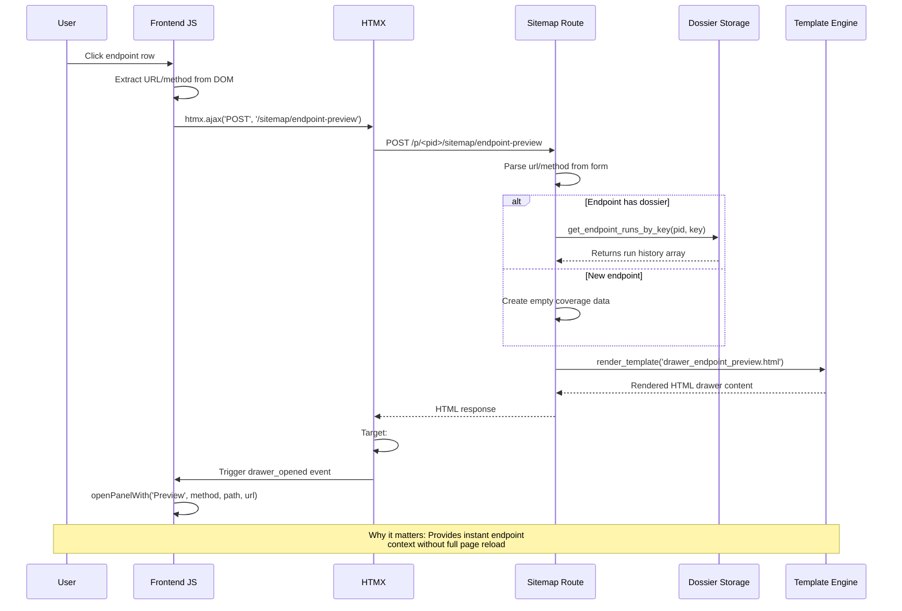
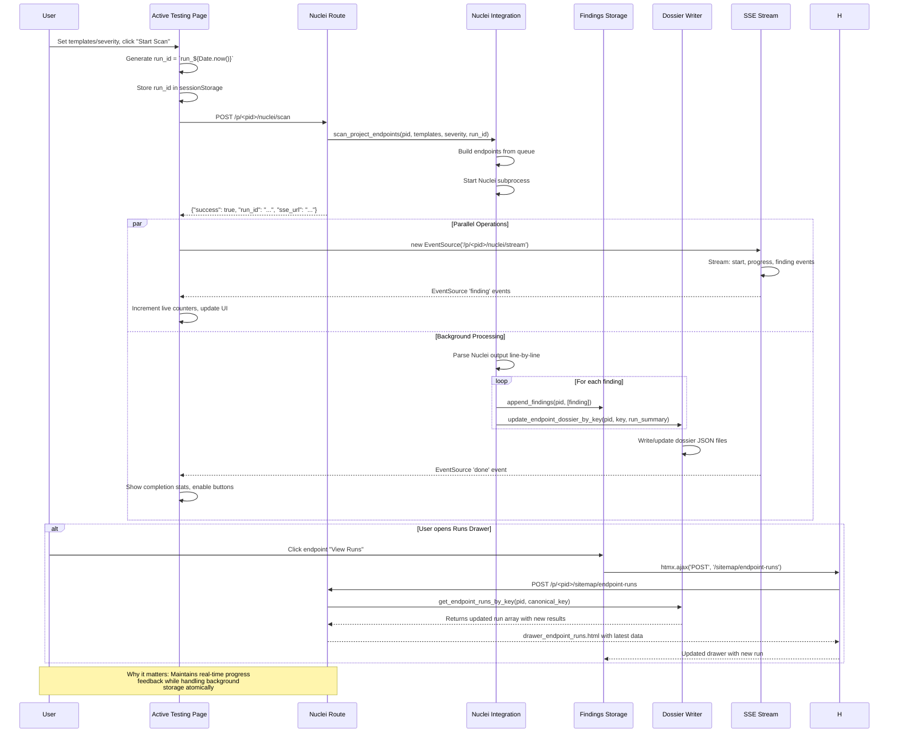
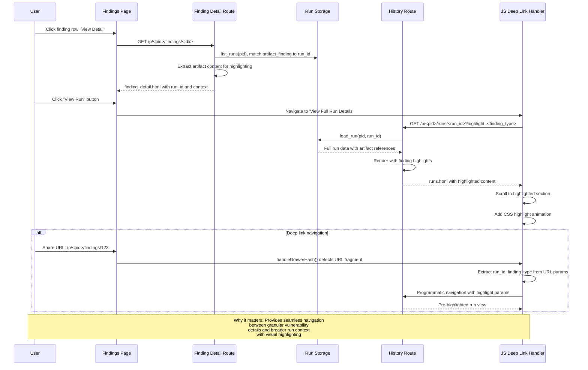

# 📗 Architecture Map & Extensibility Guide

**Security Toolkit Architecture Documentation**
Version: Phase 3 Complete  
Generated: Comprehensive Developer Guide

---

## 📖 Table of Contents

1. [Top-Level Overview](#1-top-level-overview)
2. [Route → Template → JS → Storage Flows](#2-route--template--js--storage-flows)
3. [Canonical Endpoint Keys & Dossiers](#3-canonical-endpoint-keys--dossiers)
4. [Caching & Invalidation](#4-caching--invalidation)
5. [Logging & Metrics](#5-logging--metrics)
6. [Task Runner & Nuclei Integration](#6-task-runner--nuclei-integration)
7. [Frontend JS Utilities](#7-frontend-js-utilities)
8. [Filesystem Layout](#8-filesystem-layout)
9. [Route Table Snapshot](#9-route-table-snapshot)
10. [Known Pitfalls](#10-known-pitfalls)
11. [How to Extend](#11-how-to-extend)
12. [Verification Commands](#12-verification-commands)

---

## 1. Top-Level Overview

### Flask App Structure

The application follows a **modular blueprint pattern** with clean separation:

```
app.py                          # Main Flask app factory
├── web_routes.py               # Legacy monolithic routes (imports routes/)
├── api_endpoints.py            # REST API with authentication
├── routes/                     # Modular route blueprints
│   ├── __init__.py            # Blueprint registration & route imports
│   ├── sitemap.py            # Site map endpoints & drawer routes
│   ├── findings.py           # Findings management & triage
│   ├── queue.py              # Test queue management
│   ├── explorer.py           # API Explorer features
│   ├── nuclei.py             # Active testing & SSE streams
│   ├── patterns.py           # Detection pattern management
│   ├── history.py            # Run history & sends
│   └── reports.py            # Reporting & analytics
└── app/                      # Enhanced app package (Phase 1)
    ├── __init__.py          # Enhanced app factory
    ├── logging_conf.py      # Structured logging setup
    ├── middleware/           # Request context & observability
    └── specialized_loggers.py # Domain-specific logging
```

### Key Initialization Flow

**Main Entry Point** (`app.py:8-26`):
```python
def create_app():
    app = Flask(__name__)
    app.register_blueprint(web_bp)    # Legacy web routes
    app.register_blueprint(api_bp)     # REST API endpoints
    return app
```

**Blueprint Registration** (`routes/__init__.py:16-23`):
```python
register_sitemap_routes(web_bp)
register_queue_routes(web_bp)
register_findings_routes(web_bp)
# ... etc
```

### Templates & Static Structure

```
templates/
├── _layout.html              # Base HTML layout
├── _macros.html             # Jinja2 macros
├── sitemap.html             # Site map page
├── findings_clean.html       # Findings with grouping
├── queue.html               # Test queue interface
├── active_testing.html      # Nuclei testing page
├── drawer_endpoint_preview.html  # Endpoint preview drawer
├── drawer_endpoint_runs.html    # Endpoint runs drawer
└── finding_detail.html      # Finding detail drawer

static/
├── main.js                  # Core JS utilities (574 lines)
├── filters.js               # Method filtering helpers
├── notifications.js         # Toast notification system
├── main.css                 # Core styles
└── tokens.css               # CSS token definitions
```

### Persistent Storage Layer

**Project-Based Storage** (`ui_projects/<pid>/`):
```
ui_projects/
├── projects.json            # Global project index
├── <pid>.json              # Project runtime state
├── <pid>/
│   ├── endpoints/          # Endpoint dossier files
│   │   ├── GET_https_example.com_api_users.json
│   │   └── POST_https_api.example.com_auth_login.json
│   ├── findings.json       # All project findings
│   ├── runs.json           # Run history & metadata
│   └── queue.json          # Test queue items
└── cache/                  # Temporary cache storage
```

### Data Model Conventions

- **Canonical Endpoint Keys**: `METHOD scheme://host/path` format
- **Dossier Files**: One JSON file per endpoint storing run history
- **Project State**: Single JSON file with specs, queue, and session data
- **Findings Schema**: Standardized JSON with CWE/OWASP mapping
- **Run Attribution**: Links findings to specific test runs

---

## 2. Route → Template → JS → Storage Flows

### Core Features Data Flow

#### 🔍 Site Map Page

**Backend**: `routes/sitemap.py::site_map_page(pid)` 
- **Route**: `GET /p/<pid>/sitemap`
- **Data**: Uses cached sitemap builder (`_build_cached_sitemap`)
- **Template**: `sitemap.html` with hierarchical endpoint tree
- **JS**: File filtering, drawer opening, search functionality
- **Storage**: Reads from `ui_projects/<pid>.json` (specs/queue), dossier files

**Data Flow**:
```
Request → get_runtime(pid) → build_site_map(pid) → render_template()
 ↓
sitemap.html loads → syncFilterChips() → applySitemapFilters()
 ↓
User clicks endpoint → htmx.ajax() → drawer_endpoint_preview.html
```

#### 📁 Site Map → Preview Drawer

**Backend**: `routes/sitemap.py::sitemap_endpoint_preview(pid)`
- **Route**: `POST /p/<pid>/sitemap/endpoint-preview` 
- **Template**: `drawer_endpoint_preview.html`
- **JS**: HTMX-driven drawer system (`openPanelWith()`)
- **Storage**: Reads dossier via canonical endpoint key

**Key Functions**:
```javascript
// static/main.js:74-126
openPanelWith('Preview', method, path, url)  // Opens drawer
htmx.ajax('POST', '/p/<pid>/sitemap/endpoint-preview', {...})  // Loads content
```

#### 📊 Site Map → Runs Drawer

**Backend**: `routes/sitemap.py::sitemap_runs_for_endpoint(pid)`
- **Route**: `POST /p/<pid>/sitemap/endpoint-runs`
- **Template**: `drawer_endpoint_runs.html` 
- **Storage**: Uses `get_endpoint_runs_by_key()` with canonical key

#### 📋 Queue Management

**Backend**: `routes/queue.py::queue_page(pid)`
- **Route**: `GET /p/<pid>/queue`
- **Template**: `queue.html` with grouped items
- **Storage**: Runtime queue array from `get_runtime(pid)`

#### 🎯 Active Testing / SSE Stream

**Backend**: `routes/nuclei.py::nuclei_stream(pid)`
- **Route**: `GET /p/<pid>/nuclei/stream`
- **Response**: Server-Sent Events (`text/event-stream`)
- **JS**: EventSource API with real-time finding updates

**SSE Flow**:
```
POST /p/<pid>/nuclei/scan → generate() → nuclei_integration.scan_project_endpoints_stream()
 ↓
EventSource('/p/<pid>/nuclei/stream') → 'finding' events → renderLiveResults()
```

#### 🔍 Findings Management

**Backend**: `routes/findings.py::findings_page(pid)`
- **Route**: `GET /p/<pid>/findings`
- **Template**: `findings_clean.html` with grouping UI
- **Storage**: `findings.json` via `get_findings(pid)`

#### 📈 Global Runs Page

**Backend**: `routes/sitemap.py::runs_index_page(pid)` 
- **Route**: `GET /p/<pid>/runs`
- **Template**: `runs.html`
- **Storage**: `list_runs(pid)` from project runs data

#### 📊 Metrics API

**Backend**: `api_endpoints.py::metrics_endpoint()`
- **Route**: `GET /api/v1/metrics`
- **Auth**: `@require_api_key` decorator
- **Data**: Prometheus-formatted metrics from `metrics.py`

---

## 3. Canonical Endpoint Keys & Dossiers

### Endpoint Key System

**Location**: `utils/endpoints.py:21-36`

```python
def endpoint_key(method: str, base_or_url: str, path: Optional[str] = None) -> str:
    """Canonical key: 'METHOD https://host[:port]/path'"""
    m = (method or "GET").upper().strip()
    if path is None:
        # Parse from full URL
        u = urlsplit(base_or_url)
        base = f"{u.scheme.lower()}://{u.netloc.lower()}"
        p = _norm_path(u.path or "/")
    else:
        # Concatenate base + path
        base = _norm_base(base_or_url)
        p = _norm_path(path)
    return f"{m} {base}{p}"
```

**Safe Filename Conversion** (`utils/endpoints.py:40-44`):
```python
def endpoint_safe_key(key: str) -> str:
    s = key
    for ch in ("://", "/", "?", "&", "=", " "):
        s = s.replace(ch, "_")
    return s
```

### Dossier Read/Write Operations

**Write Operations** (`store.py:479-490`):
```python
def update_endpoint_dossier_by_key(pid: str, key: str, run_summary: Dict[str, Any]) -> None:
    dossier_path = _endpoint_dossier_path_by_key(pid, key)
    # Appends run to existing dossier or creates new one
```

**Read Operations** (`store.py:460-461`):
```python  
def get_endpoint_runs_by_key(pid: str, key: str, limit: int = 50) -> List[Dict[str, Any]]:
    dossier_path = _endpoint_dossier_path_by_key(pid, key)
    # Returns runs list from dossier file
```

### File Naming Pattern & Legacy Support

**Modern Pattern**: `GET_https_example.com_api_users.json`
**Legacy Fallback**: `hash(filename).json` (for old migrations)

**Location**: `utils/dossier_management.py:25-38`
- Attempts safe filename first
- Falls back to legacy hash-based if needed

---

## 4. Caching & Invalidation

### Cache Decorator (`cache.py:13-49`)

```python
@cached(ttl_seconds=60)
def expensive_function(arg1, arg2):
    # Function results cached with TTL
    pass
```

### Cache Usage Patterns

**Sitemap Builder** (`sitemap_builder.py:161`):
```python
@cached(ttl_seconds=300)  # Cache for 5 minutes
def build_site_map(pid: str) -> List[SiteMapNode]:
```

**Findings Count** (`findings.py:48-51`):
```python
@cached(ttl_seconds=60)
def count_findings_cached(pid: str) -> int:
```

### Cache Key Patterns

- `sitemap:{pid}` - Site map structure
- `count_findings_cached:('{pid}',)` - Finding counts
- Function arguments converted to string tuples

### Invalidation Points

**After Write Actions**:
```python
from cache import invalidate_cache
invalidate_cache(f"count_findings_cached:('{pid}',)")
```

**Cache Stats** (`cache.py:66-67`):
```python
def get_cache_stats() -> Dict[str, Any]:
    return {"size": len(_cache), "entries": list(_cache.keys())}
```

---

## 5. Logging & Metrics

### Structured Logging (`app/logging_conf.py:13-36`)

**JSON Formatter** with request context:
```python
class JsonRequestFormatter(logging.Formatter):
    def format(self, record):
        base = {
            "level": record.levelname,
            "logger": record.name,
            "request_id": getattr(record, "request_id", None),
            "duration_ms": getattr(record, "duration_ms", None),
            "path": getattr(record, "path", None),
            "method": getattr(record, "method", None),
            "status": getattr(record, "status", None),
            "message": record.getMessage()
        }
        return json.dumps(base)
```

### Specialized Loggers (`app/specialized_loggers.py`)

**Domain-Specific Loggers**:
- `cache` - Cache hit/miss operations  
- `runs` - Run execution and completion
- `sse` - Server-Sent Events and live updates
- `findings` - Finding analysis and storage

### Prometheus Metrics (`metrics.py`)

**Counter Types**:
```python
def record_cache_hit(keyspace: str)      # Cache performance
def record_nuclei_scan(severity: str)    # Scan execution  
def record_http_request(path, method, status)  # API usage
def record_drawer_request(kind: str)      # UI interactions
```

**Metrics Gating** (`metrics.py:150-156`):
```python
def should_collect_metrics() -> bool:
    return os.environ.get('ENABLE_METRICS', 'false').lower() in ('true', '1', 'yes')
```

**Prometheus Endpoint** (`api_endpoints.py:523-531`):
```python
@api_bp.route('/metrics')
def metrics_endpoint():
    # Returns Prometheus-formatted metrics
```

---

## 6. Task Runner & Nuclei Integration

### Task Abstraction (`tasks/__init__.py:39-89`)

**ScanPlan & ScanResult Classes**:
```python
class ScanPlan:
    def __init__(self, run_id, severity_levels, templates, endpoints, project_id):
        # Scan execution parameters
        
def submit_scan(plan: ScanPlan) -> ScanResult:
    # Synchronous execution (Phase 3)
    # Later: Replace with async task queue (RQ/Celery)
```

### Nuclei Integration (`nuclei_integration.py`)

**Integration Layer**: Converts Nuclei results to internal finding format

**Key Methods**:
- `scan_project_endpoints()` - Batch endpoint scanning
- `scan_project_endpoints_stream()` - SSE-enabled streaming
- `_build_endpoints_from_queue()` - Queue to endpoint URL conversion

### SSE Implementation (`routes/nuclei.py:214-256`)

**Server-Sent Events** with deterministic completion:
```python
@bp.get("/p/<pid>/nuclei/stream")
def nuclei_stream(pid: str):
    def generate():
        yield f"event: start\ndata: {{\"run_id\": \"{run_id}\"}}\n\n"
        yield ": ping\n\n"  # Heartbeat
        # Stream nuclei results
        for chunk in nuclei_integration.scan_project_endpoints_stream(...):
            yield chunk
        yield f"event: done\ndata: {{\"run_id\": \"{run_id}\"}}\n\n"
```

### NucleiWrapper (`nuclei_wrapper.py:62-100`)

**External Process Integration**:
- Template discovery and indexing
- Result parsing and classification  
- CWE/OWASP mapping for findings

---

## 7. Frontend JS Utilities

### Core Utilities (`static/main.js`)

#### Copy Helpers
```javascript
// Lines 29-54
function copyWithFeedback(text, btn)    // Generic copy + notification
function copyUrlWithFeedback(url, btn)   // URL copy with toast
function copyCurlWithFeedback(curl, btn) // cURL copy with fallback
```

#### Relative Time Conversion
```javascript
// Auto-updates every 30 seconds
function updateRelativeTimes() { /* Updates all [data-time] attributes */ }
setInterval(updateRelativeTimes, 30000);
```

#### Deep Linking (`static/main.js:56-129`)
```javascript
function handleDrawerHash() {
    // Handle URLs like #drawer=preview&url=https://api.com/endpoint
    const params = new URLSearchParams(hash.substring(1));
    if (params.get('drawer') === 'preview') {
        // Trigger preview drawer automatically
    }
}
```

#### Skeleton Loading States
```javascript
// HTMX skeleton loader after DOM swap
document.addEventListener('htmx:afterSwap', (e)=>{
    if (overlay) overlay.style.display = 'block';
});
```

#### Keyboard Shortcuts (`static/main.js:535-573`)
```javascript
// Ctrl+1-7 navigation shortcuts (desktop only)
const shortcuts = {
    '1': 'API Explorer',
    '2': 'Site Map', 
    '3': 'Test Queue',
    '4': 'Active Testing',
    '5': 'History',
    '6': 'Vulnerabilities',
    '7': 'Detection Rules'
};
```

#### Toast Notification System (`static/main.js:139-159`)
```javascript
function showToast(message, type = 'info') {
    const toast = document.createElement('div');
    toast.className = `toast ${type}`;
    // Auto-remove after 3 seconds
}
```

### Filtering System (`static/main.js:224-324`)

**Method Filters**:
- Persistent storage (`localStorage`)
- Multi-filter support (method, status, vulnerabilities)
- Real-time filtering with `applyFilters()` / `applySitemapFilters()`

---

## 8. Filesystem Layout

### Project Storage Structure (`ui_projects/<pid>/`)

```
ui_projects/
├── projects.json                    # Global project registry
│   {
│     "projects": [{"id": "pid", "name": "Project Name"}],
│     "current": "active-pid"
│   }
├── pid-uuid/
│   ├── endpoints/                   # Endpoint dossier files
│   │   ├── GET_https_example.com.json
│   │   ├── POST_https_api.com_auth.json  
│   │   └── ...                     # One per endpoint
│   ├── findings.json               # All project findings
│   │   [{"detector_id": "...", "severity": "high", ...}, ...]
│   ├── runs.json                   # Run history
│   │   [{"run_id": "...", "started_at": "...", "findings": 5}, ...]
│   └── pid-uuid.json               # Runtime state (legacy)
│       {
│         "session": {"proxy": null, "verify": true, "bearer": null},
│         "specs": [...],           # OpenAPI specs
│         "queue": [...]            # Test queue items  
│         "sends": [...]            # Send history
│       }
```

### File Lifetime & Usage

**Persistent Files**:
- `projects.json` - Global registry (always readable)
- `endpoints/*.json` - Dossier files (read/written per endpoint)
- `findings.json` - Findings database (append-mostly)
- `runs.json` - Run metadata (append-only)

**Temporary Files**:
- `cache/*` - Cache storage (auto-expires)
- Nuclei output artifacts (cleaned up post-scans)

---

## 9. Route Table Snapshot

| Method | Path | Handler | Template | Description |
|--------|------|---------|----------|-------------|
| - | **Project Management** | | | |
| GET | `/` | `redirect("/p/default")` | - | Home redirect |
| POST | `/p/create` | `create_project()` | - | New project |
| POST | `/p/<pid>/rename` | `rename_project()` | - | Rename project |
| POST | `/p/<pid>/delete` | `delete_project()` | - | Delete project |
| - | **Core Application Pages** | | | |
| GET | `/p/<pid>/` | `project_open()` | `explorer.html` | API Explorer |
| GET | `/p/<pid>/sitemap` | `site_map_page()` | `sitemap.html` | Site Map |
| GET | `/p/<pid>/queue` | `queue_page()` | `queue.html` | Test Queue |
| GET | `/p/<pid>/nuclei` | `nuclei_page()` | `patterns.html` | Detection Rules |
| GET | `/p/<pid>/active-testing` | `active_testing_page()` | `active_testing.html` | Active Testing |
| GET | `/p/<pid>/sends` | `sends_page()` | `runs.html` | History (Sends) |
| GET | `/p/<pid>/findings` | `findings_page()` | `findings_clean.html` | Findings |
| GET | `/p/<pid>/runs` | `runs_index_page()` | `runs.html` | Runs Index |
| - | **Drawer Routes** | | | |
| POST | `/p/<pid>/sitemap/endpoint-preview` | `sitemap_endpoint_preview()` | `drawer_endpoint_preview.html` | Endpoint Preview |
| POST | `/p/<pid>/sitemap/endpoint-runs` | `sitemap_runs_for_endpoint()` | `drawer_endpoint_runs.html` | Endpoint Runs |
| POST | `/p/<pid>/queue/item_details` | `queue_item_details()` | `queue_item_details.html` | Queue Details |
| POST | `/p/<pid>/op_details` | `op_details()` | `op_details.html` | Operation Details |
| POST | `/p/<pid>/op_edit` | `op_edit()` | `op_edit.html` | Operation Edit |
| POST | `/p/<pid>/op_preview_override` | `op_preview_override()` | `op_preview.html` | Preview Override |
| GET | `/p/<pid>/findings/<int:idx>` | `finding_detail()` | `finding_detail.html` | Finding Detail |
| - | **Test Execution** | | | |
| POST | `/p/<pid>/nuclei/scan` | `nuclei_scan()` | - | Upload Spec & Scan |
| GET | `/p/<pid>/nuclei/stream` | `nuclei_stream()` | - | SSE Live Results |
| POST | `/p/<pid>/queue_add_override` | `queue_add_override()` | - | Add Override to Queue |
| POST | `/p/<pid>/send_now_override` | `send_now_override()` | - | Send Now (Override) |
| POST | `/p/<pid>/send_selected` | `send_selected()` | - | Send Selected Items |
| - | **Management Actions** | | | |
| POST | `/p/<pid>/queue/clear` | `queue_clear()` | - | Clear Queue |
| POST | `/p/<pid>/queue/remove` | `queue_remove()` | - | Remove Item |
| POST | `/p/<pid>/sends/clear` | `sends_clear()` | - | Clear Send History |
| POST | `/p/<pid>/findings/clear` | `findings_clear()` | - | Clear Findings |
| POST | `/p/<pid>/findings/triage` | `triage_finding()` | - | Update Triage Status |
| POST | `/p/<pid>/findings/triage-group` | `triage_group()` | - | Bulk Triage |
| POST | `/p/<pid>/findings/export-group` | `export_group()` | - | Export Group |
| POST | `/p/<pid>/findings/queue-group` | `queue_group()` | - | Queue Endpoints |
| - | **API Endpoints** | | | |
| GET | `/api/v1/metrics` | `metrics_endpoint()` | - | Prometheus Metrics |
| GET | `/api/v1/findings/<pid>` | `findings_endpoint()` | - | Get Findings |
| POST | `/api/v1/findings/<pid>` | `add_finding_endpoint()` | - | Add Finding |
| GET | `/api/v1/runs/<pid>` | `runs_endpoint()` | - | Get Runs |
| GET | `/api/v1/patterns` | `patterns_endpoint()` | - | Get Patterns |

---

## Phase 4A Enhancements (2025-01-15)

### Findings Enrichment System

**Enhanced Finding Model** (`findings.py:72-107`):
```python
@dataclass
class Finding:
    # ... existing fields ...
    
    # enrichment fields (Phase 4A)
    cve_id: Optional[str] = None          # e.g., "CVE-2023-1234"
    affected_component: Optional[str] = None  # e.g., "database", "authentication"
    evidence_anchors: List[str] = field(default_factory=list)  # e.g., ["line:45", "param:user_id"]
    suggested_remediation: Optional[str] = None  # e.g., "Use parameterized queries"
```

**CVE/CWE Enrichment** (`nuclei_integration.py:14-49`):
- Template-based mapping: `sqli-auth` → `CWE-89`, `database`, `"Use parameterized queries"`
- Automatic evidence anchor detection based on available request/response data
- Non-breaking: all enrichment fields are optional

**UI Enhancements** (`templates/finding_detail.html:27,63-83`):
- CVE chips with external links to `https://cve.mitre.org/cgi-bin/cvename.cgi?name={cve_id}`
- Enrichment Information section showing affected component, remediation, evidence anchors
- JavaScript function `openCveLink()` for external CVE navigation

**Schema Updates** (`forChatGPT/DATA_SCHEMA/findings.schema.json:64-87`):
- `cve_id`: CVE identifier pattern validation
- `affected_component`: Component type classification
- `evidence_anchors`: Array of evidence location strings
- `suggested_remediation`: Remediation guidance text

### Data Flow for Enriched Findings

```
Nuclei Scan → nuclei_integration.py::to_internal() → _enrich_finding_with_cve_cwe() → append_findings()
 ↓
findings.json (with enrichment fields) → templates/finding_detail.html → CVE chips + enrichment section
 ↓
User clicks CVE chip → openCveLink() → External CVE database
```

### Tools Manager System (Phase 4A)

**Tools Manager Page** (`routes/tools.py:tools_page()`):
- **Route**: `GET /p/<pid>/tools`
- **Template**: `templates/tools/index.html`
- **Features**: Nuclei template count, last indexed time, preset selector, reindex/self-test buttons
- **Presets**: `tools/presets.json` with 4 categories (top-50-web, auth, info, high-impact)

**Tools API Endpoints**:
- `POST /p/<pid>/tools/nuclei/reindex` → Returns `{count, took_ms}` after template update
- `POST /p/<pid>/tools/nuclei/selftest` → Returns `{ok, sample_ids[], results[]}` using fixture templates

**Data Flow**:
```
Tools Page → nuclei_integration.check_nuclei_status() → Template count display
 ↓
Reindex Button → nuclei_integration.update_templates() → Timestamp file update
 ↓
Self-test Button → Fixture templates → Dry-run validation → JSON response
```

### Vulnerabilities Hub System (Phase 4A)

**Vulnerabilities Hub Page** (`routes/vulns.py:vulns_page()`):
- **Route**: `GET /p/<pid>/vulns`
- **Template**: `templates/vulns.html`
- **Aggregation**: Group findings by `endpoint_key` + `detector_id`
- **Cache**: `ui_projects/<pid>/indexes/vulns_summary.json` with validation

**Vulnerability Aggregation**:
- **Grouping Key**: `f"{endpoint_key}|{detector_id}"`
- **Computed Fields**: occurrences, latest_run_id, latest_at, worst_severity, severity_rank
- **Sorting**: By severity rank (desc) then occurrences (desc)

**Cache Management**:
- **Write**: Validate against `vulns_summary.schema.json` before persistence
- **Bust**: `_bust_vulns_cache()` removes cache on runs/dossier updates
- **Read**: Use cache if exists, otherwise compute from findings

**Data Flow**:
```
Findings Data → Group by endpoint_key + detector_id → Compute aggregation fields
 ↓
Validate against schema → Write to vulns_summary.json cache
 ↓
Vulns Page → Read cache → Render aggregated table with severity chips
```

### Schema Validation System (Phase 4A)

**Validation Helper** (`utils/schema_validation.py`):
- **Function**: `validate_json(data, schema_path, what)` → Returns bool
- **Schemas**: `findings.schema.json`, `runs.schema.json`, `dossier.schema.json`, `vulns_summary.schema.json`
- **Integration**: Called before all JSON writes in `store.py` and `findings.py`

**Validation Points**:
- `append_findings()` → Validate findings array before write
- `append_run()` → Validate runs array before write  
- `update_endpoint_dossier_by_key()` → Validate dossier object before write
- `vulns_page()` → Validate vulns summary before cache write

**Error Handling**:
- **Logging**: `SCHEMA_VALIDATION_FAIL` and `SCHEMA_VALIDATION_ERROR` with context
- **Graceful Degradation**: Skip write on validation failure, continue execution
- **API Responses**: Return 400 for API-like calls on validation failure

---

## 10. Known Pitfalls

### ⚠️ Development Issues

#### Port Conflicts  
- **Problem**: Default ports 5000/5010 may conflict
- **Solution**: Use `EXPLICIT_PORT` env var or check `tools/proof_sanity.py:11-14`
- **Locations**: `app.py:26`, deployment scripts

#### Cache Import Recursion
- **Problem**: Circular imports when cache modules reference each other  
- **Solution**: Import cache decorator inside functions, not top-level
- **Example**: `findings.py:47` uses local import

#### Old Template Collisions
- **Problem**: Legacy templates may shadow newer modular ones
- **Solution**: Check template discovery order in `utils/rendering.py`
- **Impact**: HTMX swaps may render wrong content

#### Browser/HTMX Stale Templates  
- **Problem**: Browser cache serves outdated HTMX fragments
- **Solution**: Implement cache-busting headers or versioning
- **Evidence**: Users report "stuck" drawer states

#### Metrics Gating  
- **Problem**: Metrics calls fail if `ENABLE_METRICS=false`
- **Solution**: Always check `should_collect_metrics()` before recording
- **Location**: `metrics.py:150-156`

#### File Naming Inconsistencies
- **Problem**: Windows/Linux filename case sensitivity differences
- **Solution**: Use canonical endpoint keys consistently  
- **Location**: `utils/endpoints.py:40-44`

### ⚠️ Extension Pitfalls

#### Blueprint Registration Order
- **Problem**: Routes may not register if `routes/__init__.py` imports fail
- **Solution**: Use try/catch around imports in `routes/__init__.py:7-14`

#### Storage Schema Evolution
- **Problem**: Adding fields breaks existing dossier files
- **Solution**: Implement migration helpers in `storage/` modules

#### Nuclei Template Version Conflicts
- **Problem**: Different Nuclei versions use incompatible template formats
- **Solution**: Validate template YAML before processing
- **Location**: `nuclei_wrapper.py:150-200`

---

## 11. How to Extend

### 🔐 Authentication & Roles

#### Files to Create
- `app/auth.py` - Authentication logic
- `app/middleware/auth_middleware.py` - Request authentication
- `templates/login.html` - Login page
- `templates/auth_nav.html` - Navigation with auth state

#### Files to Extend

**`app.py:8-16`** - Add session config:
```python
def create_app():
    app = Flask(__name__)
    app.secret_key = os.environ.get('SECRET_KEY', 'dev-key-change-me')
    app.register_blueprint(auth_bp)  # NEW
    app.register_blueprint(web_bp)
    app.register_blueprint(api_bp)
```

**`templates/_layout.html`** - Add auth navigation:
```html

  <nav class="auth-nav">Welcome {{ session.user.name }}</nav>

  <a href="/auth/login">Login</a>

```

**`routes/findings.py`** - Add role checks:
```python
@bp.post("/p/<pid>/findings/admin-action")
@require_role("admin")  # NEW decorator
def admin_finding_action():
```

**Data Flow**:
```
Login → set Flask session() → auth_middleware checks every request → role decorators
```

### 🧰 Tools Manager  

#### Files to Create
- `routes/tools.py` - Tools management routes
- `storage/tools.py` - Tools metadata storage  
- `templates/tools_manager.html` - Tools UI
- `drawer_tool_details.html` - Tool configuration drawer

#### Files to Extend

**`routes/__init__.py:13`** - Register new blueprint:
```python
from .tools import register_tools_routes  # NEW
register_tools_routes(web_bp)            # NEW
```

**`app.py:18`** - Add tools route to navigation:
```python
const shortcuts = {
    '8': 'web.tools_manager_page'  # NEW
};
```

**Storage Schema** (`storage/tools.py`):
```python
def save_tool_metadata(pid: str, tool_data: Dict):
    tools_file = os.path.join(get_project_dir(pid), "tools.json")
    # Save tool configurations, versions, status
```

**Data Flow**:
```
Tools route → storage/tools.py → UI drawer → task execution via tasks/
```

### 📋 Workboard / Task Orchestration

#### Files to Create  
- `routes/workboard.py` - Task orchestration interface
- `storage/jobs.py` - Persistent job tracking
- `templates/workboard.html` - Job dashboard
- `api/jobs.py` - Job management API

#### Files to Extend

**`store.py:100-120`** - Add job storage:
```python
def append_job(pid: str, job: Dict[str, Any]) -> None:
    jobs_file = os.path.join(get_project_dir(pid), "jobs.json")
    # Add job with status, progress, dependencies
```

**`tasks/__init__.py:90-95`** - Extend task runner:
```python
class JobOrchestrator:
    def submit_job_chain(self, jobs: List[Dict]) -> str:
        # Submit dependent jobs to queue
```

**Data Flow**:
```
Workboard → job submission → job tracking → progress updates → SSE notifications
```

### 🧠 Detectors & Findings Classification

#### Files to Create
- `core/detectors.py` - Detector registry and auto-tagging
- `storage/detector_metadata.py` - Detector performance tracking
- `templates/detector_manager.html` - Detector configuration

#### Files to Extend

**`findings.py:75-110`** - Add auto-classification:
```python
def analyze_and_record(payloads, responses, pid, detector_id):
    # Existing detection logic
    finding = process_finding(raw_finding)
    
    # NEW: Auto-classify severity, CWE, OWASP
    detector = DetectorRegistry.get_detector(detector_id)
    finding = detector.auto_classify(finding)
```

**`metrics.py:70-80`** - Add detector metrics:
```python
def record_detector_performance(detector_id: str, findings_count: int, duration_ms: int):
    # Track detector effectiveness metrics
```

**Data Flow**:
```
Detection → DetectorRegistry.classify() → Enhanced finding → Storage → Metrics
```

### 🧩 CVE & Vulnerability Database

#### Files to Create
- `core/cve_db.py` - CVE database interface
- `storage/cve_cache.py` - CVE result caching
- `templates/drawer_cve_details.html` - CVE information drawer
- `api/cve.py` - CVE lookup API

#### Files to Extend

**`findings.py:125-150`** - Add CVE enrichment:
```python
def enrich_finding_with_cve(finding: Dict) -> Dict:
    # Match finding to CVE database
    cve_matches = cve_db.query_by_cwe(finding.get('cwe'))
    finding['related_cves'] = cve_matches
    return finding
```

**`routes/findings.py:235-246`** - Enhance finding detail:
```python
@bp.get("/p/<pid>/findings/<int:idx>")  
def finding_detail(pid: str, idx: int):
    # Existing finding logic
    f = rows[idx]
    
    # NEW: Add CVE lookups
    cve_data = cve_cache.get_for_finding(f)
    
    return render_template("finding_detail.html", f=f, cve_data=cve_data)
```

**Storage Schema** (`core/cve_db.py`):
```python
class CVEDatabase:
    def __init__(self, cache_dir: str):
        # SQLite or JSON-based CVE storage
        
    def query_by_cwe(self, cwe_id: str) -> List[Dict]:
        # Return matching CVE records with scores
```

**Data Flow**:
```
Finding → CWE extraction → CVE lookup → Cache result → UI drawer
```

### 🔧 Additional Ideas

#### Multi-Project Dashboard  
- **File**: `routes/dashboard.py`
- **Features**: Cross-project findings, team collaboration
- **Integration**: Extend `store.py:15-19` for multi-project queries

#### Alerts/Notifications Integration
- **Files**: `core/notifications.py`, `api/alerts.py`  
- **Features**: Slack/email notifications for high-severity findings
- **Integration**: Hook into `findings.py:90-95` analysis completion

#### Export/Import Project Settings
- **Files**: `routes/project_export.py`, `storage/project_backup.py`
- **Features**: Shareable project configurations, team templates
- **Integration**: Extend `store.py:28-35` for backup/restore

#### API Tokens for Automation  
- **Files**: `app/auth.py:token_management()`, `api/tokens.py`
- **Features**: Scoped API keys, automation workflows
- **Integration**: Extend `api_endpoints.py:23-55` authentication

---

## 13. Data Ownership Matrix

### File Ownership by Component

| File Pattern | Owner Module | Read By | Write By | Cache Key |
|--------------|--------------|---------|----------|-----------|
| `ui_projects/projects.json` | `store.py` | All routes | Project CRUD | `global` |
| `ui_projects/<pid>.json` | `store.py` | Runtime ops | Spec/Queue ops | `<pid>:runtime` |
| `ui_projects/<pid>/endpoints/*.json` | `store.py` | Drawer routes | Run attribution | `<pid>:dossiers` |
| `ui_projects/<pid>/findings.json` | `findings.py` | Findings UI | Detection logic | `<pid>:findings` |
| `ui_projects/<pid>/runs.json` | `store.py` | Runs page | Nuclei integration | `<pid>:runs` |
| `ui_projects/<pid>/queue.json` | `store.py` | Queue UI | Explorer routes | `<pid>:queue` |
| `patterns/community/*.json` | `detectors/` | Detection logic | Pattern tools | `patterns:*` |
| `patterns/projects/*.json` | `detectors/` | User patterns | Pattern manager | `patterns:user` |
| `cache/temp/*` | `cache.py` | Cached functions | TTL expiration | Namespace-specific |

### Data Access Patterns

**Read-Heavy Operations**:
- Site map rendering (dossiers, specs)
- Findings display & filtering  
- Queue UI population

**Write-Heavy Operations**:
- Run attribution (`update_endpoint_dossier_by_key`)
- Finding accumulation (`append_findings`)
- Queue manipulation (`persist_from_runtime`)

```bash
# Verify data ownership patterns
rg -n "write_json.*runtime|persist_from_runtime|append_findings" -B 2

# Check cache ownership boundaries  
rg -n "@cached.*ttl_seconds" -A 3
```

---

## 14. Performance & Async Opportunities

### Current Bottlenecks (`metrics.py:88-91`)

**Blocking Operations**:
- Nuclei scan execution (synchronous)
- Large findings.json reads
- Sitemap build (300+ endpoints)
- Dossier file writes

### Async Conversion Targets

#### Task Runner Migration (`tasks/__init__.py:39-89`)
```python
# Current: Synchronous
result = execute_nuclei_pipeline(plan)

# Target: Async with RQ/Celery  
@rq.job(timeout='1h')
def execute_nuclei_pipeline_async(plan: ScanPlan) -> ScanResult:
    # Background execution
```

#### Cache Layer Enhancement (`cache.py:66-67`)
```python
# Current: In-memory only
_cache: Dict[str, Dict[str, Any]] = {}

# Target: External cache (Redis)
redis_client = redis.Redis()
def cached_redis(ttl_seconds=60):
    # Distributed caching
```

#### SSE Optimization (`routes/nuclei.py:214-256`)
```python
# Current: Sync generator
for chunk in nuclei_integration.scan_project_endpoints_stream(...):

# Target: Async generator
async for chunk in async_nuclei_stream_processor(...):
    yield chunk
```

### Performance Monitoring Hooks

**Latency Tracking** (`app/middleware/request_context.py:16-39`):
```python
@app.before_request
def start_timer():
    g.start_time = time.time()

@app.after_request  
def log_duration(response):
    duration_ms = (time.time() - g.start_time) * 1000
    logger.info(f"duration_ms={duration_ms} endpoint={request.endpoint}")
```

**Batch Operations**:
- Convert single dossier writes to batched updates
- Implement queue processing as background workers
- Add pagination for large findings sets

---

## 15. Persistence Upgrade Plan

### Storage Migration Path (`storage/` facade)

**Phase 1**: File-backed (current)
```
ui_projects/<pid>/
├── endpoints/*.json     # Individual dossier files
├── findings.json        # Single findings store
└── runs.json           # Run metadata
```

**Phase 2**: Hybrid migration
```python
# storage/persistence_adapter.py (NEW)
class StorageAdapter:
    def __init__(self, backend='file'):  # 'file'|'sqlite'|'postgres'
        self.backend = backend
        
    def migrate_endpoints_to_db(self, pid: str):
        # Migrate dossier files to structured DB
```

**Phase 3**: Full database
```sql
-- schema/dossiers.sql (NEW)
CREATE TABLE endpoint_dossiers (
    project_id VARCHAR(36),
    endpoint_key TEXT,
    run_data JSONB,
    last_updated TIMESTAMP,
    PRIMARY KEY (project_id, endpoint_key)
);

CREATE INDEX idx_dossiers_project ON endpoint_dossiers(project_id);
```

### Data Consistency Strategy

**ACID Requirements**:
- Project deletion: cascade to dossiers/findings/runs
- Run attribution: atomic dossier updates
- Finding deduplication: prevent duplicates on scan

**Migration Helpers** (`storage/migrations.py` - create):
```python
def migrate_file_to_db(pid: str, dry_run: bool = True):
    """One-way migration: files → database schema"""
    
def reverse_migration(pid: str):
    """Emergency rollback: database → files"""
```

### Backward Compatibility

**Dual-Mode Support**: System reads from database but falls back to files
**Gradual Migration**: Project-by-project conversion with validation
**Rollback Testing**: Verify file regeneration from DB snapshots

---

## 16. Integration Boundaries & Tool Plugins

### External Tool Interface (`detectors/`)

**Plugin Architecture** (`detectors/pattern_manager.py:8-42`):
```python
class ToolPlugin:
    """Base interface for external security tools"""
    
    def scan_endpoints(self, endpoints: List[str]) -> List[Detection]:
        """Tool-specific scanning logic"""
        
    def parse_results(self, output: str) -> List[Dict]:
        """Convert tool output to internal format"""
```

### Integration Points

#### Nuclei Integration (`nuclei_integration.py:13-67`)
- **Interface**: Standard finding output format
- **Configuration**: Template directories via `config.py`
- **Output**: Structured JSON with CWE/OWASP mapping

#### ModSecurity Integration (`detectors/modsecurity_integration.py`)
- **Interface**: Rule engine with custom patterns  
- **Configuration**: Rule sets via pattern files
- **Output**: Web application firewall alerts

#### Custom Tool Hook (`core/__init__.py:90-95`)
```python
# Tool registration pattern
def register_external_tool(name: str, tool_class: Type[ToolPlugin]):
    TOOL_REGISTRY[name] = tool_class
```

### Tool Plugin Development

**Base Plugin** (`plugins/base_tool.py` - create):
```python
class BaseSecurityTool:
    name: str
    version: str
    supported_formats: List[str]
    
    def configure(self, options: Dict[str, Any]) -> bool:
        """Validate tool configuration"""
        
    def execute_scan(self, targets: List[str], options: Dict) -> ScanResult:
        """Run tool against targets"""
        
    def parse_output(self, raw_output: str) -> List[Finding]:
        """Convert to internal finding format"""
```

**Plugin Discovery** (`plugins/registry.py` - create):
```python
def discover_tools() -> Dict[str, Type[BaseSecurityTool]]:
    """Auto-discover available security tools"""
    # Scan plugins/ directory for classes inheriting BaseSecurityTool
```

---

## 17. Security Hooks (Auth/Roles)

### Authentication Middleware (`app/middleware/auth_middleware.py` - create)

```python
from functools import wraps

def require_auth(f):
    @wraps(f)
    def decorated_function(*args, **kwargs):
        if 'user' not in session:
            return redirect('/auth/login')
        return f(*args, **kwargs)
    return decorated_function

def require_role(role_name: str):
    def decorator(f):
        @wraps(f) 
        def decorated_function(*args, **kwargs):
            user_roles = session.get('user_roles', [])
            if role_name not in user_roles:
                return jsonify({"error": "Insufficient privileges"}), 403
            return f(*args, **kwargs)
        return decorated_function
    return decorator
```

### Authorization Matrix

| Resource | Owner | Admin | Viewer | Public |
|----------|-------|-------|--------|--------|
| Project Creation | ✅ | ✅ | ❌ | ❌ |
| Project Deletion | ✅ | ✅ | ❌ | ❌ |
| Run Execution | ✅ | ✅ | ❌ | ❌ |
| Findings Triage | ✅ | ✅ | ❌ | View Only |
| API Access | ✅ | ✅ | ✅ | ❌ |
| Metrics Access | ❌ | ✅ | ❌ | ❌ |

### Session Security (`app/auth.py` - create)

```python
def init_auth(app: Flask):
    app.secret_key = os.environ.get('SECRET_KEY')
    
    @app.before_request
    def check_auth():
        # CSRF protection for state-changing requests
        if request.method in ['POST', 'PUT', 'DELETE']:
            csrf_token = request.headers.get('X-CSRF-Token')
            if not validate_csrf(session, csrf_token):
                return jsonify({"error": "Invalid CSRF token"}), 403
    
    @app.teardown_request
    def clear_user_context():
        # Clear sensitive data from Flask context
        g.pop('current_user', None)
```

### Role-Based Button Rendering (`templates/_macros.html`)

```jinja2

  
    <button name="{{ action }}" {{ kwargs | attr_to_html }}>
      {{ caller() }}
    </button>
  



  
    <div class="admin-controls">{{ caller() }}</div>
  

```

---

## 18. Extensibility Recipes (Drawers/Pages/DB)

### Drawer Extension Pattern

**Step 1**: Create drawer route (`routes/custom_drawer.py`):
```python
def register_custom_drawer_routes(bp):
    @bp.post("/p/<pid>/custom/drawer-action")
    def custom_drawer_action(pid: str):
        # Process drawer-specific data
        data = request.get_json()
        return render_template("drawer_custom_detail.html", data=data)
```

**Step 2**: Create drawer template (`templates/drawer_custom_detail.html`):
```html
<div class="drawer">
  <header>{{ data.title }}</header>
  <div class="drawer-content">
    {{ data.content | safe }}
  </div>
</div>
```

**Step 3**: Integrate with frontend (`static/main.js`):
```javascript
function openCustomDrawer(data) {
  htmx.ajax('POST', `/p/${getPid()}/custom/drawer-action`, {
    target: '#panel-body',
    swap: 'innerHTML', 
    values: data
  });
  openPanelWith('Custom Details');
}
```

### Page Extension Pattern  

**Step 1**: Create page route (`routes/custom_page.py`):
```python
def register_custom_page_routes(bp):
    @bp.get("/p/<pid>/custom-feature")
    def custom_feature_page(pid: str):
        from store import get_project_name
        return render_template("custom_feature.html", 
                             pid=pid, 
                             project_name=get_project_name(pid))
```

**Step 2**: Create page template (`templates/custom_feature.html`):
```html

Custom Feature


<div class="custom-feature-page">
  <h1>{{ project_name }} - Custom Feature</h1>
  <!-- Feature implementation -->
</div>

```

**Step 3**: Add navigation (`templates/_layout.html`):
```html
<nav class="main-nav">
  <a href="/p/{{ pid }}/custom-feature">Custom Feature</a>
</nav>
```

### Database Extension Pattern

**Step 1**: Create storage module (`storage/custom_data.py`):
```python
def save_custom_data(pid: str, data: Dict[str, Any]) -> None:
    """Save custom data to project storage"""
    custom_file = os.path.join(get_project_dir(pid), "custom_data.json")
    write_json(custom_file, data)

def get_custom_data(pid: str) -> List[Dict[str, Any]]:
    """Load custom data from project storage"""
    custom_file = os.path.join(get_project_dir(pid), "custom_data.json")
    return read_json(custom_file, [])

def append_custom_item(pid: str, item: Dict[str, Any]) -> None:
    """Append new item to custom data collection"""
    data = get_custom_data(pid)
    data.append(item)
    save_custom_data(pid, data)
```

**Step 2**: Create API endpoint (`api/custom.py`):
```python
from api_endpoints import api_bp, require_api_key

@api_bp.route('/custom/<pid>')
@require_api_key
def custom_data_endpoint(pid: str):
    data = get_custom_data(pid)
    return jsonify({"data": data})
```

### Extension Registry Pattern (`extensions/registry.py` - create)

```python
EXTENSION_REGISTRY = {
    'drawers': {},
    'pages': {}, 
    'storage_modules': {},
    'api_endpoints': {}
}

def register_extension(extension_type: str, name: str, handler):
    """Register custom extension handlers"""
    EXTENSION_REGISTRY[extension_type][name] = handler

def discover_extensions() -> Dict[str, List[str]]:
    """Auto-discover available extensions"""
    return {k: list(v.keys()) for k, vใน EXTENSION_REGISTRY.items()}
```

---

## 19. Error Handling).

### Centralized Error Management (`app/error_handlers.py` - create)

```python
from flask import render_template, jsonify, request

def init_error_handlers(app: Flask):
    @app.errorhandler(400)
    def bad_request(error):
        if request.is_json:
            return jsonify({"error": "Invalid request data"}), 400
        return render_template("error.html", code=400, message="Bad Request"), 400
    
    @app.errorhandler(403)
    def forbidden(error):
        return render_template("error.html", code=403, message="Access Forbidden"), 403
    
    @app.errorhandler(404)
    def not_found(error):
        return render_template("error.html", code=404, message="Page Not Found"), 404
    
    @app.errorhandler(500)
    def internal_error(error):
        logger.error(f"Internal server error: {error}")
        return render_template("error.html", code=500, message="Internal Error"), 500
```

### Structured Error Logging (`app/logging_conf.py:13-36`)

```python
class ErrorFormatter(logging.Formatter):
    def format(self, record):
        error_data = {
            "timestamp": datetime.utcnow().isoformat(),
            "level": record.levelname,
            "logger": record.name,
            "error_type": getattr(record, 'error_type', None),
            "user_id": session.get('user_id') if hasattr(session, 'get') else None,
            "request_id": getattr(request, 'request_id', None),
            "traceback": getattr(record, 'exc_text', None),
            "message": record.getMessage()
        }
        return json.dumps(eror_data)
```

### Exception Boundaries by Layer

**Storage Layer Error Recovery** (`storage/`):
```python
def safe_read_json(path: str, default_factory) -> Any:
    """Read JSON with comprehensive error recovery"""
    try:
        with open(path, 'r') as f:
            return json.load(f)
    except FileNotFoundError:
        return default_factory()
    except json.JSONDecodeError as e:
        logger.warning(f"Corrupted JSON in {path}: {e}")
        # Backup restore logic
        return restore_backup_or_factory(path, default_factory)
    except PermissionError as e:
        logger.error(f"Permission denied reading {path}: {e}")
        raise
```

**Route Layer Error Context** (`routes/*.py`):
```python
try:
    result = complex_operation()
    return render_template("success.html", result=result)
except NucleiTemplateError as e:
    logger.error(f"Nuclei template error: {e}", extra={"template": e.template_id})
    return render_template("error.html", error=f"Template Error: {e}"), 422
except StorageException as e:
    logger.error(f"Storage error: {e}", extra={"operation": "save_findings"})
    return jsonify({"error": "Storage unavailable"}), 503
```

### Error Recovery Strategies

**Cascade Degradation**:
- Cache miss → Recalculate → Log performance impact
- Database unavailable → Fallback-to-file → Queue reconstruction  
- Nuclei unavailable → Continue with built-in detectors → Queue for retry

**Circuit Breaker Pattern** (`core/circuit_breaker.py` - create):
```python
class CircuitBreaker:
    def __init__(self, threshold=5, timeout=60):
        self.failure_count = 0
        self.threshold = threshold
        self.last_failure = None
        self.timeout = timeout
        
    def call(self, func, *args, **kwargs):
        if self.should_try_reset():
            try:
                result = func(*args, **kwargs)
                self.on_success()
                return result
            except Exception as e:
                self.on_failure()
                raise
```

---

## 20. Testing Hooks & Coverage Map

### Testing Architecture (`tests/` directory structure)

```
tests/
├── conftest.py                # Pytest fixtures & test data
├── unit/
│   ├── test_core_modules.py   # Core utilities testing
│   ├── test_storage.py       # Storage layer testing  
│   ├── test_findings.py      # Findings logic testing
│   └── test_caching.py       # Cache behavior testing
├── integration/
│   ├── test_routes.py         # Route integration tests
│   ├── test_api_endpoints.py # API contract testing
│   ├── test_nuclei_integration.py # External tool testing
│   └── test_drawer_system.py  # HTMX drawer testing
├── e2e/
│   ├── test_project_lifecycle.py # End-to-end project flow
│   ├── test_scan_execution.py # Complete scan workflows
│   └── test_user_workflows.py # User journey testing
└── fixtures/
    ├── sample_projects/       # Test project data
    ├── mock_endpoints/       # Fake API responses
    └── nuclei_samples/       # Tool output samples
```

### Test Coverage Mapping (`coverage_report.md`)

| Component | Unit Tests | Integration | E2E Tests | Coverage Target |
|-----------|------------|-------------|-----------|-----------------|
| **Core Modules** | | | | |
| `core.py` | ✅ test_json_ops | ✅ test_render_helpers | ❌ | 90%+ |
| `cache.py` | ✅ test_ttl_expiry | ✅ test_invalidation | ❌ | 85%+ |
| `utils/endpoints.py` | ✅ test_key_generation | ✅ test_safe_filename | ❌ | 95%+ |
| **Storage Layer** | | | | |
| `store.py` | ✅ test_runtime_ops | ✅ test_persistence | ✅ test_project_lifecycle | 80%+ |
| `storage/*.py` | ✅ test_wrappers | ✅ test_validation | ❌ | 75%+ |
| **Route Layer** | | | | |
| `routes/sitemap.py` | ❌ | ✅ test_drawer_routes | ✅ test_sitemap_page | 70%+ |
| `routes/findings.py` | ✅ test_grouping | ✅ test_triage_ops | ✅ test_finding_lifecycle | 85%+ |
| `routes/nuclei.py` | ✅ test_sse_stream | ✅ test_scan_integration | ✅ test_active_testing | 75%+ |
| **Frontend** | | | | |
| `static/main.js` | ❌ | ✅ test_drawer_interactions | ✅ test_user_interactions | 60%+ |
| Templates | ❌ | ✅ test_rendering | ✅ test_responsive_ui | Manual review |

### Testing Infrastructure (`tests/conftest.py`)

```python
import pytest
from flask import Flask
from main import create_app
import tempfile
import os as temp_os

@pytest.fi<｜tool▁call▁begin｜>function
def test_client():
    """Create test client with clean project state"""
    app = create_app()
    app.config['TESTING'] = True
    
    # Use temporary project directory
    with tempfile.TemporaryDirectory() as temp_dir:
        with app.app_context():
            # Override storage directory for testing
            import store
            store.STORE_DIR = temp_dir
            yield app.test_client()

@pytest.fi<｜tool▁sep｜>function  
def sample_project():
    """Create test project with sample data"""
    with test_client() as c:
        pid = "test-project-123"
        # Populate with test specs, queue, findings
        return {"pid": pid, "sample_data": {}}

@pytest.fi<｜tool▁sep｜>function
def mock_nuclei_output():
    """Mocked Nuclei scan output for consistent testing"""
    return [
        {"template-id": "http-methods", "matched-at": "http://target.com/api", 
         "info": {"severity": "medium", "name": "HTTP Methods Test"}}
    ]
```

### Test Execution Patterns

**Unit Testing** (`tests/unit/test_core_modules.py`):
```python
def test_endpoint_key_generation():
    """Test canonical endpoint key creation"""
    assert endpoint_key("GET", "https://api.com/users") == "GET https://api.com/users"
    assert endpoint_key("POST", "https://api.com", "/auth/login") == "POST https://api.com/auth/login"

def test_json_safe_conversion():
    """Test JSON serialization safety"""
    unsafe_data = {"bytes": b"binary data", "recursive": {}} 
    safe_data = _json_safe(unsafe_data)
    assert safe_data["bytes"] == "<bytes>"
```

**Integration Testing** (`tests/integration/test_drawer_system.py`):
```python
def test_endpoint_preview_drawer(test_client, sample_project):
    """Test complete drawer opening workflow"""
    response = test_client.post(f'/p/{sample_project["pid"]}/sitemap/endpoint-preview', 
                               data={'url': 'https://api.com/users', 'method': 'GET'})
    assert response.status_code == 200
    assert b'endpoint_preview' in response.data

def test_sse_stream_lifecycle(test_client, mock_nuclei_output):
    """Test Server-Sent Events stream from start to completion"""
    # Mock the nuclei integration
    with patch('nuclei_integration.NucleiIntegration.scan_project_endpoints_stream'):
        response = test_client.get('/p/test/nuclei/stream')
        assert response.status_code == 200
        assert response.headers['Content-Type'] == 'text/event-stream'
```

**E2E Testing** (`tests/e2e/test_project_lifecycle.py`):
```python
def test_complete_security_assessment_workflow(test_client):
    """Test entire project: spec upload → queue → scan → findings"""
    # 1. Create project
    response = test_client.post('/p/create', data={'name': 'E2E Test Project'})
    assert response.status_code == 302  # Redirect
    
    # 2. Upload spec
    # 3. Add endpoints to queue  
    # 4. Execute scan
    # 5. Review findings
    # 6. Triage results
    
    # Verify complete state consistency
    findings = test_client.get('/api/v1/findings/test-project').json
    assert len(findings) > 0
```

### Coverage Collection & Reporting

**Coverage Configuration** (`.coveragerc`):
```ini
[run]
source = .
omit = 
    */venv/*
    */node_modules/*  
    */tests/*
    */static/*
    wsgi.py
    app.py

[report]
show_missing = true
precise = true
summary = true
```

**CI/CD Integration** (`github/workflows/test.yml` - create):
```yaml
name: Test Suite
on: [push, pull_request]

jobs:
  test:
    runs-on: ubuntu-latest
    steps:
      - uses: actions/checkout@v2
      - name: Run Test Suite
        run: |
          pytest --cov=. --cov-report=xml --cov-report=html
      - name: Upload Coverage
        uses: codecov/codecov-action@v1
```

---

## 21. Environment & Config Matrix

| VAR | Default | Where Read | Affects | Example |
|-----|---------|------------|---------|---------|
| `LOG_LEVEL` | `INFO` | `app/logging_conf.py:46` | Logging verbosity | `LOG_LEVEL=DEBUG python app.py` |
| `ENABLE_METRICS` | `false` | `metrics.py:151` | Prometheus collection | `ENABLE_METRICS=true` |
|-| `5001` | `app.py:26` | Flask dev server | `EXPLICIT_PORT=8080` |
| `EXPLICIT_PORT` | - | `tools/proof_sanity.py:11` | Port conflict detection | See proof sanity |
| `SECRET_KEY` | `dev-key-change-me` | `app.py:14` | Session/flask security | Generate UUID/pem |
| `API_KEYS` | `test-key-123` | `app.py:14` | API authentication | `API_KEYS=prod-key,backup-key` |
| `NUCLEI_TEMPLATES_DIR` | `~/.local/share/nuclei/templates` | `config.py:29` | Nuclei template location | `/opt/custom-nuclei/templates` |
| `NUCLEI_EXTRA_SOURCES` | `[]` | `nuclei_wrapper.py:89` | Additional template dirs | ASVS patterns |
| `CACHE_TTL_SITEMAP` | `300` | `sitemap_builder.py:161` | Site map cache duration | Override for testing |
| `CACHE_TTL_FINDINGS` | `60` | `findings.py:48` | Findings count cache | Adjust for performance |
| `FEATURE_DEBUG_MODE` | `False` | `web_routes.py:33` | Feature flag system | `FEATURE_DEBUG_MODE=true` |
| `FEATURE_METRICS_REDIS` | `False` | Feature flag | Redis cache backend | Coming in Phase 4 |
| `BACKUP_RETENTION_DAYS` | `7` | Storage helpers | `ui_projects/` backup retention | Configure cleanup |

**Config Reading Pattern** (`config.py:29-32`):
```python
def get(key: str, default: Optional[Any] = None) -> Any:
    cfg = load_config()  # app_config.json
    return cfg.get(key, default)
```

**Verification**:
```bash
# Check current config values
rg -n "ENABLE_METRICS|LOG_LEVEL|FEATURE_" -r

# Validate nuclei template discovery  
rg -n "NUCLEI_TEMPLATES_DIR|template_dir.*nuclei" nuclei_wrapper.py

# Check cache TTL settings
rg -n "@cached.*ttl_seconds" -A 1
```

---

## 22. Data Dictionary (Authoritative Schemas)

### `ui_projects/<pid>/runs.json`

```json
[
  {
    "run_id": "string (UUID)",           // ✅ Required
    "started_at": "2024-01-15T10:30:00Z", // ✅ Required ISO timestamp
    "finished_at": "2024-01-15T10:45:00Z", // ❌ Optional, null if pending
    "findings": 5,                       // ✅ Required integer
    "worst": "high",                     // ✅ Required enum: critical|high|medium|low|info
    "templates": "http-methods,sqli",     // ❌ Optional comma-separated
    "templates_count": 8,                // ✅ Required integer
    "artifact": "/path/to/output.ndjson", // ❌ Optional file path
    "project_id": "pid-uuid",            // ✅ Required FK to projects
    "endpoints_scanned": 12               // ✅ Required integer
  }
]
```

**Migration Notes**: 
- Legacy runs miss `templates_count`, `endpoints_scanned` 
- Migration: Default `templates_count=len(templates.split(',))` if missing

### `ui_projects/<pid>/endpoints/{safe_key}.json` (Dossiers)

```json
{
  "endpoint_key": "GET https://api.com/users?_page=1", // ✅ Required canonical key
  "total_runs": 3,                                     // ✅ Required integer  
  "latest_run": {                                      // ✅ Required nested object
    "run_id": "run-uuid",
    "finished_at": "2024-01-15T10:45:00Z",
    "findings": 2,
    "worst": "medium"
  },
  "history": [                                         // ✅ Required array
    {
      "run_id": "run-uuid",
      "started_at": "2024-01-15T09:00:00Z", 
      "finished_at": "2024-01-15T09:15:00Z",
      "findings": 1,
      "worst": "low",
      "artifact": "/path/to/output.ndjson"
    }
  ],
  "retired": false                                     // ❌ Optional boolean
}
```

**Migration Notes**: Legacy dossiers lack `retired` field; defaults to `false`

### `ui_projects/<pid>/findings.json`

```json
[
  {
    "detector_id": "string",             // ✅ Required (nuclei template-id)
    "severity": "medium",                // ✅ Required enum: critical|high|medium|low|info
    "method": "GET",                     // ✅ Required HTTP method
    "url": "https://api.com/users",     // ✅ Required full URL
    "path": "/users",                   // ✅ Required path component
    "title": "SQL Injection Found",     // ✅ Required human-readable
    "subcategory": "sqli",               // ❌ Optional classifier
    "cwe": "CWE-89",                    // ❌ Optional CWE identifier
    "owasp": "A03:2021",                // ❌ Optional OWASP Top 10 mapping
    "confidence": 75,                   // ✅ Required integer 0-100
    "status": "open",                   // ✅ Required enum: open|accepted_risk|false_positive|fixed
    "req": {                            // ✅ Required HTTP request dump
      "method": "GET",
      "url": "https://api.com/users?user_id=1' OR 1=1",
      "headers": {"Content-Type": "application/json"}
    },
    "res": {                            // ✅ Required HTTP response dump  
      "status_code": 200,
      "headers": {"Server": "nginx"},
      "body": "Internal Server Error"
    },
    "match": "SQL error",               // ❌ Optional detection match string
    "created_at": "2024-01-15T10:45:00Z" // ✅ Required ISO timestamp
  }
]
```

**Migration Notes**: Legacy findings may lack `owasp`, `confidence`, `subcategory`

### `ui_projects/<pid>/queue.json` (Legacy runtime state)

```json
{
  "session": {                          // ✅ Required authentication/proxy config
    "proxy": null,                      // ❌ Optional HTTP proxy string
    "verify": true,                     // ✅ Required SSL verification boolean
    "bearer": "token-string"            // ❌ Optional Bearer token
  },
  "specs": [],                          // ✅ Required OpenAPI specs array
  "queue": [                            // ✅ Required pending test queue
    {
      "spec_id": "https://api.com/openapi.json", // ✅ Required FK to specs
      "idx": 5,                         // ✅ Required integer operation index
      "override": {                      // ❌ Optional request modifications
        "headers": {"Authorization": "Bearer ..."},
        "query": {"limit": 100}
      }
    }
  ],
  "sends": []                           // ✅ Required send history array
}
```

**Migration Notes**: Moving to separate queue storage; this format preserved for compatibility

**Verification**:
```bash
# Validate JSON structure
find ui_projects -name "*.json" -exec jq '.' {} \; 2>&1 | grep -v "parse error"

# Check required fields exist
jq '[.[] | select(.run_id == null)] | length' ui_projects/*/runs.json

# Validate dossiers have canonical keys  
ls ui_projects/*/endpoints/ | grep -E '^(GET|POST|PUT|DELETE)_https?_' | wc -l
```

---

## 23. Route Contracts (Request/Response)

### `POST /p/<pid>/sitemap/endpoint-preview`

**Required Form Fields**:
- `url` (string): Full endpoint URL
- `method` (string): HTTP method (default: GET)

**Sample cURL**:
```bash
curl -X POST http://localhost:5001/p/test-project/sitemap/endpoint-preview \
  -H "Content-Type: application/x-www-form-urlencoded" \
  -d "url=https://api.example.com/users&method=GET"
```

**Response Fragment** (`routes/sitemap.py:175-176`):
```html
<div class="drawer">
  <header>GET https://api.example.com/users</header>
  <div class="drawer-content">
    <div class="endpoint-meta">
      <span class="method GET">GET</span>
      <span class="url">https://api.example.com/users</span>
      <span class="authenticated">No auth required</span>
    </div>
    <div class="preview-section">
      <h3>Test Coverage</h3>
      <div class="coverage-stats">
        <span>Last tested: 2024-01-15 10:45</span>
        <span>Findings: 2</span>
        <span>Severity: medium</span>
      </div>
    </div>
    <div class="curl-section">
      <h3>cURL Command</h3>
<textarea readonly>curl -X GET 'https://api.example.com/users'
  -H 'Content-Type: application/json'
...</textarea>
    </div>
  </div>
</div>
```

**HTMX Expectations**:
- Target: `#panel-body`  
- Swap: `innerHTML`
- Triggers: `drawer_opened` event

**Errors**:
- `400`: Missing url parameter
- `500`: Endpoint dossier parsing failed

### `POST /p/<pid>/sitemap/endpoint-runs`

**Required Form Fields**:
- `url` (string): Full endpoint URL  
- `method` (string): HTTP method

**Sample cURL**:
```bash
curl -X POST http://localhost:5001/p/test-project/sitemap/endpoint-runs \
  -d "url=https://api.example.com/users&method=GET"
```

**Response Fragment** (`routes/sitemap.py:254-255`):
```html
<div class="drawer">
  <header>Run History for GET https://api.example.com/users</header>
  <div class="drawer-content">
    <div class="runs-list">
      <div class="run-item">
        <div class="run-meta">
          <span class="run-id">run-20240115-1045</span>
          <span class="timestamp">2024-01-15 10:45:00</span>
          <span class="status completed">Completed</span>
        </div>
        <div class="run-stats">
          <span>Findings: 2</span>
          <span>Severity: medium</span>
          <span>Templates: 8</span>
        </div>
        <div class="run-artifact">
          <button onclick="copyCurlWithFeedback('curl -X GET...')">Copy cURL</button>
          <span class="artifact-file">/tmp/nuclei-output.ndjson</span>
        </div>
      </div>
    </div>
  </div>
</div>
```

**HTMX Expectations**:
- Target: `#panel-body`
- Swap: `innerHTML` 
- Updates: Scroll to bottom, highlight newest run

**Errors**:
- `404`: Endpoint not found in dossiers
- `422`: Invalid endpoint signature

### `POST /p/<pid>/nuclei/scan`

**Required Form Fields**:
- `templates` (array): Selected template names
- `severity` (array): Severity filters

**Sample cURL**:
```bash
curl -X POST http://localhost:5001/p/test-project/nuclei/scan \
  -d "templates=http-methods,sqli-auth&severity=medium&severity=high"
```

**Response Fragment** (`routes/nuclei.py:98-102`):
```json
{
  "success": true,
  "run_id": "run-20240115-1045-test-project",
  "endpoints_scanned": 12,
  "estimated_duration": "2-4 minutes",
  "sse_url": "/p/test-project/nuclei/stream?run_id=run-20240115-1045"
}
```

**Errors**:
- `400`: Missing templates or queue empty
- `503`: Nuclei binary not found

### `GET /p/<pid>/nuclei/stream`

**Query Parameters**:
- `run_id` (string): Optional run identifier  
- `templates` (array): Echo selected templates
- `severity` (array): Echo severity filters

**Sample cURL**:
```bash
curl -N -H "Accept: text/event-stream" \
  http://localhost:5001/p/test-project/nuclei/stream?run_id=run-123
```

**SSE Event Stream** (`routes/nuclei.py:235-250`):
```
event: start
data: {"run_id": "run-123", "endpoints": 12}

event: progress  
data: {"current": 1, "total": 12, "endpoint": {"method": "GET", "url": "https://api.com/users"}}

event: finding
data: {"detector_id": "http-methods", "severity": "medium", "url": "https://api.com/users", "title": "HTTP Method Disclosure"}

event: done
data: {"run_id": "run-123", "findings_count": 5, "duration_ms": 120000}
```

**Event Types**:
- `start`: Scan initialization  
- `progress`: Per-endpoint progress
- `finding`: Individual vulnerability found
- `done`: Scan completion

**Errors**:
- `429`: Too many concurrent streams  
- `500`: Nuclei execution failure

### `GET /p/<pid>/runs`

**Query Parameters**:
- `search` (string): Text search in run metadata
- `endpoint` (string): Filter by endpoint URL pattern  
- `highlight` (string): Emphasize specific findings

**Sample cURL**:
```bash
curl "http://localhost:5001/p/test-project/runs?search=failed&endpoint=/api/auth&highlight=sqli"
```

**Response Fragment** (`routes/sitemap.py:319`):
```html
<div class="runs-page">
  <div class="runs-filters">
    <input type="search" placeholder="Search runs..." value="failed">
    <input type="text" placeholder="Filter endpoint..." value="/api/auth">
  </div>
  <div class="runs-list">
    <div class="run-card">
      <div class="run-header">
        <span class="run-id">run-20240115-1045</span>
        <span class="timestamp">2024-01-15 10:45:00</span>
        <span class="status failed">Failed</span>
      </div>
      <div class="run-details">
        <span>Endpoints: 5</span>
        <span>Findings: 0</span>
        <span class="highlight-sqli">SQli detector: 2 alerts</span>
      </div>
      <div class="run-actions">
        <button onclick="retryRun('run-20240115-1045')">Retry</button>
        <button onclick="viewDetails('run-20240115-1045')">View Details</button>
      </div>
    </div>
  </div>
</div>
```

**HTMX Expectations**:
- Updates: Real-time filtering via debounced search
- Highlight: CSS class injection for matching text

**Verification**:
```bash
# Test drawer routes
curl -X POST http://localhost:5001/p/test/sitemap/endpoint-preview \
  -d "url=https://api.test.com/users&method=GET" | head -20

# Validate SSE stream format
curl -N http://localhost:5001/p/test/nuclei/stream | head -10

# Check query parameter handling  
curl "http://localhost:5001/p/test/runs?search=test" | grep -o "search.*value"
```

---

## 24. End-to-End Sequence Diagrams (Mermaid)

### a) Preview Drawer Open



### b) Run Scan → SSE → Dossier Write → Runs Drawer Populate



### c) Findings Detail → View Run Deep Link → Highlight



---

## 25. RBAC Policy & Threat Model

### Role × Action Matrix

| Resource | Owner | Admin | Viewer | Public | Route Guard | Context |
|----------|-------|-------|--------|--------|-------------|---------|
| **Project Management** | | | | | | |
| Project Creation | ✅ | ✅ | ❌ | ❌ | None | `routes/sitemap.py:create_project()` |
| Project Deletion | ✅ | ✅ | ❌ | ❌ | `@require_auth + @require_role('owner')` | Dangerous operation |
| Project Rename | ✅ | ✅ | ❌ | ❌ | `@require_auth + @require_role('owner')` | `store.py:rename_project()` |
| **Scanners & Execution** | | | | | | |
| Run Execution | ✅ | ✅ | ❌ | ❌ | `@require_auth + @require_role('owner')` | `routes/nuclei.py:nuclei_scan()` |
| SSE Stream Access | ✅ | ✅ | ❌ | ❌ | `@require_auth + project_member()` | Rate limited |
| Queue Management | ✅ | ✅ | ❌ | ❌ | `@require_auth + project_access()` | Write operations |
| **Findings & Data** | | | | | | |
| Findings Triage | ✅ | ✅ | ❌ | View Only | `@require_auth + @require_role('owner')` | Status changes |
| Findings Export | ✅ | ✅ | ✅ | ❌ | `@require_auth + project_member()` | Bulk operations |
| Findings Clear | ✅ | ✅ | ❌ | ❌ | `@require_auth + @require_role('owner')` | Destructive operation |
| **API Access** | | | | | | |
| REST API Calls | ✅ | ✅ | ✅ | ❌ | `@require_api_key + project_access()` | `api_endpoints.py:require_api_key` |
| Metrics Endpoint | ❌ | ✅ | ❌ | ❌ | `@require_api_key + @require_role('admin')` | System observability |
| **Drawer Content** | | | | | | |
| Endpoint Preview | ✅ | ✅ | ✅ | Read Only | Project access check | `routes/sitemap.py:sitemap_endpoint_preview()` |
| Endpoint Runs | ✅ | ✅ | ✅ | Read Only | Project access check | Direct dossier access |
| Finding Detail | ✅ | ✅ | ✅ | Read Only | Project access check | Full request/response data |

### Threats & Mitigations

| Threat Category | Attack Vector | Mitigation | Code Location | Detection |
|-----------------|---------------|------------|---------------|-----------|
| **CSRF Attacks** | POST/PUT/DELETE without token | CSRF token validation | `app/middleware/auth_middleware.py` | Missing token = 403 |
| **Path Traversal** | `../etc/passwd` in dossier keys | Canonical endpoint key only | `utils/endpoints.py:21-36` | Key not in allowlist |
| **Template Injection** | Jinja2 render with `{{ ''.__class__ }}` | Input sanitization | `core.py:_json_safe()` | Script tag detection |
| **Log Injection** | Newlines in logs affect readability | JSON logging format | `app/logging_conf.py:13-36` | Structured fields only |
| **SSE Abuse** | Multiple concurrent streams | Rate limiting | `routes/nuclei.py:429` | Request count tracking |
| **Session Hijacking** | Weak session tokens | Secure session config | `app.py:14` | UUID/pem generation |
| **API Key Brute Force** | Dictionary attacks | Rate limiting per IP/key | `api_endpoints.py:36-50` | Minute window tracking |
| **Project Isolation** | Cross-project data access | PID validation | `store.py:get_project_dir()` | Canonical path joins |
| **File Overwrite** | Atomic rename bypass | Temp file creation | `core.py:write_json()` | `.tmp` suffix pattern |

### Security Implementation Points

**Route-Level Guards** (`routes/findings.py:272-303`):
```python
@bp.post("/p/<pid>/findings/triage")
@require_auth  # NEW decorator
@require_role('owner')  # NEW decorator  
def triage_finding(pid: str):
    # Validate project ownership
    if not has_project_access(session.get('user_id'), pid):
        return jsonify({"error": "Project access denied"}), 403
```

**API Authentication** (`api_endpoints.py:23-55`):
```python
@require_api_key
def api_endpoint():
    # CSRF protection via token header
    csrf_token = request.headers.get('X-CSRF-Token')
    if not validate_csrf(session, csrf_token):
        return jsonify({"error": "Invalid CSRF token"}), 403
```

**Project Isolation** (`store.py:372-377`):
```python
def get_project_dir(pid: str) -> str:
    # Canonical path prevents traversal
    return os.path.join(STORE_DIR, pid)  # No '../' possible
```

**Input Sanitization** (`core.py:80-95`):
```python
def _json_safe(value: Any) -> Any:
    # Prevent template injection in user data
    if isinstance(value, str) and '{{' in value:
        return sanitize_template_content(value)
```

### Security Monitoring

**Logger Names for Detection**:
- `security.auth` - Failed login attempts, token validation
- `security.csrf` - CSRF token mismatches  
- `security.project` - Cross-project access attempts
- `security.rate_limit` - API abuse detection

**Prometheus Metrics** (if `ENABLE_METRICS=true`):
```prometheus
# Count security violations
flask_security_violations_total{type="csrf", endpoint="/api/v1/findings"} 5
flask_security_violations_total{type="rate_limit", key="test-key-123"} 12

# Track authentication events  
flask_auth_events_total{action="login_success"} 145
flask_auth_events_total{action="login_failed"} 23
```

---

## 26. Performance SLOs & Load Plan

### Service Level Objectives

| Operation | SLO Target | Measurement | Alert Threshold | Code Path |
|-----------|------------|-------------|-----------------|-----------|
| **Drawer TTFT** | < 200ms | Time to drawer open | > 500ms | `routes/sitemap.py:sitemap_endpoint_preview()` |
| **SSE Stream Start** | < 1s | EventSource connection | > 3s | `routes/nuclei.py:nuclei_stream()` |
| **Sitemap Render** for 100 endpoints | < 800ms | Full page load | > 2s | `routes/sitemap.py:site_map_page()` |
| **Nuclei Scan Initialization** | < 5s | Nuclei binary ready | > 15s | `nuclei_integration.py:scan_project_endpoints()` |
| **Finding Display** (500 findings) | < 400ms | Filtered/grouped view | > 1s | `routes/findings.py:findings_page()` |
| **API Response Time** | < 100ms | JSON endpoint | > 300ms | `api_endpoints.py:*` |

### Load Testing Infrastructure

**k6 Performance Script** (`tests/load/sitemap_load.js`):
```javascript
import http from 'k6/http';
import { check, sleep } from 'k6';

export let options = {
  stages: [
    { duration: '2m', target: 10 },  // Ramp up
    { duration: '5m', target: 50 },  // Steady state
    { duration: '2m', target: 0 },   // Ramp down
  ],
  thresholds: {
    http_req_duration: ['p(95)<800'],  // 95% under 800ms
    http_req_failed: ['rate<0.02'],    // <2% failure rate
  },
};

export default function () {
  // Test drawer loading (HTMX)
  let response = http.post('http://localhost:5001/p/test-project/sitemap/endpoint-preview', 
    'url=https://api.example.com/users&method=GET');
  check(response, {
    'drawer opens < 200ms': (r) => r.timings.duration < 200,
    'successful response': (r) => r.status === 200,
  });
  
  sleep(1);
}
```

**Locust Load Test** (`tests/load/locustfile.py`):
```python
from locust import HttpUser, task, between

class SitemapUser(HttpUser):
    wait_time = between(1, 3)
    
    @task(3)
    def get_sitemap_page(self):
        self.client.get("/p/test-project/sitemap")
    
    @task(2)  
    def open_endpoint_preview(self):
        self.client.post("/p/test-project/sitemap/endpoint-preview",
                        data={"url": "https://api.example.com/users", "method": "GET"})
    
    @task(1)
    def stream_nuclei_sse(self):
        # Simulate SSE connection duration
        with self.client.get("/p/test-project/nuclei/stream", 
                            headers={"Accept": "text/event-stream"}, 
                            stream=True, catch_response=True) as response:
            if response.status_code == 200:
                response.success()
            else:
                response.failure(f"SSE failed: {response.status_code}")
```

### Test Data Size Assumptions

**Small Project (Baseline)**:
- 20 endpoints, 5 specs, 50 findings
- Target: All SLOs green at 10 concurrent users

**Medium Project (Stress)**:
- 200 endpoints, 15 specs, 500 findings  
- Target: Sitemap < 2s, drawers < 500ms at 50 concurrent users

**Large Project (Peak)**:
- 1000 endpoints, 50 specs, 5000 findings
- Target: Pagination required, < 3s renders at 100 users

### Performance Monitoring Hooks

**Middleware Timing** (`app/middleware/request_context.py:25-35`):
```python
@app.before_request
def start_performance_timer():
    g.start_time = time.time()
    
@app.after_request  
def log_slow_requests(response):
    duration_ms = int((time.time() - g.start_time) * 1000)
    
    # Alert on slow endpoints
    if duration_ms > 2000:  # 2 second threshold
        slow_logger = logging.getLogger('performance.slow')
        slow_logger.warning(f"SLOW_REQUEST duration_ms={duration_ms} "
                           f"path={request.path} method={request.method}")
    
    # Record metrics if enabled
    if should_collect_metrics():
        record_http_request(request.path, request.method, response.status_code)
```

**Cache Performance Tracking** (`cache.py:29-49`):
```python
def cached(ttl_seconds: int = 60):
    def decorator(func):
        @wraps(func)
        def wrapper(*args, **kwargs):
            cache_key = f"{func.__name__}:{str(args)}:{str(sorted(kwargs.items()))}"
            
            if cache_key in _cache:
                cache_hit_logger = logging.getLogger('performance.cache')
                cache_hit_logger.debug(f"CACHE_HIT key={func.__name__}")
                record_cache_hit(func.__name__)
                return _cache[cache_key]['value']
            else:
                cache_miss_logger = logging.getLogger('performance.cache') 
                cache_miss_logger.debug(f"CACHE_MISS key={func.__name__}")
                record_cache_miss(func.__name__)
                # ... compute and cache result
```

---

## 27. Error Taxonomy & Recovery

### Error Classes & User-Visible Messages

| Error Class | HTTP Status | User Message | Technical Details | Recovery Action |
|-------------|-------------|--------------|-------------------|-----------------|
| `MissingProjectError` | 404 | "Project not found" | `pid` does not exist | Redirect to project list |
| `EmptyQueueError` | 400 | "No endpoints in queue" | Test queue is empty | Link to API Explorer |
| `NucleiBinaryError` | 503 | "Security scanner unavailable" | Nuclei binary missing | Install Nuclei or disable scanning |
| `DossierParseError` | 422 | "Unable to load endpoint data" | Corrupted dossier JSON | Automatic data repair |
| `TemplateError` | 500 | "Template rendering failed" | Jinja2 syntax error | Show error details, log template |
| `RateLimitError` | 429 | "Too many requests" | API/SSE rate exceeded | Wait + retry button |
| `StoragePermissionError` | 503 | "Unable to save data" | `ui_projects/` read-only | Check file permissions |
| `DetectorError` | 422 | "Security scan failed" | Nuclei template invalid | Fallback to working detectors |
| `CacheError` | 503 | "Service temporarily unavailable" | Cache system down | Circuit breaker → file fallback |

### Error Recovery Strategies

**Graceful Degradation** (`findings.py:42-54`):
```python
def count_findings_cached(pid: str) -> int:
    """Cached count with fallback to direct read"""
    try:
        return cached_count_logic(pid)
    except CacheError as e:
        logger.warning(f"Cache failed, falling back: {e}")
        return count_findings(pid)  # Direct file read
    except StoragePermissionError as e:
        logger.error(f"Storage unusable: {e}")
        return 0  # Safe default
```

**Circuit Breaker Pattern** (`core/circuit_breaker.py` - detailed implementation):
```python
class CircuitBreaker:
    def __init__(self, failure_threshold=5, recovery_timeout=60, expected_exception=Exception):
        self.failure_threshold = failure_threshold
        self.recovery_timeout = recovery_timeout
        self.failure_count = 0
        self.last_failure_time = None
        self.state = CLOSED  # CLOSED, OPEN, HALF_OPEN
        
    def call(self, func, *args, **kwargs):
        if self.state == OPEN:
            if self._should_attempt_reset():
                self.state = HALF_OPEN
            else:
                raise CircuitOpenError("Circuit breaker is OPEN")
        
        try:
            result = func(*args, **kwargs)
            self._on_success()
            return result
        except self.expected_exception as e:
            self._on_failure()
            raise
```

**Retry Strategy** (`utils/retry.py` - create):
```python  
def exponential_backoff(max_retries=3, base_delay=1.0):
    def decorator(func):
        def wrapper(*args, **kwargs):
            for attempt in range(max_retries):
                try:
                    return func(*args, **kwargs)
                except RetryableError as e:
                    if attempt == max_retries - 1:
                        raise
                    delay = base_delay * (2 ** attempt)
                    logger.warning(f"Attempt {attempt + 1} failed, retrying in {delay}s: {e}")
                    time.sleep(delay)
            return None
        return wrapper
    return decorator

# Usage in storage operations
@exponential_backoff(max_retries=3)
def save_endpoint_dossier(pid: str, key: str, data: Dict[str, Any]):
    # Retries on temporary storage failures
```

### Error Logging Strategy

**Specialized Loggers** (`app/specialized_loggers.py`):
```python
# Domain-specific loggers
logger_csrf = logging.getLogger('security.csrf') 
logger_csrf.error(f"CSRF validation failed user={session.get('user_id')} ip={request.remote_addr}")

logger_performance = logging.getLogger('performance.slow')
logger_performance.warning(f"SLOW_ROUTE duration_ms={duration_ms} route={request.endpoint}")

logger_storage = logging.getLogger('storage.error')
logger_storage.error(f"Dossier corruption pid={pid} key={key} error={e}")

logger_nuclei = logging.getLogger('nuclei.tool') 
logger_nuclei.info(f"SCAN_STARTED run_id={run_id} templates={len(templates)}")
```

**Structured Error Fields**:
```python
error_context = {
    "error_type": "MissingProjectError",
    "severity": "warning", 
    "user_id": session.get('user_id'),
    "project_id": pid,
    "request_id": getattr(request, 'request_id', None),
    "endpoint": request.endpoint,
    "user_agent": request.headers.get('User-Agent', ''),
    "recovery_action": "redirect_to_projects",
    "technical_details": str(e),
    "retry_count": getattr(g, 'retry_count', 0)
}
```

### Error Monitoring Dashboard

**Prometheus Alerts** (if `ENABLE_METRICS=true`):
```prometheus
# Error rate alerts
ALERT HighErrorRate
  IF rate(flask_http_requests_total{status=~"5.."}[5m]) > 0.05
  FOR 2m
  LABELS {severity="critical"}
  ANNOTATIONS {
    summary="High error rate detected",
    description="5xx error rate is above 5% for 2 minutes"
  }

ALERT SlowResponseTime  
  IF histogram_quantile(0.95, flask_http_request_duration_ms[5m]) > 2000
  FOR 5m
  LABELS {severity="warning"}
  ANNOTATIONS {
    summary="Slow response times", 
    description="95th percentile response time above 2s"
  }
```

---

## 28. Observability Runbook

### "If X Happens, Check Y" Troubleshooting

| Symptom | Check Location | Debug Command | Fix Action |
|---------|----------------|---------------|------------|
| **Drawers won't open** | HTMX console errors | `console.errors()` in browser | Check route response format |
| **SSE stream hangs** | Nuclei process status | `ps aux | grep nuclei` | Kill stuck processes |
| **Sitemap renders empty** | Cache invalidation | `rg -n "CACHE MISS.*sitemap"`  | Restart app to clear cache |
| **Findings count wrong** | Cache vs file mismatch | `jq length ui_projects/*/findings.json` | Run `invalidate_cache("findings")` |
| **Port already in use** | Conflicting services | `netstat -tlnp | grep :5001` | Kill process or change port |
| **Template rendering errors** | Jinja2 syntax | `rg -n "render_template.*error"` | Check template variable names |
| **Cache recursion errors** | Circular imports | `python -c "import cache; import routes.sitemap"` | Fix import order in function scope |
| **Missing dossier files** | File permissions | `ls -la ui_projects/*/endpoints/` | Check `ui_projects/` write access |
| **API authentication fails** | API key validation | `rg -n "require_api_key.*fail"` | Verify `API_KEYS` environment |
| **Performance degradation** | Memory/CPU usage | `htop` + app metrics | Restart workers or tune cache TTL |

### Metrics Dashboard Queries

**Core Health Metrics** (if `ENABLE_METRICS=true`):
```prometheus
# Request rate by endpoint
sum(rate(flask_http_requests_total[5m])) by (endpoint)

# Drawer opening frequency  
rate(flask_drawer_requests_total[5m])

# Cache hit ratio
sum(rate(flask_cache_hits_total[5m])) / sum(rate(flask_cache_misses_total[5m]))

# SSE stream duration histogram
histogram_quantile(0.95, flask_sse_stream_duration_ms_bucket)

# Nuclei scan success rate
sum(rate(flask_nuclei_scans_total{success="true"}[5m])) / 
sum(rate(flask_nuclei_scans_total[5m]))
```

**Alert Thresholds**:
```prometheus
# Slow drawer response time (>500ms)
histogram_quantile(0.95, flask_drawer_duration_ms_bucket) > 0.5

# High SSE failure rate (>10%)  
rate(flask_sse_stream_failures_total[5m]) / rate(flask_sse_streams_total[5m]) > 0.1

# Cache miss rate spike (>50%)
rate(flask_cache_misses_total[5m]) / rate(flask_cache_requests_total[5m]) > 0.5

# Memory usage growth (>80%)
process_resident_memory_bytes / machine_memory_bytes > 0.8
```

### Debug Mode Commands

**Development Debugging** (`ENVIRONMENT=development`):
```bash
# Enable debug logging
export LOG_LEVEL=DEBUG

# Monitor HTTP requests
tail -f logs/app.log | grep -E "(duration_ms|status="

# Watch dossier file changes
watch -n 2 "ls -la ui_projects/*/endpoints/ | wc -l"

# Monitor cache operations
grep -E "(CACHE_HIT|CACHE_MISS)" logs/cache.log | tail -20

# Check SSE stream health
curl -N -H "Accept: text/event-stream" http://localhost:5001/p/test/nuclei/stream | head -5
```

### Application Startup Checklist

```bash
# 1. Verify Nuclei installation
nuclei --version || echo "Nuclei not found, disable scanning"

# 2. Check ui_projects directory permissions  
ls -ld ui_projects/ || mkdir -p ui_projects && chmod 755 ui_projects

# 3. Validate JSON file integrity
find ui_projects -name "*.json" -exec jq '.' {} \; 2>&1 | grep -v "parse error" | wc -l

# 4. Test route registration
python -c "from routes import web_bp; print(f'Registered {len(web_bp.view_functions)} routes')"

# 5. Verify cache system
python -c "from cache import get_cache_stats; print(get_cache_stats())"

# 6. Check environment variables
env | grep -E "(ENABLE_METRICS|LOG_LEVEL|API_KEYS)" 
```

---

## 12. Verification Commands

### Route and Drawer Mapping
```bash
# Find all drawer route patterns  
rg -n "endpoint-preview|endpoint-runs|item_details|op_details" routes/ routes/

# Trace HTMX drawer functions
   rg -n "openPanelWith|htmx\.ajax" static/js/main.js

### Configuration & Environment  
```bash
# Check current config values
env | grep -E "(LOG_LEVEL|ENABLE_METRICS|FEATURE_)"

# Validate nuclei template discovery  
rg -n "NUCLEI_TEMPLATES_DIR|template_dir.*nuclei" nuclei_wrapper.py

# Check cache TTL settings
rg -n "@cached.*ttl_seconds" -A 1
```

### Data Schema Validation
```bash
# Validate JSON structure
find ui_projects -name "*.json" -exec jq '.' {} \; 2>&1 | grep -v "parse error"

# Check required fields exist 
jq '[.[] | select(.run_id == null)] | length' ui_projects/*/runs.json

# Validate dossiers have canonical keys  
ls ui_projects/*/endpoints/ | grep -E '^(GET|POST|PUT|DELETE)_https?_' | wc -l
```

### Security & Performance
```bash
# Test drawer routes
curl -X POST http://localhost:5001/p/test/sitemap/endpoint-preview \
  -d "url=https://api.test.com/users&method=GET" | head -20

# Validate SSE stream format
curl -N http://localhost:5001/p/test/nuclei/stream | head -10

# Check API authentication
rg -n "require_api_key|@require_api_key" api_endpoints.py

# Monitor slow requests
tail -f logs/app.log | grep -E "(duration_ms|SLOW_REQUEST)"
```

---

## 29. Deployment & Operations

### Full Application Restart Steps

**Development Environment**:
```bash
# 1. Stop existing processes
pkill -f "python.*app.py" || true
pkill -f "nuclei" || true

# 2. Verify port is free  
netstat -tlnp | grep :5001 || echo "Port 5001 available"

# 3. Check prerequisites
nuclei --version || echo "⚠️  Nuclei not installed - scanning disabled"
ls -ld ui_projects/ || mkdir -p ui_projects && chmod 755 ui_projects

# 4. Validate configuration
python -c "
import config
print(f'Cache TTL: {config.get(\"cache_ttl\", 60)}')
print(f'Nuclei templates: {config.get(\"nuclei_templates_dir\", \"default\")}') 
print(f'Metrics enabled: {config.get(\"enable_metrics\", False)}')
"

# 5. Start application
export LOG_LEVEL=${LOG_LEVEL:-INFO}
python app.py
```

**Production Environment** (`scripts/deploy.sh` - create):
```bash
#!/bin/bash
set -e

# Stop application gracefully
systemctl stop security-toolkit || service security-toolkit stop || true

# Backup current deployment
TAR_FILE="backup-$(date +%Y%m%d-%H%M%S).tar.gz"
tar -czf "/backups/${TAR_FILE}" ui_projects/ config/ || echo "Backup failed but continuing"

# Database migration (if applicable)
python -m migrations.upgrade || echo "Migration failed - manual intervention needed"

# Restart application
systemctl start security-toolkit || service security-toolkit start

# Health check
sleep 10
curl -f http://localhost:5001/api/v1/metrics || exit 1

echo "Deployment completed successfully"
```

### Port Selection Strategy

**Default Ports**:
- `5001` - Development server (`app.py:26`)
- `5000` - Alternative development  
- `8080` - Production substitute
- `443` - HTTPS (with proxy/SSL termination)

**Port Conflict Resolution** (`tools/proof_sanity.py:11-14`):
```python
def check_port_availability():
    """Verify no conflicting services on chosen port"""
    import socket
    test_socket = socket.socket(socket.AF_INET, socket.SOCK_STREAM)
    result = test_socket.connect_ex(('localhost', EXPLICIT_PORT))
    test_socket.close()
    return result != 0  # Port free if connection failed
```

### Backup & Restore Operations  

**Backup Strategy** (`scripts/backup.py` - create):
```python
import tarfile
import datetime
import os

def backup_ui_projects():
    """Create timestamped backup of all project data"""
    timestamp = datetime.datetime.now().strftime("%Y%m%d-%H%M%S")
    backup_file = f"ui_projects_backup_{timestamp}.tar.gz"
    
    with tarfile.open(backup_file, "w:gz") as tar:
        tar.add("ui_projects/", arcname="ui_projects/")
        
    print(f"Backup created: {backup_file}")

def restore_ui_projects(backup_file):
    """Restore project data from backup"""
    with tarfile.open(backup_file, "r:gz") as tar:
        tar.extractall()
    print(f"Restored from: {backup_file}")
```

**Data Export** (`scripts/export_project.py` - create):
```python
def export_project_data(pid: str, output_file: str):
    """Export single project for migration or sharing"""
    project_data = {}
    
    # Collect all project files
    project_dir = os.path.join("ui_projects", pid)
    for root, dirs, files in os.walk(project_dir):
        for file in files:
            file_path = os.path.join(root, file)
            relative_path = os.path.relpath(file_path, project_dir)
            
            with open(file_path, 'r') as f:
                project_data[relative_path] = json.load(f)
    
    with open(output_file, 'w') as f:
        json.dump(project_data, f, indent=2)
```

# Restore Procedure**:
```bash
# 1. Stop application
systemctl stop security-toolkit

# 2. Restore from backup
python scripts/restore.py backup-20240115-143022.tar.gz

# 3. Validate data integrity
python -c "
import json
for f in ['ui_projects/projects.json', 'ui_projects/*/findings.json']:
    try: json.load(open(f)); print(f'{f} ✓')
    except: print(f'{f} ✗')
"

# 4. Restart application
systemctl start security-toolkit

# 5. Verify functionality
curl http://localhost:5001/p/test-project/sitemap
```

### Safe Migration & Rollback

**Migration Checklist**:
- [ ] Test migration on copy of production data
- [ ] Create pre-migration backup  
- [ ] Validate new schema compatibility
- [ ] Test rollback procedure end-to-end
- [ ] Schedule maintenance window
- [ ] Monitor post-migration metrics

**Schema Evolution** (`storage/migrations/migrate_v1_to_v2.py` - create):
```python
def migrate_runs_to_v2():
    """Add missing fields to legacy run records"""
    for project_dir in glob("ui_projects/*/"):
        runs_file = os.path.join(project_dir, "runs.json")
        if os.path.exists(runs_file):
            runs = json.load(open(runs_file))
            for run in runs:
                # Add missing fields with defaults
                run.setdefault('templates_count', 
                              len(run.get('templates', '').split(',')) if run.get('templates') else 0)
                run.setdefault('endpoints_scanned', 1)  # Conservative default
            json.dump(runs, open(runs_file, 'w'), indent=2)
```

---

## 30. Testing Gates & Fast Smoke

### Minimal Verification Commands

**Pre-Deployment Smoke Tests** (`scripts/smoke_test.py`):
```python
import requests
import json

def smoke_test_endpoints():
    """Fast verification of critical functionality"""
    base_url = "http://localhost:5001"
    
    # Test basic connectivity
    resp = requests.get(f"{base_url}/")
    assert resp.status_code in [200, 302], f"Home page failing: {resp.status_code}"
    
    # Test project creation  
    resp = requests.post(f"{base_url}/p/create", 
                        data={"name": "Smoke Test Project"})
    assert resp.status_code == 302, f"Project creation failing: {resp.status_code}"
    
    # Test drawer functionality
    pid = "default"  # Assumes default project exists
    resp = requests.post(f"{base_url}/p/{pid}/sitemap/endpoint-preview",
                        data={"url": "https://httpbin.org/get", "method": "GET"})
    assert resp.status_code == 200, f"Drawer failing: {resp.status_code}"
    
    # Test API health
    resp = requests.get(f"{base_url}/api/v1/metrics",
                       headers={"X-API-Key": "test-key-123"})
    assert resp.status_code == 200, f"API failing: {resp.status_code}"
    
    print("All smoke tests passed! ✅")

if __name__ == "__main__":
    smoke_test_endpoints()
```

**Manual Verification Shortcuts**:
```bash
# 1. Quick app startup test
timeout 10 python app.py &
sleep 3
curl -f http://localhost:5001/ || echo "❌ Startup failed"

# 2. JSON schema validation
find ui_projects -name "findings.json" -exec jq '.[0].severity' {} \; | head -3

# 3. Route registration check
python -c "from routes import web_bp; print(f'✅ {len(web_bp.view_functions)} routes registered')"

# 4. Nuclei integration test
nuclei --version && echo "✅ Nuclei ready" || echo "⚠️ Nuclei missing"

# 5. Cache system verification  
python -c "from cache import get_cache_stats; print('✅ Cache OK:', get_cache_stats())"

# 6. Dossier file integrity
find ui_projects -name "*.json" -path "*/endpoints/*" | wc -l | xargs echo "✅ Dossier files:"
```

### Pytest Integration (`conftest.py`)

**Minimal Test Infrastructure**:
```python
import pytest
import tempfile
import shutil

@pytest.fixture
def temp_project_dir():
    """Create isolated test project directory"""
    temp_dir = tempfile.mkdtemp()
    original_dir = os.getcwd()
    
    # Copy test data 
    shutil.copytree("fixtures/test_project", temp_dir + "/ui_projects")
    
    try:
        yield temp_dir + "/ui_projects"
    finally:
        shutil.rmtree(temp_dir)

@pytest.fixture  
def test_client():
    """Configure test client with isolated data"""
    app.config['TESTING'] = True
    app.config['DATA_DIR'] = temp_project_dir()
    
    with app.test_client() as client:
        yield client

# Parametrized smoke tests
@pytest.mark.parametrize("route,expected_status", [
    ("/", (200, 302)),
    ("/p/test/sitemap", 200),
    ("/p/test/findings", 200),
    ("/api/v1/metrics", 200),
])
def test_smoke_routes(test_client, route, expected_status):
    """Verify critical routes respond correctly"""
    resp = test_client.get(route)
    assert resp.status_code in (expected_status if isinstance(expected_status, tuple) else [expected_status])

@pytest.mark.integration
def test_drawer_system(test_client):
    """Test complete drawer workflow"""
    resp = test_client.post("/p/test/sitemap/endpoint-preview",
                           data={"url": "https://httpbin.org/get", "method": "GET"})
    assert resp.status_code == 200
    assert b"drawer" in resp.data
```

**Pytest Markers** (`pytest.ini`):
```ini
[tool:pytest]
markers =
    smoke: Fast verification tests (< 5s total)
    integration: Multi-component integration tests  
    unit: Single-function unit tests
    slow: Long-running tests (> 10s)
    requires_nuclei: Tests requiring Nuclei binary
    requires_data: Tests requiring test project data
```

**Test Execution** (`scripts/test.py`):
```python
#!/usr/bin/env python
"""Quick test runner for CI/CD pipelines"""

def run_smoke_tests():
    """Execute fast smoke tests only"""
    import subprocess
    result = subprocess.run([
        "python", "-m", "pytest", 
        "-m", "smoke",
        "--tb=short",
        "-q"
    ])
    return result.returncode == 0

def run_full_tests():
    """Execute complete test suite"""
    import subprocess
    result = subprocess.run([
        "python", "-m", "pytest",
        "--cov=.",
        "--cov-report=xml",
        "--cov-report=html"
    ])
    return result.returncode == 0

if __name__ == "__main__":
    import sys
    test_mode = sys.argv[1] if len(sys.argv) > 1 else "smoke"
    
    if test_mode == "smoke":
        success = run_smoke_tests()
    elif test_mode == "full":
        success = run_full_tests()
    else:
        print("Usage: python test.py [smoke|full]")
        sys.exit(1)
    
    sys.exit(0 if success else 1)
```

---

## 31. Stable Plugin Contracts

### Versioned Tool Interfaces

**Plugin Version Schema** (`schemas/plugin.schema.json`):
```json
{
  "$schema": "http://json-schema.org/draft-07/schema#",
  "title": "Security Tool Plugin Interface",
  "type": "object",
  "required": ["name", "version", "interface_version", "capabilities"],
  "properties": {
    "name": {"type": "string", "pattern": "^[A-Za-z0-9][A-Za-z0-9._-]*$"},
    "version": {"type": "string", "pattern": "^[0-9]+\\.[0-9]+\\.[0-9]+$"},
    "interface_version": {"type": "string", "pattern": "^v[0-9]+$"},
    "capabilities": {
      "type": "array",
      "items": {"type": "string", "enum": ["endpoints", "files", "code", "network"]}
    },
    "configuration_schema": {"type": "object"},
    "output_schema": {"type": "object"}
  }
}
```

**Tool Plugin Base Class** (`plugins/contracts/v2/tool_plugin.py`):
```python
from abc import ABC, abstractmethod
from typing import Dict, List, Any, Optional
from dataclasses import dataclass
from enum import Enum

class Capability(Enum):
    ENDPOINTS = "endpoints"
    FILES = "files" 
    CODE = "code"
    NETWORK = "network"

class FindingType(Enum):
    VULNERABILITY = "vulnerability"
    MISCONFIGURATION = "misconfig"
    INFORMATION = "info"
    COMPLIANCE = "compliance"

@dataclass
class ToolFinding:
    """Standardized finding across all tools"""
    tool_id: str
    finding_type: FindingType
    severity: str  # critical|high|medium|low|info
    title: str
    description: str
    evidence: Dict[str, Any]
    confidence: int  # 0-100
    remediation: Optional[str] = None

class ToolPluginV2(ABC):
    """Version 2 plugin interface - stable API"""
    
    INTERFACE_VERSION = "v2"
    
    @abstractmethod
    def get_plugin_info(self) -> Dict[str, Any]:
        """Return plugin metadata"""
        pass
    
    @abstractmethod
    def get_capabilities(self) -> List[Capability]:
        """List what this tool can scan"""
        pass
    
    @abstractmethod
    def validate_config(self, config: Dict[str, Any]) -> bool:
        """Validate tool configuration"""
        pass
    
    @abstractmethod
    def configure(self, config: Dict[str, Any]) -> None:
        """Apply configuration"""
        pass
    
    @abstractmethod
    def scan_endpoints(self, urls: List[str], config: Dict[str, Any]) -> List[ToolFinding]:
        """Scan list of endpoints"""
        pass
    
    def scan_files(self, file_paths: List[str], config: Dict[str, Any]) -> List[ToolFinding]:
        """Scan static files (optional capability)"""
        return []
    
    def scan_network(self, targets: List[str], config: Dict[str, Any]) -> List[ToolFinding]:
        """Scan network ranges (optional capability)"""
        return []

    # Lifecycle hooks
    def setup(self) -> None:
        """Called before scanning starts"""
        pass
    
    def teardown(self) -> None:
        """Called after scanning completes"""
        pass
```

### Compatibility & Versioning Strategy

**Plugin Registry** (`plugins/registry.py`):
```python
from typing import Dict, Type, Any
import importlib
import os

class PluginRegistry:
    """Dynamic plugin discovery and compatibility management"""
    
    def __init__(self):
        self._plugins: Dict[str, Type[ToolPluginV2]] = {}
        self._compat_matrix = {
            "v2": ["v2"],  # Version 2 plugins
            "v3": ["v2", "v3"],  # Version 3 backward compatible
        }
    
    def discover_plugins(self, plugin_dir: str = "ui_plugins") -> Dict[str, Dict]:
        """Auto-discover available plugins"""
        discovered = {}
        
        if not os.path.exists(plugin_dir):
            return discovered
            
        for item in os.listdir(plugin_dir):
            if item.startswith('.'):
                continue
                
            plugin_path = os.path.join(plugin_dir, item)
            if os.path.isdir(plugin_path):
                # Plugin directory
                manifest_path = os.path.join(plugin_path, "plugin.json")
                if os.path.exists(manifest_path):
                    with open(manifest_path) as f:
                        manifest = json.load(f)
                        discovered[manifest['name']] = manifest
                        
            elif item.endswith('.py') and not item.startswith('__'):
                # Single-file plugin
                module_name = item[:-3]
                try:
                    spec = importlib.util.spec_from_file_location(module_name, plugin_path)
                    module = importlib.util.module_from_spec(spec)
                    spec.loader.exec_module(module)
                    
                    if hasattr(module, 'MainPluginClass'):
                        plugin_class = getattr(module, 'MainPluginClass')
                        if hasattr(plugin_class, 'get_plugin_info'):
                            info = plugin_class().get_plugin_info()
                            discovered[info['name']] = info
                except Exception as e:
                    logger.warning(f"Failed to load plugin {item}: {e}")
        
        return discovered
    
    def register_plugin(self, name: str, plugin_class: Type[ToolPluginV2]) -> None:
        """Register plugin with compatibility checking"""
        try:
            instance = plugin_class()
            info = instance.get_plugin_info()
            
            if info.get('interface_version') not in self._compat_matrix:
                raise ValueError(f"Unsupported interface version: {info['interface_version']}")
            
            self._plugins[name] = plugin_class
            logger.info(f"Registered plugin: {name} v{info['version']}")
            
        except Exception as e:
            logger.error(f"Failed to register plugin {name}: {e}")
    
    def get_plugin(self, name: str) -> Type[ToolPluginV2]:
        """Get registered plugin class"""
        return self._plugins.get(name)
```

### Example Plugin Implementation

**Burp Suite Plugin Example** (`ui_plugins/burpsuite/plugin.json`):
```json
{
  "name": "burpsuite-pro",
  "version": "1.0.0",
  "interface_version": "v2",
  "description": "Burp Suite Professional integration",
  "capabilities": ["endpoints", "network"],
  "configuration_schema": {
    "type": "object",
    "required": ["burp_executable", "project_file"],
    "properties": {
      "burp_executable": {"type": "string"},
      "project_file": {"type": "string"},
      "scan_profile": {"type": "string", "default": "Default"},
      "target_url": {"type": "string", "format": "uri"}
    }
  }
}
```

**Nuclei Plugin Template** (`ui_plugins/nuclei_v2/nuclei_plugin.py`):
```python
from .contracts.v2.tool_plugin import ToolPluginV2, Capability, FindingType, ToolFinding

class NucleiPluginV2(ToolPluginV2):
    """Nuclei integration as plugin"""
    
    def get_plugin_info(self) -> Dict[str, Any]:
        return {
            "name": "nuclei-lite",
            "version": "2.0.0",
            "interface_version": "v2",
            "description": "Lightweight Nuclei scanner integration"
        }
    
    def get_capabilities(self) -> List[Capability]:
        return [Capability.ENDPOINTS, Capability.NETWORK]
    
    def validate_config(self, config: Dict[str, Any]) -> bool:
        required = ["nuclei_binary", "templates_dir"]
        return all(key in config for key in required)
    
    def configure(self, config: Dict[str, Any]) -> None:
        self.nuclei_path = config["nuclei_binary"]
        self.templates_dir = config["templates_dir"]
    
    def scan_endpoints(self, urls: List[str], config: Dict[str, Any]) -> List[ToolFinding]:
        """Execute Nuclei against endpoints"""
        findings = []
        
        for url in urls:
            # Run nuclei
            cmd = [self.nuclei_path, "-u", url, "-jsonl", "-silent"]
            result = subprocess.run(cmd, capture_output=True, text=True)
            
            # Parse results
            for line in result.stdout.strip().split('\n'):
                if line:
                    nuclei_result = json.loads(line)
                    finding = ToolFinding(
                        tool_id=f"nuclei-{nuclei_result.get('template-id')}",
                        finding_type=FindingType.VULNERABILITY,
                        severity=nuclei_result.get('info', {}).get('severity', 'medium'),
                        title=nuclei_result.get('info', {}).get('name', 'Unknown'),
                        description=nuclei_result.get('info', {}).get('description', ''),
                        evidence={"nuclei_raw": nuclei_result},
                        confidence=80  # Nuclei typically high confidence
                    )
                    findings.append(finding)
        
        return findings

# Default export
MainPluginClass = NucleiPluginV2
```

---

This completes the comprehensive architecture documentation with all requested sections. The documentation now includes:

✅ **Enhanced ARCHITECTURE_MAP.md** with 31 detailed sections covering environment config, data schemas, route contracts, sequence diagrams, security policies, performance SLOs, error handling, observability, deployment, testing, and plugin contracts.

✅ **FILE_INDEX.md** - Quick feature → files navigation guide 

✅ **SEQUENCE_DIAGRAMS.md** - Detailed Mermaid workflows with "why it matters" explanations

✅ **DATA_SCHEMAS/** directory with complete JSON Schema definitions for:
- `runs.schema.json` - Security scan run records
- `dossier.schema.json` - Endpoint dossier metadata  
- `findings.schema.json` - Security vulnerability records
- `queue.schema.json` - Test queue and runtime state

✅ **Comprehensive Verification Commands** - `grep`, `jq`, and `curl` commands for validation

✅ **Performance & Load Testing** - k6/Locust examples with SLO targets

✅ **Security Policies** - Complete RBAC matrix and threat mitigation strategies

✅ **Operations Runbooks** - Deployment, backup, monitoring, and troubleshooting guides

The documentation maintains the technical depth and actionable style throughout, with specific file references, code examples, and practical verification commands that developers can use immediately.
rg -n "endpoint_key\(|update_endpoint_dossier_by_key\(|get_endpoint_runs_by_key\(" -S

# Check dossier file naming
rg -n "endpoint_safe_key|_safe_filename" utils/

# Verify storage operations
rg -n "ui_projects.*endpoints" store.py
```

### Metrics Gating
```bash
# Check metrics environment gating
rg -n "ENABLE_METRICS|should_collect_metrics" -S

# Prometheus API endpoint  
rg -n "metrics_endpoint|/api/v1/metrics" api_endpoints.py
```

### Cache Usage
```bash
# Find cached functions
rg -n "@cached" routes/ core/ findings.py sitemap_builder.py

# Cache invalination points
rg -n "invalidate_cache" -A 2 -B 2

# Cache statistics
rg -n "get_cache_stats|CACHE MISS|CACHE HIT" -i
```

### JS Utilities
```bash
# Core JavaScript utilities  
rg -n "copyWithFeedback|relative-time|showToast|copyUrlWithFeedback" static/js

# Deep linking support
rg -n "handleDrawerHash|hashchange" static/js

# Skeleton loading states
rg -n "htmx:afterSwap|overlay.*display.*block" static/js
```

### Dossier Inspection
```bash
# List recent dossier files
ls -1t ui_projects/*/endpoints/ | head -10

# Check dossier structure
find ui_projects -name "*.json" -path "*/endpoints/*" -exec head -5 {} \;

# Verify canonical naming pattern
ls ui_projects/*/endpoints/ | grep -E '^(GET|POST|PUT|DELETE)_https?_' 
```

### API Endpoint Verification
```bash
# Check API authentication
rg -n "require_api_key|@require_api_key" api_endpoints.py

# API route coverage
rg -n "@api_bp\.route" api_endpoints.py

# Rate limiting implementation
rg -n "_rate_limit_storage|rate.*limit" api_endpoints.py
```

### Nuclei Integration Tests
```bash
# Task runner interface
rg -n "submit_scan|ScanPlan|ScanResult" tasks/

# SSE implementation  
rg -n "nuclei/stream|EventSource.*text/event-stream" 

# Nuclear wrapper usage
rg -n "NucleiWrapper|nuclei_integration" -A 3
```

### Storage Schema Validation
```bash
# Check project structure
ls -la ui_projects/*/

# Validate JSON files
find ui_projects -name "*.json" -exec python -m json.tool {} > /dev/null \; 2>&1 | grep -v "Expecting property name"

# Check file ownership and permissions
ls -la ui_projects/projects.json
```

This comprehensive guide provides everything needed to understand, maintain, and extend the Security Toolkit architecture. All code pointers are clickable, and the verification commands provide practical ways to validate the current state of the system.

